# CHƯƠNG 3. NỀN TẢNG LÝ THUYẾT VÀ CÔNG NGHỆ SỬ DỤNG

## 3.1 Cơ sở lý thuyết

Để xây dựng một ứng dụng công nghệ giáo dục thực tế ảo thực sự hiệu quả và có cơ sở lý thuyết vững chắc, đồ án đã nghiên cứu và tích hợp đồng bộ các lý thuyết nền tảng sư phạm và mô hình toán học nhận diện vào thiết kế tương tác người dùng. Đây là các cơ sở lý luận đã được đề cập xuyên suốt trong việc đặt vấn đề và phân tích yêu cầu tại các chương trước nhằm định hình phương thức học tập trực quan tay trần.

### 3.1.1 Nón trải nghiệm Edgar Dale

Học thuyết nón trải nghiệm của Edgar Dale mô tả trực quan mối quan hệ biện chứng giữa các hình thức tiếp nhận thông tin và hiệu quả lưu giữ kiến thức của não bộ con người. Mô hình này phân cấp các hoạt động nhận thức từ trạng thái thụ động nhất ở đỉnh nón, nơi người học chỉ tiếp nhận các ký hiệu ngôn từ và hình ảnh tĩnh, đến trạng thái chủ động nhất ở đáy nón, nơi diễn ra các hoạt động thực nghiệm thực tế và thực hành trực tiếp.

Theo các nghiên cứu thực nghiệm của Edgar Dale, khả năng lưu giữ kiến thức của người học sau hai tuần được phân bậc vô cùng rõ rệt dựa trên mức độ tham gia vào bài học. Cụ thể, học viên chỉ có thể nhớ được mười phần trăm lượng thông tin nếu chỉ tiếp nhận qua việc đọc, tương ứng với phương pháp tự học truyền thống qua giáo trình in ấn hoặc các tài liệu sách ảnh ngôn ngữ ký hiệu tĩnh. Tỷ lệ này chỉ tăng lên mức hai mươi phần trăm đối với hình thức nghe và ba mươi phần trăm đối với hình thức nhìn, phản ánh thực trạng học tập thụ động qua các video hướng dẫn dạng hai chiều trên màn hình phẳng. Ngược lại, hiệu quả ghi nhớ có thể đạt tới chín mươi phần trăm lượng kiến thức nếu người học được trực tiếp thảo luận và thực hành thông qua các trải nghiệm thực tế có mục đích rõ rệt.

Từ cơ sở khoa học trên, hệ thống bài giảng tương tác ngôn ngữ ký hiệu trong thực tế ảo định vị người học ở vị trí đáy của nón trải nghiệm nhằm tối ưu hóa hiệu quả giáo dục đặc biệt. Bằng việc loại bỏ hoàn toàn các thiết bị điều khiển vật lý cầm tay và bắt buộc học viên phải sử dụng chính đôi bàn tay trần để uốn nắn các tư thế ký hiệu trước cảm biến của kính thực tế ảo, hệ thống đã kích hoạt mạnh mẽ trí nhớ vận động cơ bắp. Trải nghiệm học tập thông qua hành động trực tiếp này giúp người học cảm thụ sâu sắc và trực quan cấu trúc không gian ba chiều của từng cử chỉ tay, đồng thời nâng cao hiệu quả lưu giữ kiến thức dài hạn lên gấp chín lần so với phương pháp học lý thuyết truyền thống.

### 3.1.2 Thuyết học tập trải nghiệm David Kolb

Học thuyết học tập trải nghiệm của David Kolb định nghĩa quá trình học tập thực chất là một vòng lặp liên tục gồm bốn giai đoạn là Trải nghiệm cụ thể, Quan sát phản chiếu, Khái quát hóa khái niệm, Thử nghiệm chủ động. Hệ thống hiện thực hóa vòng lặp phản hồi nhận thức siêu tốc này trong cả chế độ thực hành và kiểm tra thông qua việc lồng ghép các thiết bị tương tác và cơ chế giao diện thông minh. Ở giai đoạn Trải nghiệm cụ thể, người học trực tiếp quan sát giảng viên ảo Kyle làm mẫu, sử dụng đôi bàn tay trần vật lý của mình để mô phỏng và uốn nắn các cử chỉ tương ứng trước cảm biến của kính thực tế ảo mà không cần bất kỳ tay cầm vật lý nào cản trở.

Giai đoạn Quan sát phản chiếu được kích hoạt ngay lập tức nhờ cơ chế phản hồi trực quan thời gian thực từ hệ thống nhận dạng cử chỉ tay trần. Khi người học thực hiện đúng, mô hình bàn tay ảo chuyển sang tông màu xanh lá dịu mát báo hiệu hoàn thành chuẩn xác; ngược lại, khi uốn tay chưa đúng, hệ thống hiển thị màu đỏ cảnh báo kèm theo âm thanh báo lỗi, đồng thời luôn duy trì tông màu be trung tính dịu nhẹ ở trạng thái chờ đợi ban đầu. Những tín hiệu thị giác và thính giác tức thời này giúp học viên ngay lập tức tự nhận diện chất lượng hành động của mình. Để hỗ trợ quá trình phản chiếu tiến trình học tập cá nhân mà không gây xao nhãng khỏi không gian thực hành, bảng điều khiển đeo tay được thiết kế gọn gàng ngay phía trên cổ tay như một chiếc đồng hồ thông minh, giúp người học dễ dàng quan sát bất kỳ lúc nào mà không làm cản trở tầm nhìn hay phá vỡ sự tập trung. Song song với đó, hệ thống bảng thông tin tự hướng theo góc nhìn của người học gồm các nhãn chữ và bảng câu đố thi cũng tự động xoay hướng theo góc nhìn để luôn đối diện thẳng góc với kính của người học, đảm bảo quá trình quan sát phản chiếu thông tin diễn ra liên tục từ mọi vị trí đứng thực hành.

Vòng lặp được khép kín bằng sự chuyển giao nhịp nhàng sang giai đoạn Khái quát hóa khái niệm và Thử nghiệm chủ động. Khi nhận được phản hồi chưa chính xác từ hệ thống, người học tự động thực hiện việc đối chiếu sự sai lệch giữa bàn tay vật lý của mình với tư thế mẫu của giảng viên Kyle. Học viên tự khái quát hóa lại góc độ gập mở của các khớp ngón tay, từ đó chủ động thử nghiệm lại tư thế tay mới cho đến khi hệ thống ghi nhận kết quả chính xác hoàn toàn. Vòng lặp tự điều chỉnh khép kín này diễn ra liên tục và tự nhiên, giúp thúc đẩy việc hình thành và củng cố vùng trí nhớ vận động dài hạn của học viên một cách bền vững.

### 3.1.3 Thuật toán nhận diện quỹ đạo nét vẽ động \$1 Unistroke

Đối với các chữ cái động có nét vẽ kéo dài trong không gian ảo như các chữ cái `J` và `Z`, việc nhận diện bằng tư thế khớp ngón tay tĩnh là hoàn toàn bất khả thi do hình dạng bàn tay và vị trí tọa độ liên tục biến đổi theo thời gian thực. Đồ án giải quyết triệt để bài toán này bằng cách tự nghiên cứu và triển khai bộ nhận dạng quỹ đạo nét vẽ đơn **\$1 Unistroke Recognizer** dựa trên các nghiên cứu toán học hình học phổ biến của Wobbrock, Wilson và Li.

Hệ thống cho phép ngón trỏ của người học vẽ trực tiếp một đường nét liên tục trong không gian ảo 3D. Tọa độ 3D này sau đó được chiếu lên một mặt phẳng 2D cục bộ song song với Camera kính HMD của người chơi để đưa về dạng tọa độ phẳng. Bộ nhận dạng thu thập chuỗi điểm tọa độ phẳng này, sau đó đưa chuỗi điểm qua các bước chuẩn hóa toán học hình học liên tục để khử hoàn toàn các sai lệch vật lý trước khi tiến hành so khớp khoảng cách với nét mẫu.

> **Hình 3.1:** Sơ đồ quy trình 4 bước chuẩn hóa quỹ đạo của giải thuật \$1 Unistroke

```mermaid
flowchart TD
    StartNode((●)) --> Step1([Bước 1: Resample])
    Step1 --> Step2([Bước 2: Rotate to Zero])
    Step2 --> Step3([Bước 3: Scale to Square])
    Step3 --> Step4([Bước 4: Translate to Origin])
    Step4 --> EndNode((●))

    %% Định dạng CSS đơn giản giống hình mẫu
    classDef startEnd fill:#000,stroke:#000,stroke-width:1px;
    classDef greenNode fill:#d4edda,stroke:#28a745,stroke-width:1.5px,rx:8px,ry:8px;

    class StartNode,EndNode startEnd;
    class Step1,Step2,Step3,Step4 greenNode;
```

Quy trình chuẩn hóa và so khớp nét vẽ của thuật toán \$1 Unistroke được triển khai tuần tự qua 5 bước logic chặt chẽ. Bước đầu tiên là đồng bộ số lượng điểm vẽ bằng phương pháp nội suy tuyến tính để chuyển đổi chuỗi điểm gốc thành một chuỗi điểm mới gồm đúng 64 điểm cố định cách đều nhau về mặt khoảng cách hình học, giúp triệt tiêu hoàn toàn ảnh hưởng của tốc độ di chuyển tay nhanh hay chậm của người học. Bước thứ hai là khử góc xoay nét vẽ bằng cách tìm kiếm trọng tâm hình học của toàn bộ nét vẽ, tính toán góc chỉ thị tạo bởi trọng tâm này với điểm đặt bút đầu tiên, và tiến hành xoay ngược toàn bộ tập điểm quanh trọng tâm một góc tương ứng để đưa góc chỉ thị về 0 độ, giúp nhận diện chính xác dù người học vẽ nghiêng hay thẳng. Bước thứ ba là khử kích thước nét vẽ thông qua việc co giãn phi tuyến nét vẽ sau khi xoay để nó nằm vừa vặn trong một hộp bao vuông, đảm bảo kích cỡ nét vẽ to hay nhỏ đều được chuẩn hóa về cùng một quy mô so sánh. Bước thứ tư là khử vị trí nét vẽ bằng cách dịch chuyển tịnh tiến toàn bộ tập điểm sau co giãn sao cho trọng tâm hình học trùng hoàn toàn với gốc tọa độ hình học, loại bỏ hoàn toàn yếu tố vị trí đứng vẽ của người chơi trong phòng học ảo. Bước cuối cùng là so khớp khoảng cách tối ưu thông qua việc so sánh nét vẽ đã chuẩn hóa với nét vẽ mẫu tiêu chuẩn trong thư viện bằng cách tính toán trung bình cộng khoảng cách Euclide giữa các cặp điểm tương ứng. Để xử lý các sai lệch nhỏ về góc xoay tự nhiên của tay, thuật toán áp dụng phương pháp tìm kiếm tỷ lệ vàng (Golden Section Search) với hằng số tỷ lệ đặc trưng để liên tục tinh chỉnh xoay thử nét vẽ trong khoảng từ $-45^\circ$ đến $+45^\circ$ nhằm tìm ra góc xoay có giá trị khoảng cách lệch nhỏ nhất. Điểm số nhận diện cuối cùng được quy đổi về khoảng từ 0.0 đến 1.0 và khi vượt quá ngưỡng đỗ cấu hình sẵn thì chữ cái động tương ứng được hệ thống công nhận thực hiện thành công.

## 3.2 Công nghệ sử dụng

Trong quá trình phát triển bài giảng ngôn ngữ ký hiệu, một yêu cầu quan trọng hàng đầu là xây dựng một hệ thống điều khiển tự nhiên, tăng tính nhập vai và loại bỏ hoàn toàn sự phụ thuộc vào tay cầm truyền thống. Do đặc thù của ngôn ngữ ký hiệu là sử dụng sự uyển chuyển, khéo léo của các ngón tay để giao tiếp, việc lạm dụng nút bấm vật lý trên tay cầm VR sẽ phá vỡ hoàn toàn tính chân thực của bài học. Để giải quyết triệt để bài toán này, đồ án sử dụng thư viện Unity XR Hands kết hợp với bộ công cụ XR Interaction Toolkit để triển khai toàn bộ các cơ chế nhận diện cử chỉ tay trần trong ứng dụng.

Thư viện Unity XR Hands cung cấp khả năng truy cập trực tiếp vào dữ liệu khớp xương bàn tay và nhận diện trạng thái tay thông qua việc phân tích dữ liệu từ các cảm biến camera hồng ngoại tích hợp sẵn trên các thiết bị kính VR. Cụ thể, công nghệ hoạt động dựa trên việc tái dựng một bộ xương bàn tay ảo thời gian thực gồm đúng 26 khớp xương cho mỗi bàn tay, được phân cấp chặt chẽ từ khớp cổ tay chính làm gốc đến các khớp xa và đầu ngón tay của cả 5 ngón. Thông qua thư viện Unity XR Hands, ứng dụng liên tục truy vấn tọa độ không gian 3D và hướng xoay Rotation của 26 khớp xương này ở mỗi khung hình để phân tích chuyển động và tư thế tay vật lý của người học một cách chi tiết nhất.

> **Hình 3.2:** Cấu trúc khớp xương bàn tay ảo được theo dõi bởi thư viện Unity XR Hands

Việc ứng dụng thư viện Unity XR Hands đã giải quyết triệt để ba bài toán lớn trong quá trình thiết kế và phát triển đồ án giáo dục tương tác này. Trước hết, công nghệ này giúp tối ưu hóa tính nhập vai tự nhiên bằng cách loại bỏ hoàn toàn thiết bị điều khiển vật lý, cho phép người học sử dụng chính đôi bàn tay trần của mình để uốn nắn và định hình chính xác từng tư thế ngón tay. Điều này đặc biệt có ý nghĩa trong việc thực hành uốn nắn các chữ cái đơn lẻ trong bảng chữ cái ngôn ngữ ký hiệu, nơi mỗi ký tự đòi hỏi sự phối hợp tinh tế của các khớp xương tay. Học viên có thể tự do co duỗi, gập mở và so sánh tư thế tay ảo của mình với mô hình giảng viên hướng dẫn trong không gian ba chiều, tạo ra cảm giác học tập sinh động và thực tế như đang giao tiếp trực diện ngoài đời thực.

Bên cạnh đó, giải pháp này giúp giảm thiểu tối đa độ phức tạp trong các thao tác tương tác. Bản thân việc tiếp thu ngôn ngữ ký hiệu vốn đã đòi hỏi người học phải tập trung cao độ vào việc ghi nhớ và định hình cơ tay cho từng chữ cái hay từ vựng cụ thể. Nếu bắt buộc học viên phải ghi nhớ thêm các tổ hợp nút bấm phức tạp trên tay cầm thực tế ảo như các nút bấm kích hoạt hay các phím phản hồi lực thì sẽ dễ dàng gây quá tải hoạt động vận động và làm nhiễu loạn quá trình tiếp thu kiến thức. Nhờ hệ thống bắt khớp tay trần, học viên chỉ cần tập trung hoàn toàn vào việc uốn nắn đúng hình dáng của ngón tay để tạo nên các chữ cái chuẩn xác.
