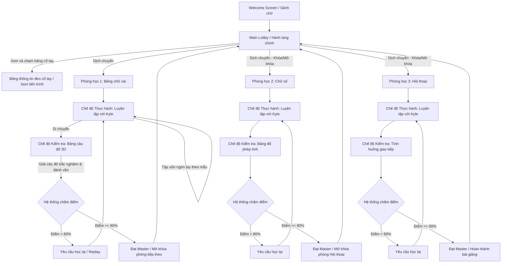

# CHƯƠNG 4. THIẾT KẾ BÀI GIẢNG, TRIỂN KHAI VÀ ĐÁNH GIÁ HỆ THỐNG

---

## 4.1 Tổng quan bài giảng

- **Tên bài giảng:** Bài giảng tương tác Ngôn ngữ ký hiệu Mỹ trong Thực tế ảo (ASL VR)
- **Bản sắc bài giảng:** Bài giảng là một không gian thực nghiệm tương tác tay trần 3D sinh động, nơi người học sử dụng đôi bàn tay vật lý tự uốn nắn khớp ngón tay chuẩn hóa và tự do trải nghiệm lý thuyết EdTech trực quan mà không bị cản trở bởi tay cầm vật lý.
- **Trụ cột bài giảng:**
  - Chân thực (Immersive).
  - Tự nhiên (Natural).
  - Thấu cảm (Empowering).
- **Điểm độc đáo:**
  - Cơ chế uốn nắn bàn tay trần tự nhiên, trực quan hóa khớp tay ảo thời gian thực không cần tay cầm.
  - Nhận dạng quỹ đạo nét vẽ của đầu ngón trỏ đối với các chữ cái động như J và Z.
  - Giảng viên ảo Kyle phản hồi sinh học thời gian thực sinh động, giúp thu hẹp khoảng cách giao tiếp với cộng đồng khiếm thính.
- **Phong cách đồ họa:** Bài giảng sử dụng tông màu be và xanh pastel dịu nhẹ, phong cách nghệ thuật stylized, lowpoly tối giản tạo cảm giác thoáng đãng và giảm mỏi mắt nhận thức.

---

## 4.2 Lối tương tác

### 4.2.1 Ấn tượng ban đầu

Khởi đầu người học sẽ ở trong Hành lang chính, nhìn xung quanh sẽ thấy khung cảnh thoáng đãng, hiện đại của một phòng nghiên cứu ngôn ngữ ảo. Phía đối diện, giảng viên ảo Kyle sẽ vẫy tay chào để tạo cảm giác thân thiện và chào mừng học viên. Tại đây, người học sẽ được nhìn thấy đôi bàn tay ảo của mình hiển thị khung xương mờ 26 khớp xương thời gian thực và được tập làm quen với cơ chế di chuyển: chỉ tay trỏ bám tia sáng xuống sàn nhà để teleport đi xung quanh khám phá phòng học.

Sau đó một khoảng thời gian ngắn, một bảng hướng dẫn lơ lửng sẽ tự động hiển thị thông tin hướng dẫn học viên cách xem và tương tác với bảng đeo tay. Học viên chỉ cần đưa cổ tay lên ngang tầm mắt để dễ dàng quan sát tiến trình cá nhân của mình.

Sau khi làm quen thành công với các thao tác tương tác cơ bản, người học sẽ bấm chọn dịch chuyển (Teleport) mở khóa phòng học đầu tiên là phòng học Bảng chữ cái để bắt đầu bài học đầu tiên.

### 4.2.2 Mục tiêu

Sự thử thách và động lực trong bài giảng bắt nguồn từ việc đối mặt với các bài kiểm tra đánh giá năng lực đa dạng sau khi thực hành cùng giảng viên ảo Kyle. Người học phải không ngừng luyện tập các cử chỉ tay trần tĩnh và nét vẽ động J/Z trong không gian ảo.

Do đó, người học phải tập trung uốn ngón tay chính xác, phối hợp các thao tác nét vẽ bám tia sáng để trả lời các câu đố trên bảng câu đố 3D. Họ có thể thành công bằng cách hoàn thành bài thi với điểm số đạt từ 80% trở lên. Mỗi phòng học hoàn thành xuất sắc giúp người học mở khóa phòng học chuyên đề mới, sở hữu thêm các kỹ năng giao tiếp phức tạp hơn, từ đó tiến xa hơn trên hành trình làm chủ ngôn ngữ ký hiệu ASL.

### 4.2.3 Tiến trình và luồng bài giảng

Luồng tiến trình học tập của bài giảng tương tác ASL VR được đặc tả chi tiết dưới dạng mã sơ đồ Mermaid dưới đây:

### 4.2.4 Nhiệm vụ, thử thách

Trong bài giảng này, nhiệm vụ chính của người học là chinh phục ba chủ đề học tập cốt lõi (Bảng chữ cái, Chữ số học thuật, Hội thoại giao tiếp). Để mở khóa từng phòng học, người học phải vượt qua các đợt thi đánh giá năng lực đa dạng do bộ điều khiển kiểm tra tự động nạp từ dữ liệu cấu trúc đã chuẩn bị sẵn.

Người học cần rèn luyện sự dẻo dai của ngón tay, phối hợp phản xạ và độ chính xác của cơ tay qua từng bài học thực hành, từ đó tự tin làm chủ ngôn ngữ ký hiệu. Mỗi bài thi trên bảng kiểm tra 3D là cơ hội để học viên tự thử và sai, củng cố trí nhớ vận động nhằm đạt trạng thái Master hoàn toàn bài giảng.

---

## 4.3 Cơ chế của bài giảng

### 4.3.1 Luật

Trong bài giảng, người học sẽ thực hiện các hành động tương tác như dịch chuyển vị trí học tập, chạm các nút ảo trực quan trên bảng thông tin đeo tay, uốn nắn bàn tay trần tạo các tư thế tay tĩnh, và vẽ nét ngón trỏ trong không gian để mô phỏng ký tự động. Người học được tự do điều chỉnh bàn tay ảo và luyện tập thử sai liên tục mà không bị giới hạn.

Mỗi phòng học chuyên đề mang đến những thử thách thực hành độc đáo:

- **Ở phòng học 1 (Bảng chữ cái):** Người học thực hành uốn nắn hai mươi sáu tư thế tay tĩnh đơn lẻ và hai chữ cái động như J và Z bằng cách di chuyển đầu ngón tay vẽ nét quỹ đạo trong không gian.
- **Ở phòng học 2 (Chữ số):** Người học thực hành đếm các số từ 0 - 9 và giải các bài đố phép toán trực quan trên bảng.
- **Ở phòng học 3 (Hội thoại):** Người học thực hiện ghép các từ vựng giao tiếp thông dụng đòi hỏi phối hợp đồng bộ cử chỉ của cả hai bàn tay vật lý.

Để vượt qua bài kiểm tra năng lực và hoàn thành mục tiêu của mỗi phòng học chuyên đề, học viên bắt buộc phải đạt tỷ lệ chính xác tối thiểu là 80% trong các chuỗi thực hành (đạt cấp độ Master). Việc tích lũy đủ 80% điểm số này là luật cốt lõi để kích hoạt điều kiện mở khóa cánh cửa dẫn vào phòng học chuyên đề tiếp theo trên sảnh hành lang chính. Nếu học viên đạt điểm dưới mức 80% (bao gồm cả mức Đạt chuẩn từ 50% đến dưới 80%), cửa phòng tiếp theo vẫn khóa, buộc học viên phải thực hiện chế độ học lại để cải thiện kết quả.

Học viên có thể chủ động học lại nhiều lần để cải thiện năng lực của mình. Càng thực hiện chính xác các câu hỏi ngay từ lượt uốn tay đầu tiên, điểm số kiểm tra tích lũy càng cao, nâng cao tinh thần chủ động tự học.

### 4.3.2 Mô hình thế giới

#### a, Cơ chế vật lý của thế giới

**Sảnh hành lang chính**
Sảnh hành lang chính là khu vực xuất phát điểm của học viên, một không gian tràn ngập ánh sáng tự nhiên với sàn gỗ ấm áp và các bức tường mang màu sắc dịu nhẹ. Tại trung tâm sảnh, giảng viên ảo Kyle đứng chào mừng học viên trước ba cánh cửa lớn dẫn vào các phòng học chuyên đề đang ở trạng thái khóa. Học viên có thể tự do dịch chuyển bằng cách phóng tia chỉ trỏ xuống nền nhà để làm quen với không gian, đồng thời dễ dàng chạm trực tiếp vào bảng đeo tay để tương tác với bảng thông tin cá nhân.

**Phòng học bảng chữ cái**
Phòng học bảng chữ cái mô phỏng một không gian nghiên cứu ngôn ngữ ấm cúng và tĩnh lặng. Nơi đây bố trí bục giảng của giảng viên Kyle ở trung tâm để hướng dẫn làm mẫu, bảng câu đố thi hiển thị câu hỏi ở phía bên phải, cùng các bảng mẫu hướng dẫn ký tự trực quan xung quanh. Người học sử dụng đôi bàn tay trần ảo để thực hành uốn nắn hai mươi sáu tư thế ngón tay tĩnh, hoặc di chuyển đầu ngón trỏ vẽ nét trong không gian để mô phỏng các chữ cái động có quỹ đạo như J và Z.

**Phòng học chữ số**
Phòng học chữ số là một không gian học tập toán học sinh động với các phương trình số học đơn giản được vẽ cách điệu trên tường. Trong phòng học này, học viên thực hành uốn nắn bàn tay để đếm các số từ không đến chín dưới sự hỗ trợ của giảng viên Kyle, đồng thời dịch chuyển đến bảng câu đố để giải các phép tính số học trực quan và nhập đáp án bằng cách uốn ngón tay theo phương pháp nhận dạng tối giản.

**Phòng học hội thoại**
Phòng học hội thoại được thiết kế theo phong cách phòng thực nghiệm tương tác đồng bộ với các bàn kệ thiết bị kỹ thuật gọn gàng. Phòng học được bố trí bảng kiểm tra nâng cao cùng hệ thống màn hình trình chiếu video hướng dẫn sẵn để học viên thực hành ghép các cụm từ đối thoại theo một tiến trình học tập tuyến tính nghiêm ngặt. Tại đây, người học cần quan sát các video bài giảng mẫu theo đúng thứ tự quy định và phối hợp đồng bộ cử chỉ của cả hai bàn tay để ghép thành từ vựng hoàn chỉnh trước khi làm bài thi trả lời các câu hỏi tình huống giao tiếp thực tế.

#### b, Hệ thống tiến trình và đánh giá năng lực học thuật

Hệ thống tiến trình và đánh giá năng lực học thuật trong bài giảng được xây dựng chặt chẽ nhằm phản ánh chính xác mức độ tiếp thu và độ thành thạo ngôn ngữ ký hiệu của học viên thông qua từng giai đoạn học tập. Thay vì sử dụng các cơ chế thăng cấp hay điểm số tiền tệ của các trò chơi giải trí thông thường, bài giảng tập trung vào việc đo lường năng lực thực tế. Học viên khi tham gia học tập sẽ thực hiện các bài thi trắc nghiệm và đánh giá thực hành trực tiếp tại bảng kiểm tra 3D của mỗi phòng học. Điểm số đánh giá được tính dựa trên tỷ lệ phần trăm mức độ chính xác của các tư thế tay và nét vẽ được uốn nắn thành công ngay từ những lượt thử đầu tiên, dao động từ 0% đến 100%.

Trong đó, nhằm đảm bảo công bằng và phản ánh đúng thực chất năng lực mà không gây ức chế tâm lý do giới hạn vật lý của cảm biến bắt khớp tay trần trên kính VR, hệ thống đánh giá tích hợp các cơ chế bảo vệ học tập đặc thù:

- **Cơ chế Sai lầm ẩn:** Cảm biến camera hồng ngoại của kính VR dễ gặp hiện tượng nhiễu bắt khớp ngón tay trong một vài khung hình ngắn. Thay vì lập tức trừ điểm hay ghi nhận lỗi sai khi khớp tay bị lệch nhẹ ngoài ý muốn trong quá trình đánh giá, hệ thống sử dụng một bộ đệm thời gian ngắn (từ 1.5 - 2 giây). Chỉ khi người học duy trì tư thế tay sai vượt quá thời gian đệm này, hệ thống mới chính thức ghi nhận lỗi và áp dụng vào kết quả đánh giá thực tế.
- **Cửa sổ vô địch:** Ngay sau khi người học làm sai một cử chỉ và bị hệ thống báo lỗi, một cửa sổ thời gian miễn phạt ngắn (1.0 giây) được kích hoạt. Giai đoạn này cho phép người học thả lòng cơ tay, thoải mái uốn nắn điều chỉnh lại các khớp ngón tay mà không lo sợ bị hệ thống liên tục phạt điểm dồn dập trong kết quả tiến trình.
- **Danh sách cử chỉ miễn phạt:** Các cử chỉ tay tự nhiên dùng để tương tác điều khiển giao diện (như đưa ngón trỏ để chạm các nút trên bảng đeo tay hay trỏ ngón tay di chuyển) được hệ thống đăng ký vào danh sách ngoại lệ, đảm bảo không bao giờ bị tính nhầm là lỗi thực hiện sai bài học.

Toàn bộ kết quả và mức độ thông thạo này sẽ được ghi nhận và cập nhật trực tiếp lên bảng thông tin tiến trình cá nhân gắn trên cổ tay của học viên dưới dạng ba trạng thái trực quan: Màu xám đại diện cho những phòng học hoặc chủ đề chưa mở khóa; Màu xanh lá đại diện cho trạng thái Đạt chuẩn; Màu vàng kim đại diện cho trạng thái Master - Đỉnh cao Xuất sắc (được đồng bộ theo quy định hoàn thành tối thiểu 80% điểm số tại phần Luật bài giảng). Để đảm bảo tính bền vững của tiến trình tự học dài hạn, điểm số đánh giá cao nhất của mỗi học viên cho từng chủ đề sẽ được tự động ghi nhớ và lưu trữ vĩnh viễn trên hệ thống của thiết bị, giúp học viên có thể tiếp tục hành trình học tập cá nhân hóa của mình vào bất kỳ lúc nào mà không lo bị mất dữ liệu tiến độ.

### 4.3.3 Luồng màn hình

> **Hình 4.1:** _Screen Chart_

```mermaid
graph TD
    Start((Bắt đầu bài giảng)) --> Lobby[Sảnh Hành lang chính]
    Lobby <-->|Chạm trực tiếp| WristMenu[Bảng điều khiển đeo tay]
    Lobby <-->|Tia chỉ trỏ di chuyển| Classroom1[Phòng Bảng chữ cái]
    Lobby <-->|Tia chỉ trỏ di chuyển - Khóa/Mở khóa| Classroom2[Phòng Chữ số]
    Lobby <-->|Tia chỉ trỏ di chuyển - Khóa/Mở khóa| Classroom3[Phòng Hội thoại]

    style Lobby fill:#d4edda,stroke:#28a745,stroke-width:2px;
    style Classroom1 fill:#d4edda,stroke:#28a745,stroke-width:2px;
    style Classroom2 fill:#d4edda,stroke:#28a745,stroke-width:2px;
    style Classroom3 fill:#d4edda,stroke:#28a745,stroke-width:2px;

    style WristMenu fill:#f8d7da,stroke:#dc3545,stroke-width:2px;

    style Start fill:#000,stroke:#000;
```

Hình 4.1 thể hiện luồng giao diện của bài giảng. Luồng giao diện này được điều khiển bởi chuyển động chỉ ngón trỏ hoặc việc chạm trực tiếp vào bảng đeo tay của người học để hiển thị và di chuyển giữa các không gian chính.

Người học sẽ bắt đầu bài giảng trực tiếp tại **Sảnh Hành lang chính (Lobby)**. Tại đây, không gian ảo sẽ hiển thị bối cảnh nghiên cứu ngôn ngữ hiện đại, giảng viên ảo Kyle chào mừng và các cánh cửa dẫn đến ba phòng học chuyên đề.

Từ **Sảnh Hành lang chính (Lobby)**, người học chỉ cần đưa tay lên để quan sát **Bảng điều khiển đeo cổ tay** hiển thị phía trên cổ tay. Bảng điều khiển này cung cấp thông tin trực quan thời gian thực về tiến trình học tập cá nhân, bao gồm trạng thái mở khóa của từng phòng học chuyên đề, điểm số thi cao nhất đạt được, và các thành tựu tích lũy trong suốt bài giảng.
Người học có thể thao tác với bảng điều khiển để bước vào các phòng học chuyên đề tương ứng gồm: **Phòng học Bảng chữ cái**, **Phòng học Chữ số**, và **Phòng học Hội thoại**. Người học có thể tự do quay lại sảnh chính bất kỳ lúc nào để chuyển đổi chủ đề hoặc kiểm tra tiến độ học tập.

---

## 4.4 Điều khiển

Bài giảng sử dụng đôi bàn tay vật lý của người học để thực hiện các thao tác điều khiển trực tiếp, thông qua công nghệ theo dõi bàn tay tích hợp trên kính để ghi nhận và chuyển đổi các cử chỉ thành hành động tương tác thời gian thực trong không gian ảo ba chiều. Mỗi cử chỉ ngón tay và chuyển động khớp trong bài giảng đều được thiết kế tương ứng với một lệnh điều hướng, học tập hoặc tương tác sư phạm cụ thể, giúp người học kiểm soát các không gian phòng học ảo và giao tiếp với giảng viên ảo Kyle một cách trực quan, hiệu quả. Hệ thống điều khiển tay trần tự nhiên này giúp triệt tiêu hoàn toàn sự phức tạp trong việc ghi nhớ các nút bấm vật lý của tay cầm truyền thống, đồng thời mở ra khả năng tự do uốn nắn tay trần để rèn luyện vùng ký ức vận động dài hạn.

> **Hình 4.2:** _Cử chỉ chỉ hai tay di chuyển_

Hình 4.2 thể hiện cơ chế di chuyển trong môi trường học tập bằng cách hướng đồng thời hai ngón trỏ của hai bàn tay ra phía trước, trong khi các ngón tay khác thu lại một cách tự nhiên. Hệ thống sẽ thu thập dữ liệu hướng chỉ của cả hai ngón trỏ và tự động tính toán góc trung bình giữa hai bàn tay để dịch chuyển nhân vật một cách mượt mà và trực quan theo hướng đó trong không gian ảo, giúp người học dễ dàng tiếp cận các khu vực bục giảng hoặc bảng câu đố thi.

> **Hình 4.3:** _Cử chỉ uốn chữ cái A_

Hình 4.3 mô tả cử chỉ uốn nắn bàn tay trần tạo thành chữ cái tĩnh A trong bài học bảng chữ cái. Học viên thực hiện uốn nắn các khớp ngón tay vật lý để nắm bốn ngón tay từ ngón trỏ đến ngón út lại áp sát vào lòng bàn tay, đồng thời duỗi thẳng ngón tay cái và đặt sát bên ngoài ngón trỏ. Hệ thống sẽ tự động ghi nhận hai mươi sáu khớp xương của bàn tay ảo và gửi vào bộ nhận dạng cử chỉ tĩnh để so khớp góc khớp ngón tay thời gian thực, giúp đánh giá chính xác tư thế tay của học viên so với hình ảnh mẫu chuẩn.

> **Hình 4.4:** _Cử chỉ uốn chữ số năm_

Hình 4.4 thể hiện cử chỉ uốn nắn bàn tay trần đại diện cho chữ số tĩnh năm trong bài thực hành chữ số. Người học thực hiện xòe rộng cả năm ngón tay vật lý một cách tự nhiên trước cảm biến của kính thực tế ảo để tạo lập hình dáng chữ số năm. Hệ thống sẽ theo dõi và ghi nhận khoảng cách cũng như góc độ của các khớp ngón tay ảo, sau đó so khớp thời gian thực với cử chỉ mẫu chuẩn của giảng viên Kyle để đưa ra các phản hồi trực quan tức thì.

> **Hình 4.5:** _Bảng điều khiển đeo tay_

Hình 4.5 minh họa bảng điều khiển đeo tay được thiết kế ngay phía trên khớp cổ tay như một chiếc đồng hồ thông minh. Trong quá trình học tập, bảng điều khiển này luôn hiển thị trực quan trên khớp cổ tay trái hoặc phải. Người học chỉ cần đưa tay lên để kiểm tra tiến trình học tập cá nhân, theo dõi tỷ lệ phần trăm hoàn thành bài kiểm tra và các cấp độ thành thạo tích lũy của mình mà không cần phải thực hiện các thao tác xoay ngửa cổ tay phức tạp.

Bên cạnh các cử chỉ di chuyển và uốn nắn tĩnh, hệ thống còn hỗ trợ tư thế sẵn sàng vẽ nét trong không gian dành cho các chữ cái động có quỹ đạo như J và Z. Người học chỉ cần duỗi thẳng ngón trỏ của bàn tay thuận và thu các ngón khác lại để kích hoạt trạng thái vẽ nét quỹ đạo. Khi đầu ngón trỏ di chuyển trong không gian, hệ thống sẽ liên tục ghi nhận tọa độ thực tế và vẽ đường nét bám sát theo chuyển động của ngón tay. Người học thả lỏng tư thế tay để kết thúc nét vẽ và tự động kích hoạt bộ so khớp quỹ đạo.

---

## 4.5 Nhân vật và giảng viên hướng dẫn

Trong môi trường thực tế ảo của bài giảng, hình ảnh đại diện của học viên được thiết kế tinh giản tối đa để tập trung hoàn toàn vào trải nghiệm học tập ngôn ngữ ký hiệu. Học viên không có khả năng tùy biến hay định hình ngoại hình, trang phục hay giới tính của nhân vật đại diện do ứng dụng sử dụng góc nhìn thứ nhất trực diện, tránh các yếu tố gây mất tập trung thị giác không cần thiết. Thay vào đó, người học được trực quan hóa thông qua một cặp bàn tay ảo hiển thị theo sát cử động của bàn tay thực tế ngoài đời thực. Học viên là nhân vật tương tác duy nhất có khả năng chủ động di chuyển, thực hiện uốn nắn các cử chỉ tay trần và chạm trực tiếp vào các nút bấm ảo trên bảng kiểm tra hoặc bảng đeo tay để điều hướng hệ thống.

Danh sách nhân vật xuất hiện trong bài giảng bao gồm học viên đóng vai trò là nhân vật tương tác chính và giảng viên ảo Kyle đóng vai trò là nhân vật hướng dẫn không thể tương tác điều khiển. Vì đây là một ứng dụng phần mềm giáo dục hướng đến trải nghiệm tự học cá nhân hóa, bài giảng hoàn toàn không thiết kế các lớp nhân vật kẻ địch hay đối thủ cạnh tranh. Đối tượng tương tác gián tiếp để người học đối chiếu hành vi uốn nắn cơ tay là các mô hình bàn tay ba chiều hiển thị tĩnh các tư thế chuẩn được đặt trên các bàn gỗ ở sảnh hành lang chính. Giảng viên ảo Kyle được xây dựng với hình dáng một nhân vật người máy ba chiều thân thiện, sở hữu bộ xương tay chi tiết để mô phỏng chính xác các cử chỉ tay từ đơn giản đến phức tạp. Kyle đóng vai trò kết nối học viên với bài giảng, đại diện cho một người hướng dẫn kiên nhẫn và luôn sẵn sàng hỗ trợ người học ở mọi trạng thái học tập.

Sự xuất hiện của giảng viên ảo Kyle được phân bổ phù hợp tại các khu vực sảnh hành lang chính để chào mừng, cũng như hướng dẫn người học tại phòng học bảng chữ cái. Tại phòng học chữ số và phòng học hội thoại giao tiếp, nhân vật Kyle không xuất hiện trực tiếp mà vai trò hướng dẫn được chuyển giao hoàn toàn cho các màn hình trình chiếu video hướng dẫn sẵn. Trí tuệ nhân tạo điều khiển hành vi của giảng viên ảo Kyle hoạt động dựa trên máy trạng thái hữu hạn tích hợp các phản hồi sư phạm sinh động. Tùy thuộc vào hành vi của học viên, Kyle sẽ tự động chuyển đổi qua bốn trạng thái bao gồm vẫy tay chào mừng thân thiện khi học viên mới vào phòng, vỗ tay mỉm cười tán thưởng khi học viên thực hiện đúng để khích lệ học viên tiếp tục thực hành khi thực hiện sai.

---

## 4.6 Các phòng học chuyên đề (Màn học)

### 4.6.1 Màn 1 - Phòng học bảng chữ cái

Ở màn học đầu tiên, người học bắt đầu tại phòng học bảng chữ cái, một thư viện ngôn ngữ thu nhỏ được trang bị đầy đủ tủ sách lý thuyết và bục giảng thực hành. Ngay từ đầu, người học được hướng dẫn tương tác trực quan với hệ thống ba màn hình bài giảng điện tử lơ lửng để làm quen với các khái niệm ký hiệu cơ bản. Những thử thách học tập đầu tiên sẽ giúp người học rèn luyện tư thế tay trần thông qua sự làm mẫu chuẩn xác của giảng viên ảo Kyle đứng ở trung tâm bục giảng. Sau đó, người học sẽ tiếp tục luyện tập uốn nắn cơ tay khi hệ thống theo dõi khớp tay trần ghi nhận và so khớp các ký tự tĩnh từ chữ A đến chữ Z, đồng thời đưa ra các phản hồi màu sắc trực tiếp trên bàn tay ảo để người học tự động căn chỉnh.

Tiếp theo, người học sẽ làm quen với các ký tự động khó hơn như chữ J và chữ Z đòi hỏi phải di chuyển đầu ngón trỏ để vẽ nét quỹ đạo chuyển động trong không gian thực tế ảo. Lúc này, kỹ năng định vị vẽ nét sẽ phát huy tác dụng, giúp người học ghi nhận tọa độ đầu ngón tay và hoàn thành đường nét uốn lượn chính xác. Sau khi vượt qua các thử thách luyện tập này, người học sẽ tự tin di chuyển sang góc phòng học bên phải để đứng trước bảng kiểm tra lớn. Tại đây, người học sẽ thực hiện bài thi đánh giá năng lực bằng cách đánh vần các từ vựng tiếng Anh thông dụng để tự động kích hoạt cơ chế mở khóa cửa phòng và chuyển sang màn học tiếp theo.

### 4.6.2 Màn 2 - Phòng học chữ số

Ở màn học thứ hai, bối cảnh chuyển sang phòng thực nghiệm toán học số hóa với bố cục các hàng ghế hình bán nguyệt đối diện bảng giảng dạy chính. Người học xuất hiện trước bục giảng, nơi được trang bị cả hệ thống video trình chiếu trực quan và các mô hình mẫu tay ảo ba chiều biểu thị tĩnh các khớp ngón tay. Trong quá trình học tập, người học sẽ theo dõi video trình chiếu chuyển động đếm số từ không đến chín, đồng thời kết hợp quan sát đa chiều góc xương khớp của các mẫu tay ảo xung quanh để dễ dàng đối chiếu uốn nắn cơ tay vật lý của mình.

Tiếp theo, thử thách tính toán thực tế sẽ được đưa ra khi hệ thống hiển thị các phép toán cộng trừ nhân chia trực quan, đòi hỏi người học phải uốn nắn bàn tay tạo hình chữ số chính xác biểu thị kết quả để trả lời câu hỏi. Bên cạnh những phép toán, người học còn phải trả lời câu hỏi dưới hình thức điền chữ số vào các ô trống còn thiếu. Hoàn thành xuất sắc bài thi này sẽ mở khóa cửa phòng học cuối cùng để người học tiến vào trải nghiệm màn học nâng cao.

### 4.6.3 Màn 3 - Phòng học hội thoại giao tiếp

Màn học cuối cùng đưa người học đến phòng học hội thoại giao tiếp. Tại đây, người học tiến hành tự học dựa trên các màn hình hiển thị video bài giảng có sẵn từ trước, giúp làm quen với các ngữ cảnh đàm thoại đời thường và kỹ năng phối hợp đồng bộ cả hai bàn tay để tạo thành câu hoàn chỉnh. Người học phải tận dụng tối đa kỹ năng uốn nắn, phản xạ khớp tay linh hoạt và khả năng phối hợp đồng bộ hai bàn tay để chuẩn bị cho bài kiểm tra cuối khóa. Khi đã hoàn thành toàn bộ chuỗi video bài giảng, người học di chuyển tới bảng kiểm tra để trả lời chuỗi câu hỏi tình huống thực tế bằng cách thực hiện chính xác các cử chỉ tuần tự hoàn chỉnh, chính thức vượt qua màn học cuối cùng và hoàn thành chương trình học tập thực tế ảo.

## 4.7 Giao diện người dùng (UI)

Giao diện người dùng của bài giảng được thiết kế theo hướng tối giản hóa các thành phần hiển thị lơ lửng không cần thiết nhằm tối ưu hóa tầm nhìn của học viên và tránh hiện tượng che khuất camera theo dõi chuyển động bàn tay. Thay vì sử dụng các thanh thông số hay biểu tượng trạng thái tĩnh xuất hiện liên tục trong không gian hiển thị của thiết bị đeo đầu gây mỏi mắt nhận thức, hệ thống ưu tiên sử dụng giao diện lập thể tích hợp trực tiếp vào môi trường ba chiều. Các thành phần giao diện chỉ xuất hiện khi người học chủ động tương tác hoặc kích hoạt các khu vực thực hành chuyên đề, giúp duy trì sự tập trung tối đa vào đôi bàn tay ảo và các cử chỉ mẫu của giảng viên hướng dẫn.

> **Hình 4.6:** _Bản phác thảo thiết kế giao diện bảng đeo tay trên cổ tay_

Bản phác thảo thiết kế giao diện bảng đeo tay trên cổ tay người học được minh họa cụ thể trong Hình 4.6. Bảng điều khiển này hoạt động như một giao diện phẳng hai chiều được đặt trong không gian ba chiều và liên kết trực tiếp với khớp cổ tay của bàn tay ảo. Người học chỉ cần đưa tay lên là có thể quan sát toàn bộ các thông số liên quan đến tiến trình học tập cá nhân, tỷ lệ hoàn thành bài thi và cấp độ thành thạo tích lũy mà không cần thực hiện các thao tác điều khiển phức tạp hay ngửa cổ tay quá mức gây mỏi cơ. Giải pháp này giúp duy trì tốc độ khung hình ổn định và mang lại trải nghiệm tương tác mượt mà cho học viên.

> **Hình 4.7:** _Thiết kế giao diện Quiz Board khi thực hiện kiểm tra_

Bên cạnh bảng điều khiển đeo tay, hệ thống còn thiết kế một bảng kiểm tra năng lực lớn đặt tại giữa phòng học chuyên đề nhằm hỗ trợ người học làm bài thi trắc nghiệm và đánh giá thực hành. Giao diện bảng kiểm tra được thiết kế tối giản với màu be chủ đạo tạo cảm giác sang trọng, giảm thiểu sự mỏi mắt nhận thức cho học viên khi tương tác lâu. Để tăng cường khả năng đọc và độ sắc nét trong không gian thực tế ảo, các ký tự văn bản hiển thị câu hỏi và ô trống đáp án được tăng kích thước hiển thị lớn hơn từ một trăm tám mươi phần trăm đến hai trăm phần trăm so với kích thước tiêu chuẩn. Đồng thời, toàn bộ các bảng chỉ dẫn lơ lửng và nhãn giao diện trong phòng học đều tự động xoay hướng mặt về phía người học, giúp thông tin hướng dẫn luôn được truyền tải rõ ràng nhất ở mọi góc độ đứng thực hành. Thiết kế giao diện bảng kiểm tra khi thực hiện đánh vần từ được mô tả chi tiết tại Hình 4.7.

---
