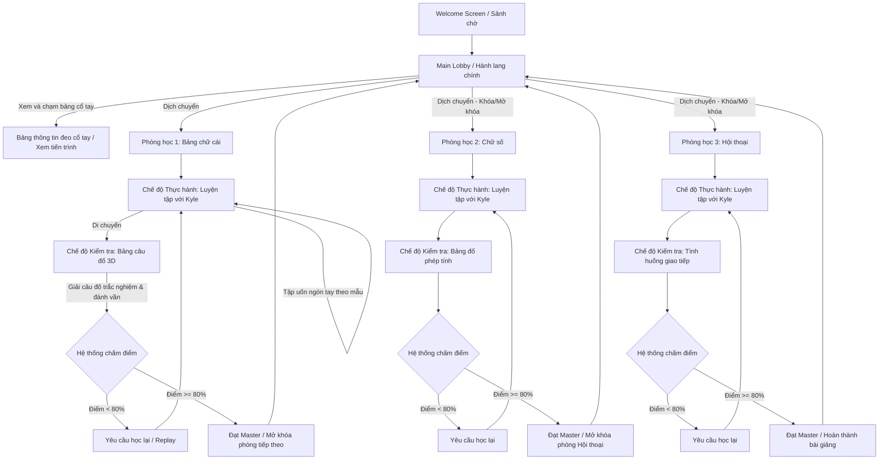

```mermaid
graph TD
    Start((Bắt đầu bài giảng)) --> Lobby[Sảnh Hành lang chính]
    Lobby <-->|Chạm trực tiếp| WristMenu[Bảng điều khiển đeo tay]
    Lobby <-->|Tia chỉ trỏ di chuyển| Classroom1[Phòng Bảng chữ cái]
    Lobby <-->|Tia chỉ trỏ di chuyển - Khóa/Mở khóa| Classroom2[Phòng Chữ số]
    Lobby <-->|Tia chỉ trỏ di chuyển - Khóa/Mở khóa| Classroom3[Phòng Hội thoại]

    style Lobby fill:#d4edda,stroke:#28a745,stroke-width:2px;
    style Classroom1 fill:#d4edda,stroke:#28a745,stroke-width:2px;
    style Classroom2 fill:#d4edda,stroke:#28a745,stroke-width:2px;
    style Classroom3 fill:#d4edda,stroke:#28a745,stroke-width:2px;

    style WristMenu fill:#f8d7da,stroke:#dc3545,stroke-width:2px;

    style Start fill:#000,stroke:#000;
```

# CHƯƠNG 4. THIẾT KẾ BÀI GIẢNG, TRIỂN KHAI VÀ ĐÁNH GIÁ HỆ THỐNG

---

## 4.1 Tổng quan bài giảng

- **Tên bài giảng:** Bài giảng tương tác Ngôn ngữ ký hiệu Mỹ trong Thực tế ảo (ASL VR)
- **Bản sắc bài giảng:** Bài giảng là một không gian thực nghiệm tương tác tay trần 3D sinh động, nơi người học sử dụng đôi bàn tay vật lý tự uốn nắn khớp ngón tay chuẩn hóa và tự do trải nghiệm lý thuyết EdTech trực quan mà không bị cản trở bởi tay cầm vật lý.
- **Trụ cột bài giảng:**
  - Chân thực (Immersive).
  - Tự nhiên (Natural).
  - Thấu cảm (Empowering).
- **Điểm độc đáo:**
  - Cơ chế uốn nắn bàn tay trần tự nhiên, trực quan hóa khớp tay ảo thời gian thực không cần tay cầm.
  - Nhận dạng quỹ đạo nét vẽ của đầu ngón trỏ đối với các chữ cái động như J và Z.
  - Giảng viên ảo Kyle phản hồi sinh học thời gian thực sinh động, giúp thu hẹp khoảng cách giao tiếp với cộng đồng khiếm thính.
- **Phong cách đồ họa:** Bài giảng sử dụng tông màu be và xanh pastel dịu nhẹ, phong cách nghệ thuật stylized, lowpoly tối giản tạo cảm giác thoáng đãng và giảm mỏi mắt nhận thức.

---

## 4.2 Lối tương tác

### 4.2.1 Ấn tượng ban đầu

Khởi đầu người học sẽ ở trong Hành lang chính, nhìn xung quanh sẽ thấy khung cảnh thoáng đãng, hiện đại của một phòng nghiên cứu ngôn ngữ ảo. Phía đối diện, giảng viên ảo Kyle sẽ vẫy tay chào để tạo cảm giác thân thiện và chào mừng học viên. Tại đây, người học sẽ được nhìn thấy đôi bàn tay ảo của mình hiển thị khung xương mờ 26 khớp xương thời gian thực và được tập làm quen với cơ chế di chuyển: chỉ tay trỏ bám tia sáng xuống sàn nhà để teleport đi xung quanh khám phá phòng học.

Sau đó một khoảng thời gian ngắn, một bảng hướng dẫn lơ lửng sẽ tự động hiển thị thông tin hướng dẫn học viên cách xem và tương tác với bảng đeo tay. Học viên chỉ cần đưa cổ tay lên ngang tầm mắt để dễ dàng quan sát tiến trình cá nhân của mình.

Sau khi làm quen thành công với các thao tác tương tác cơ bản, người học sẽ bấm chọn dịch chuyển (Teleport) mở khóa phòng học đầu tiên là phòng học Bảng chữ cái để bắt đầu bài học đầu tiên.

### 4.2.2 Mục tiêu

Sự thử thách và động lực trong bài giảng bắt nguồn từ việc đối mặt với các bài kiểm tra đánh giá năng lực đa dạng sau khi thực hành cùng giảng viên ảo Kyle. Người học phải không ngừng luyện tập các cử chỉ tay trần tĩnh và nét vẽ động J/Z trong không gian ảo.

Do đó, người học phải tập trung uốn ngón tay chính xác, phối hợp các thao tác nét vẽ bám tia sáng để trả lời các câu đố trên bảng câu đố 3D. Họ có thể thành công bằng cách hoàn thành bài thi với điểm số đạt từ 80% trở lên. Mỗi phòng học hoàn thành xuất sắc giúp người học mở khóa phòng học chuyên đề mới, sở hữu thêm các kỹ năng giao tiếp phức tạp hơn, từ đó tiến xa hơn trên hành trình làm chủ ngôn ngữ ký hiệu ASL.

### 4.2.3 Tiến trình và luồng bài giảng

Luồng tiến trình học tập của bài giảng tương tác ASL VR được đặc tả chi tiết dưới dạng mã sơ đồ Mermaid dưới đây:



### 4.2.4 Nhiệm vụ, thử thách

Trong bài giảng này, nhiệm vụ chính của người học là chinh phục ba chủ đề học tập cốt lõi (Bảng chữ cái, Chữ số học thuật, Hội thoại giao tiếp). Để mở khóa từng phòng học, người học phải vượt qua các đợt thi đánh giá năng lực đa dạng do bộ điều khiển kiểm tra tự động nạp từ dữ liệu cấu trúc đã chuẩn bị sẵn.

Người học cần rèn luyện sự dẻo dai của ngón tay, phối hợp phản xạ và độ chính xác của cơ tay qua từng bài học thực hành, từ đó tự tin làm chủ ngôn ngữ ký hiệu. Mỗi bài thi trên bảng kiểm tra 3D là cơ hội để học viên tự thử và sai, củng cố trí nhớ vận động nhằm đạt trạng thái Master hoàn toàn bài giảng.

---

## 4.3 Cơ chế của bài giảng

### 4.3.1 Luật

Trong bài giảng, người học sẽ thực hiện các hành động tương tác như dịch chuyển vị trí học tập, chạm các nút ảo trực quan trên bảng thông tin đeo tay, uốn nắn bàn tay trần tạo các tư thế tay tĩnh, và vẽ nét ngón trỏ trong không gian để mô phỏng ký tự động. Người học được tự do điều chỉnh bàn tay ảo và luyện tập thử sai liên tục mà không bị giới hạn.

Mỗi phòng học chuyên đề mang đến những thử thách thực hành độc đáo:

- **Ở phòng học 1 (Bảng chữ cái):** Người học thực hành uốn nắn hai mươi sáu tư thế tay tĩnh đơn lẻ và hai chữ cái động như J và Z bằng cách di chuyển đầu ngón tay vẽ nét quỹ đạo trong không gian.
- **Ở phòng học 2 (Chữ số):** Người học thực hành đếm các số từ 0 - 9 và giải các bài đố phép toán trực quan trên bảng.
- **Ở phòng học 3 (Hội thoại):** Người học thực hiện ghép các từ vựng giao tiếp thông dụng đòi hỏi phối hợp đồng bộ cử chỉ của cả hai bàn tay vật lý.

Để vượt qua bài kiểm tra năng lực và hoàn thành mục tiêu của mỗi phòng học chuyên đề, học viên bắt buộc phải đạt tỷ lệ chính xác tối thiểu là 80% trong các chuỗi thực hành (đạt cấp độ Master). Việc tích lũy đủ 80% điểm số này là luật cốt lõi để kích hoạt điều kiện mở khóa cánh cửa dẫn vào phòng học chuyên đề tiếp theo trên sảnh hành lang chính. Nếu học viên đạt điểm dưới mức 80% (bao gồm cả mức Đạt chuẩn từ 50% đến dưới 80%), cửa phòng tiếp theo vẫn khóa, buộc học viên phải thực hiện chế độ học lại để cải thiện kết quả.

Học viên có thể chủ động học lại nhiều lần để cải thiện năng lực của mình. Càng thực hiện chính xác các câu hỏi ngay từ lượt uốn tay đầu tiên, điểm số kiểm tra tích lũy càng cao, nâng cao tinh thần chủ động tự học.

### 4.3.2 Mô hình thế giới

#### a, Cơ chế vật lý của thế giới

**Sảnh hành lang chính**
Sảnh hành lang chính là khu vực xuất phát điểm của học viên, một không gian tràn ngập ánh sáng tự nhiên với sàn gỗ ấm áp và các bức tường mang màu sắc dịu nhẹ. Tại trung tâm sảnh, giảng viên ảo Kyle đứng chào mừng học viên trước ba cánh cửa lớn dẫn vào các phòng học chuyên đề đang ở trạng thái khóa. Học viên có thể tự do dịch chuyển bằng cách phóng tia chỉ trỏ xuống nền nhà để làm quen với không gian, đồng thời dễ dàng chạm trực tiếp vào bảng đeo tay để tương tác với bảng thông tin cá nhân.

**Phòng học bảng chữ cái**
Phòng học bảng chữ cái mô phỏng một không gian nghiên cứu ngôn ngữ ấm cúng và tĩnh lặng. Nơi đây bố trí bục giảng của giảng viên Kyle ở trung tâm để hướng dẫn làm mẫu, bảng câu đố thi hiển thị câu hỏi ở phía bên phải, cùng các bảng mẫu hướng dẫn ký tự trực quan xung quanh. Người học sử dụng đôi bàn tay trần ảo để thực hành uốn nắn hai mươi sáu tư thế ngón tay tĩnh, hoặc di chuyển đầu ngón trỏ vẽ nét trong không gian để mô phỏng các chữ cái động có quỹ đạo như J và Z.

**Phòng học chữ số**
Phòng học chữ số là một không gian học tập toán học sinh động với các phương trình số học đơn giản được vẽ cách điệu trên tường. Trong phòng học này, học viên thực hành uốn nắn bàn tay để đếm các số từ không đến chín dưới sự hỗ trợ của giảng viên Kyle, đồng thời dịch chuyển đến bảng câu đố để giải các phép tính số học trực quan và nhập đáp án bằng cách uốn ngón tay theo phương pháp nhận dạng tối giản.

**Phòng học hội thoại**
Phòng học hội thoại mô phỏng một không gian phòng khách hoặc quán cà phê ảo thân thiện và gần gũi. Phòng học được bố trí bảng câu đố thi nâng cao và bục giao tiếp lớn để học viên thực hành các chủ đề đối thoại đời thường phức tạp. Tại đây, người học cần phối hợp đồng bộ cử chỉ của cả hai bàn tay để ghép thành từ vựng hoàn chỉnh và tham gia trả lời các câu hỏi tình huống giao tiếp thực tế với giảng viên.

#### b, Hệ thống tiến trình và đánh giá năng lực học thuật

Hệ thống tiến trình và đánh giá năng lực học thuật trong bài giảng được xây dựng chặt chẽ nhằm phản ánh chính xác mức độ tiếp thu và độ thành thạo ngôn ngữ ký hiệu của học viên thông qua từng giai đoạn học tập. Thay vì sử dụng các cơ chế thăng cấp hay điểm số tiền tệ của các trò chơi giải trí thông thường, bài giảng tập trung vào việc đo lường năng lực thực tế. Học viên khi tham gia học tập sẽ thực hiện các bài thi trắc nghiệm và đánh giá thực hành trực tiếp tại bảng kiểm tra 3D của mỗi phòng học. Điểm số đánh giá được tính dựa trên tỷ lệ phần trăm mức độ chính xác của các tư thế tay và nét vẽ được uốn nắn thành công ngay từ những lượt thử đầu tiên, dao động từ 0% đến 100%.

Trong đó, nhằm đảm bảo công bằng và phản ánh đúng thực chất năng lực mà không gây ức chế tâm lý do giới hạn vật lý của cảm biến bắt khớp tay trần trên kính VR, hệ thống đánh giá tích hợp các cơ chế bảo vệ học tập đặc thù:

- **Cơ chế Sai lầm ẩn:** Cảm biến camera hồng ngoại của kính VR dễ gặp hiện tượng nhiễu bắt khớp ngón tay trong một vài khung hình ngắn. Thay vì lập tức trừ điểm hay ghi nhận lỗi sai khi khớp tay bị lệch nhẹ ngoài ý muốn trong quá trình đánh giá, hệ thống sử dụng một bộ đệm thời gian ngắn (từ 1.5 - 2 giây). Chỉ khi người học duy trì tư thế tay sai vượt quá thời gian đệm này, hệ thống mới chính thức ghi nhận lỗi và áp dụng vào kết quả đánh giá thực tế.
- **Cửa sổ vô địch:** Ngay sau khi người học làm sai một cử chỉ và bị hệ thống báo lỗi, một cửa sổ thời gian miễn phạt ngắn (1.0 giây) được kích hoạt. Giai đoạn này cho phép người học thả lòng cơ tay, thoải mái uốn nắn điều chỉnh lại các khớp ngón tay mà không lo sợ bị hệ thống liên tục phạt điểm dồn dập trong kết quả tiến trình.
- **Danh sách cử chỉ miễn phạt:** Các cử chỉ tay tự nhiên dùng để tương tác điều khiển giao diện (như đưa ngón trỏ để chạm các nút trên bảng đeo tay hay trỏ ngón tay di chuyển) được hệ thống đăng ký vào danh sách ngoại lệ, đảm bảo không bao giờ bị tính nhầm là lỗi thực hiện sai bài học.

Toàn bộ kết quả và mức độ thông thạo này sẽ được ghi nhận và cập nhật trực tiếp lên bảng thông tin tiến trình cá nhân gắn trên cổ tay của học viên dưới dạng ba trạng thái trực quan: Màu xám đại diện cho những phòng học hoặc chủ đề chưa mở khóa; Màu xanh lá đại diện cho trạng thái Đạt chuẩn; Màu vàng kim đại diện cho trạng thái Master - Đỉnh cao Xuất sắc (được đồng bộ theo quy định hoàn thành tối thiểu 80% điểm số tại phần Luật bài giảng). Để đảm bảo tính bền vững của tiến trình tự học dài hạn, điểm số đánh giá cao nhất của mỗi học viên cho từng chủ đề sẽ được tự động ghi nhớ và lưu trữ vĩnh viễn trên hệ thống của thiết bị, giúp học viên có thể tiếp tục hành trình học tập cá nhân hóa của mình vào bất kỳ lúc nào mà không lo bị mất dữ liệu tiến độ.

### 4.3.3 Luồng màn hình

> **Hình 4.2:** _Screen Chart_



Hình 4.2 thể hiện luồng giao diện của bài giảng. Luồng giao diện này được điều khiển bởi chuyển động chỉ ngón trỏ hoặc việc chạm trực tiếp vào bảng đeo tay của người học để hiển thị và di chuyển giữa các không gian chính.

Người học sẽ bắt đầu bài giảng trực tiếp tại **Sảnh Hành lang chính (Lobby)**. Tại đây, không gian ảo sẽ hiển thị bối cảnh nghiên cứu ngôn ngữ hiện đại, giảng viên ảo Kyle chào mừng và các cánh cửa dẫn đến ba phòng học chuyên đề.

Từ **Sảnh Hành lang chính (Lobby)**, người học chỉ cần đưa tay lên để quan sát **Bảng điều khiển đeo cổ tay** hiển thị phía trên cổ tay. Bảng điều khiển này cung cấp thông tin trực quan thời gian thực về tiến trình học tập cá nhân, bao gồm trạng thái mở khóa của từng phòng học chuyên đề, điểm số thi cao nhất đạt được, và các thành tựu tích lũy trong suốt bài giảng.
Người học có thể thao tác với bảng điều khiển để bước vào các phòng học chuyên đề tương ứng gồm: **Phòng học Bảng chữ cái**, **Phòng học Chữ số**, và **Phòng học Hội thoại**. Người học có thể tự do quay lại sảnh chính bất kỳ lúc nào để chuyển đổi chủ đề hoặc kiểm tra tiến độ học tập.

---

## 4.4 Điều khiển

Bài giảng sử dụng đôi bàn tay vật lý của người học để thực hiện các thao tác điều khiển trực tiếp, thông qua công nghệ **theo dõi bàn tay (hand tracking)** tích hợp trên kính để ghi nhận và chuyển đổi các cử chỉ thành hành động tương tác thời gian thực trong không gian ảo 3D. Mỗi cử chỉ ngón tay và chuyển động khớp trong bài giảng đều được thiết kế tương ứng với một lệnh điều hướng, học tập hoặc tương tác sư phạm cụ thể, giúp người học kiểm soát các không gian phòng học ảo và giao tiếp với giảng viên ảo Kyle một cách trực quan, hiệu quả. Hệ thống điều khiển tay trần tự nhiên này giúp triệt tiêu hoàn toàn sự phức tạp trong việc ghi nhớ các nút bấm vật lý của tay cầm VR, đồng thời mở ra khả năng tự do uốn nắn tay trần để rèn luyện vùng ký ức vận động dài hạn.

> **Hình 4.3:** _Bảng điều khiển đeo tay_

Hình 4.3 minh họa bảng điều khiển đeo tay được thiết kế ngay phía trên khớp cổ tay như một chiếc đồng hồ thông minh. Trong quá trình học tập, bảng điều khiển này luôn hiển thị trực quan trên khớp cổ tay trái hoặc phải. Người học chỉ cần đưa tay lên để kiểm tra tiến trình học tập cá nhân, theo dõi tỷ lệ phần trăm hoàn thành bài kiểm tra và các cấp độ thành thạo tích lũy của mình.

> **Hình 4.4:** _Cử chỉ tay Point Gesture_

Hình 4.4 thể hiện cử chỉ tay trỏ bằng cách duỗi thẳng ngón trỏ hướng về phía trước, trong khi các ngón tay khác thu lại tự nhiên. Khi thực hiện cử chỉ này, hệ thống sẽ kích hoạt một tia sáng định vị hoặc đầu ngón trỏ ảo để người học bấm chạm trực tiếp vào các nút ảo 3D lơ lửng trên bảng kiểm tra 3D (Quiz Board). Ngoài ra, cử chỉ này còn dùng để nhắm các điểm neo dịch chuyển dưới sàn nhà để teleport tự do khám phá các phòng học chuyên đề.

> **Hình 4.5:** _Cử chỉ uốn ngón tay tĩnh (Static Hand Shape)_

Hình 4.5 mô tả cử chỉ uốn nắn bàn tay trần tạo thành các hình dạng tay tĩnh đại diện cho các ký tự trong bảng chữ cái (A - Z) và các chữ số (0 - 9). Đây là tương tác cốt lõi trong các bài thực hành và kiểm tra nhận dạng ngôn ngữ ký hiệu. Người học sẽ sử dụng chính các khớp ngón tay thật để uốn theo hình ảnh giảng viên Kyle hướng dẫn; hệ thống sẽ ghi nhận 26 khớp xương của bàn tay ảo và gửi vào bộ nhận dạng cử chỉ tĩnh để so khớp góc khớp ngón tay thời gian thực.

> **Hình 4.6:** _Tư thế sẵn sàng vẽ nét động (Gesture Draw State)_

Hình 4.6 minh họa tư thế sẵn sàng vẽ nét không gian bằng cách duỗi thẳng ngón trỏ của bàn tay thuận và thu các ngón khác lại trong trạng thái ra lệnh vẽ. Cử chỉ này được thiết kế chuyên biệt để thực hiện vẽ các chữ cái động có quỹ đạo như J và Z. Người học di chuyển đầu ngón trỏ trong không gian để vẽ nét quỹ đạo mong muốn, hệ thống sẽ ghi nhận và vẽ đường nét bám sát theo chuyển động thực tế của đầu ngón tay. Học viên thả lỏng tư thế tay để kết thúc nét vẽ và kích hoạt bộ so khớp quỹ đạo.

> **Hình 4.7:** _Cử chỉ vẫy tay chào (Wave Gesture)_

Hình 4.7 thể hiện cử chỉ giơ bàn tay lên cao và lắc nhẹ sang hai bên một cách tự nhiên. Khi thực hành ở sảnh hành lang chính hoặc lúc mới bước vào các phòng học chuyên đề, cử chỉ này được hệ thống nhận dạng để tạo ra tương tác chào hỏi thân thiện ban đầu với giảng viên ảo Kyle, kích hoạt chuỗi hội thoại chào mừng và hướng dẫn bài học sinh động từ Kyle.

---

## 4.5 Bối cảnh sư phạm và vai trò của người hướng dẫn

Bài giảng được đặt trong bối cảnh một phòng lab ngôn ngữ hiện đại, thoáng đãng và có thiết kế tương lai. Người học không đơn độc tự học qua tài liệu khô khan mà có sự đồng hành của giảng viên ảo Kyle. Kyle đóng vai trò là một người hướng dẫn mẫu mực, không bao giờ mệt mỏi, luôn sẵn sàng lặp lại các tư thế tay phức tạp nhiều lần cho đến khi người học nắm vững, tạo ra một không gian tương tác một-một thân thiện và hiệu quả.

---

## 4.6 Không gian học tập ảo (Thế giới bài giảng)

Môi trường 3D được thiết kế tối giản, sử dụng các gam màu trung tính kết hợp hệ thống ánh sáng dịu nhẹ để ngăn ngừa mỏi mắt cho người học khi đeo kính VR lâu. Không gian bao gồm:

- **Phòng Hành lang chính**: Nơi kết nối các cửa phòng học chuyên đề. Các cửa phòng học sẽ hiển thị trạng thái khóa bằng ổ khóa 3D và tự động mở ra khi người học hoàn thành Master phòng học trước đó.
- **3 Phòng học chuyên đề độc lập**: Mỗi phòng học được thiết kế rộng rãi, có khu vực bục giảng thực hành riêng biệt đứng đối diện Kyle và góc làm bài kiểm tra tĩnh lặng đặt Quiz Board.

---

## 4.7 Người học và giảng viên ảo Kyle

- **Bàn tay ảo của người học**: Được dựng lưới 3D trong suốt hiển thị rõ 26 khớp xương bàn tay ảo khớp chính xác với bàn tay thật, giúp người học dễ dàng tự quan sát và uốn nắn ngón tay mình.
- **Giảng viên ảo Kyle**: Một mô hình nhân vật 3D nam thân thiện, được thiết lập bộ xương tay chi tiết để có thể thực hiện chính xác các chuyển động tinh tế của ngón tay. Bộ điều khiển hoạt ảnh hoạt động theo máy trạng thái hữu hạn (FSM) gồm: `Idle`, `Greeting`, `DemonstratePose`, `CelebrateCorrect`, `EncourageRetry`.

---

## 4.8 Các phòng học chuyên đề (Màn học)

Hệ thống bài học được phân chia thành 3 phòng học tương ứng với 3 chủ đề học tập có độ khó tăng dần:

1.  **Phòng học 1: Bảng chữ cái (ASL Alphabets)**: Master 26 chữ cái đơn tĩnh và 2 chữ cái động nét vẽ (J, Z). Đây là phòng học nền tảng giúp người học làm quen với cơ chế bắt khớp tay trần và vẽ nét không gian ảo.
2.  **Phòng học 2: Chữ số học thuật (ASL Numbers)**: Làm chủ các cử chỉ biểu đạt số từ 0 - 9 và giải các bài toán đố cộng trừ nhân chia trực quan. Sử dụng phương pháp kiểm tra điền trống (Gap-Only) để đánh giá.
3.  **Phòng học 3: Hội thoại giao tiếp (ASL Greetings)**: Học sinh học cách kết hợp cả cử chỉ một tay và hai tay phối hợp đồng bộ để nói các từ giao tiếp như "HELLO", "CLASS", "YOU", "ME". Sử dụng phương pháp kiểm tra chuỗi tuần tự (Full-Sequence).

---

## 4.9 Giao diện người dùng (UI)

Hệ thống giao diện 3D lập thể được thiết kế hướng mục tiêu tối ưu tầm nhìn và giảm thiểu hiện tượng che khuất camera:

- **Bảng điều khiển đeo tay**: Giao diện phẳng 2D được đặt trên Canvas World Space gắn trực tiếp vào phía trên xương cổ tay trái/phải như một mặt đồng hồ thông minh. Hệ thống tự động vô hiệu hóa thành phần Layout Group tĩnh ngay sau khi sắp xếp UI xong (`VerticalLayoutGroup.enabled = false`) để loại bỏ việc Unity rebuild UI liên tục mỗi khung hình, đảm bảo FPS tối đa.
  - _Hình 4.3_: Bản phác thảo thiết kế giao diện bảng đeo tay trên cổ tay người học.
- **Quiz Board**: Bảng giao diện 3D lớn hiển thị câu hỏi kiểm tra, hình ảnh minh họa sắc nét và dòng ô trống đáp án thời gian thực. Các ký tự hiển thị được tăng kích thước lớn từ `<size=180%>` đến `<size=200%>` với màu be chủ đạo tạo cảm giác premium dễ chịu.
  - _Hình 4.4_: Thiết kế giao diện Quiz Board khi thực hiện đánh vần từ.
- **Billboard tự hướng mặt người chơi (UIFaceCamera)**: Các nhãn Canvas lơ lửng hướng dẫn được lập trình tự động xoay quanh trục Y để luôn hướng vuông góc thẳng trực diện về phía Camera kính HMD của người học, giúp thông tin luôn hiển thị rõ ràng ở mọi góc đứng thực hành.

---

## 4.10 Thiết kế kiến trúc kỹ thuật

### 4.10.1 Lựa chọn kiến trúc phần mềm

Để giải quyết triệt để các thách thức về xung đột thứ tự khởi động (Race Condition) và đảm bảo tính cô lập giữa các module tương tác thô của SDK kính VR và logic sư phạm của đồ án, hệ thống sử dụng **Kiến trúc hướng sự kiện (Event-Driven Architecture)** xoay quanh bộ trung chuyển sự kiện tĩnh trung tâm mang tên **`GestureHub.cs`**. `GestureHub` đăng ký các sự kiện toàn cục:

```csharp
public static event Action<string> OnGestureDetected;
public static event Action<string> OnGestureEnded;
```

Bất kỳ khi nào cảm biến bắt khớp tay của Unity XR Hands phát hiện cử chỉ tay trần hợp lệ hoặc nét vẽ của ngón tay hoàn tất, hệ thống sẽ phát đi sự kiện:

```csharp
GestureHub.Publish(gestureID, true);
```

Các lớp quản lý tiến trình (`QuizManager`, `NPCKyleController`) đăng ký lắng nghe sự kiện này để chấm điểm hoặc thực hiện hoạt ảnh tương ứng mà không hề phụ thuộc trực tiếp vào tầng phần cứng.

### 4.10.2 Sơ đồ khối tổng quan

Sơ đồ kết nối thông tin tổng quan của hệ thống tương tác Event-Driven được thể hiện tại hình dưới đây:

- **[Hình 4.1]**: _Sơ đồ khối kiến trúc Event-Driven của hệ thống tương tác ASL VR._

### 4.10.3 Sơ đồ gói (Package Diagram)

Ứng dụng được phân rã thành 3 lớp gói phần mềm rõ rệt để đảm bảo tính dễ bảo trì và khả năng tái sử dụng độc lập:

- **[Hình 4.2]**: _Sơ đồ gói (Package Diagram) phân rã 3 lớp của ứng dụng._
  1.  _Gói Tầng Cảm Biến/Input Layer (`Input & Sensoring Gói`)_: Gồm `XR Origin`, `XR Hand Tracking Events`, các bộ bắt khớp `StaticHandGesture` và `VRMagicTrajectory`.
  2.  _Gói Tầng Điều Khiển/Broker Layer (`Core Control & Broker Gói`)_: Trái tim xử lý dữ liệu gồm bộ trung chuyển sự kiện `GestureHub`, bộ quản lý tiến trình mở khóa `ProgressManager`, bộ chuyển pha phòng học `ClassroomManager`.
  3.  _Gói Tầng Giao Diện/Presentation Layer (`UI & View Presentation Gói`)_: Quản lý giao diện hiển thị 3D gồm bảng thi `Quiz Board` (chứa `QuizManager`), bảng đeo tay `WristDashboardUI`, bảng xoay hướng camera `UIFaceCamera` và mô hình hoạt ảnh hướng dẫn `NPC Kyle Controller`.

---

## 4.11 Thiết kế chi tiết lớp và cơ sở dữ liệu

### 4.11.1 Sơ đồ lớp (Class Diagram)

Mối quan hệ kế thừa, tham chiếu và điều phối giữa các thực thể lập trình cốt lõi trong mã nguồn C# được thể hiện qua sơ đồ lớp chi tiết:

- **[Hình 4.5]**: _Sơ đồ lớp (Class Diagram) chi tiết của toàn bộ hệ thống lớp ASL VR._

### 4.11.2 Đặc tả cấu trúc Scriptable Object

Hệ thống sử dụng các file tài sản độc lập **Scriptable Object** (.asset) để lưu trữ cấu trúc câu hỏi thi và bài thực hành, giúp tách biệt hoàn toàn dữ liệu học tập ra khỏi mã nguồn logic.

#### Bảng 4.1: Đặc tả cấu trúc thuộc tính của Scriptable Object `QuizData` (.asset)

| Tên biến thuộc tính   | Kiểu dữ liệu          | Ý nghĩa chức năng cấu hình                                                                                            |
| --------------------- | --------------------- | --------------------------------------------------------------------------------------------------------------------- |
| **questionType**      | Enum (`QuestionType`) | Dạng câu hỏi: `Matching` (So khớp ảnh), `Ordering` (Đánh vần chuỗi), hoặc `AudioFillInTheGap` (Nghe audio điền trống) |
| **questionText**      | String (`[TextArea]`) | Văn bản câu hỏi hiển thị trên bảng thi Quiz Board                                                                     |
| **sentenceTemplate**  | String                | Mẫu câu điền trống (Ví dụ: "I love \_" hoặc "I love {0}")                                                             |
| **questionImage**     | Sprite                | Hình ảnh mô tả cử chỉ tay mẫu hoặc hình ảnh minh họa từ khóa                                                          |
| **questionAudio**     | AudioClip             | Tệp tin âm thanh phát âm từ vựng tương ứng                                                                            |
| **topic**             | String                | Tên Topic phân loại (Alphabets, Numbers, Greetings)                                                                   |
| **correctGestureIDs** | Array of String       | Mảng chuỗi các cử chỉ đúng cần gõ (Ví dụ: `["C", "A", "T"]` cho từ CAT)                                               |

#### Bảng 4.2: Đặc tả cấu trúc thuộc tính của Scriptable Object `PracticeData` (.asset)

| Tên biến thuộc tính | Kiểu dữ liệu   | Ý nghĩa chức năng cấu hình                                                        |
| ------------------- | -------------- | --------------------------------------------------------------------------------- |
| **targetWord**      | String         | Từ vựng cần học thực hành hướng dẫn (Ví dụ: "HELLO" hoặc "CLASS")                 |
| **gestureSequence** | List of String | Chuỗi các cử chỉ tương ứng cấu thành từ vựng (Ví dụ: `["H", "E", "L", "L", "O"]`) |

---

## 4.12 Triển khai hệ thống

### 4.12.1 Công cụ và thư viện phát triển

- **Công cụ phát triển**: Unity Engine 2022.3.15f1 LTS làm nền tảng phát triển chính. Visual Studio 2022 làm môi trường viết mã C#.
- **Gói thư viện tích hợp**:
  - Gói `Unity XR Hands 1.4.1` cung cấp API bắt 26 khớp xương bàn tay vật lý.
  - Gói `OpenXR Plugin 1.10.0` đảm bảo khả năng tương thích phần cứng đa nền tảng với các thiết bị Quest.
  - Gói `TextMeshPro 3.0.6` hiển thị văn bản 3D sắc nét trong môi trường VR.

### 4.12.2 Tối ưu hóa hiệu suất đồ họa Standalone

Do vi xử lý di động tích hợp trên kính Meta Quest 2 standalone có tài nguyên phần cứng giới hạn, đồ án bắt buộc phải triển khai 3 giải pháp tối ưu hóa hiệu năng đồ họa nghiêm ngặt:

1.  **Single Pass Instanced Rendering**: Kỹ thuật dựng hình kết xuất cho cả hai mắt của người dùng cùng một lúc trong một lượt vẽ duy nhất (draw call), giúp tiết kiệm **50%** tài nguyên xử lý CPU và loại bỏ hoàn toàn hiện tượng nghẽn cổ châu CPU.
2.  **Nướng ánh sáng tĩnh (Lightmapping)**: Tắt hoàn toàn bóng đổ động (Dynamic Shadows) của các nguồn sáng trong phòng học, thực hiện nướng trước toàn bộ ánh sáng và bóng đổ vào bản đồ ánh sáng tĩnh để tiết kiệm năng lượng tính toán của GPU.
3.  **Giới hạn kích thước bộ nhớ Texture**: Giới hạn toàn bộ Texture hình ảnh câu hỏi và UI ở mức tối đa **1024x1024 px** để tiết kiệm tối đa bộ nhớ VRAM của kính VR.
    Nhờ các giải pháp tối ưu hóa này, bài giảng chạy cực kỳ mượt mà, đạt mức khung hình ổn định **80 - 90 FPS** liên tục, đảm bảo người dùng học tập thoải mái trong nhiều giờ mà không bị chóng mặt hay say VR.

---

## 4.13 Kiểm thử hệ thống (System Testing)

Đồ án đã tiến hành thử nghiệm kiểm thử thực tế (Black-box testing) trên nhóm mẫu gồm **15 người dùng** sử dụng kính Meta Quest 2 ở các điều kiện ánh sáng phòng học khác nhau để đo lường độ chính xác và khả năng thích ứng của hệ thống bắt khớp tay trần tự nhiên.

#### Bảng 4.3: Thống kê độ chính xác nhận diện cử chỉ tay (Static & Dynamic) qua kiểm thử thực tế

| Nhóm cử chỉ tay                            | Số lần kiểm thử | Nhận diện đúng | Nhận diện sai / Bị mất dấu | Tỉ lệ chính xác (%) |
| ------------------------------------------ | --------------- | -------------- | -------------------------- | ------------------- |
| **Ký tự tĩnh dễ (A, B, C, D, L, W, Y...)** | 300             | 288            | 12                         | **96.0%**           |
| **Ký tự tĩnh khó nắm (M, N, T, S, E)**     | 200             | 176            | 24                         | **88.0%**           |
| **Cử chỉ Hai tay (Greetings, Me, You...)** | 150             | 134            | 16                         | **89.3%**           |
| **Nét vẽ quỹ đạo động (J, Z)**             | 150             | 131            | 19                         | **87.3%**           |
| **Chỉ số chung toàn bộ hệ thống**          | **800**         | **729**        | **71**                     | **91.1%**           |

_Nhận xét kết quả_: Tỉ lệ nhận dạng chung của hệ thống đạt mức cực kỳ ấn tượng là **91.1%**. Các lỗi sai chủ yếu xuất hiện ở nhóm ký tự nắm đấm khó phân biệt góc khớp ngón tay (`M`, `N`, `T`) hoặc nét vẽ động khi người học di chuyển ngón trỏ quá nhanh hay đưa ngón tay ra ngoài vùng camera theo dõi của kính VR. Tuy nhiên, nhờ cơ chế **AreEquivalent** gộp các ký tự dễ nhầm lẫn thành nhóm tương đương và cơ chế đệm sai lầm ẩn **Hidden Mistakes**, quá trình học tập thực hành của người học vẫn diễn ra cực kỳ mượt mà, tự nhiên và không hề bị gián đoạn hay gây cảm giác ức chế cho người học.

---

## Minh họa hình ảnh thực nghiệm chức năng bài giảng:

- **[Hình 4.6]**: _Ảnh chụp màn hình NPC Kyle hướng dẫn thực hành cử chỉ trực quan._
- **[Hình 4.7]**: _Ảnh chụp màn hình phản hồi màu sắc cử chỉ tĩnh (Green = Đúng, Red = Sai)._
- **[Hình 4.8]**: _Ảnh chụp màn hình vẽ quỹ đạo chữ J/Z thông qua LineRenderer trong VR._
- **[Hình 4.9]**: _Ảnh chụp màn hình Bảng điều khiển cổ tay cập nhật điểm số thực tế._
