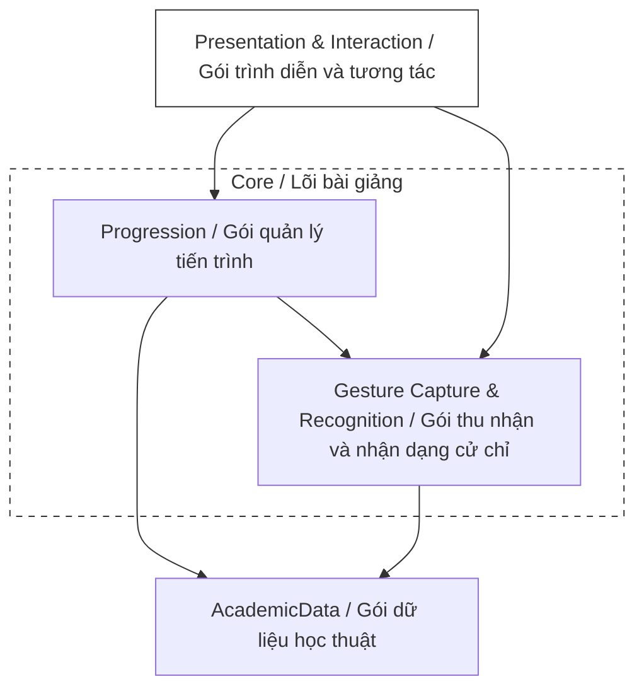
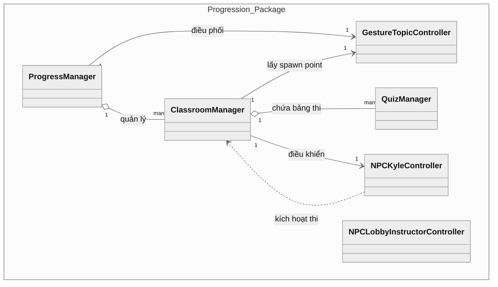
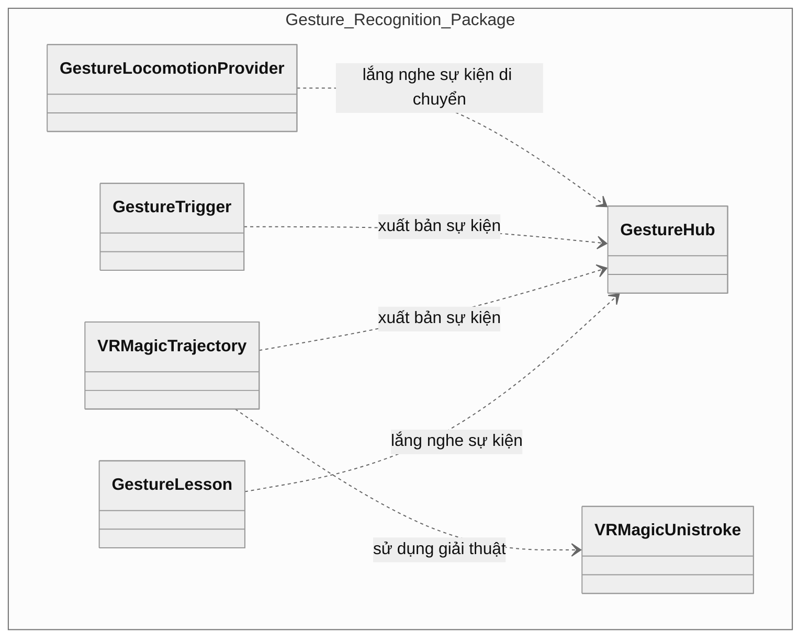
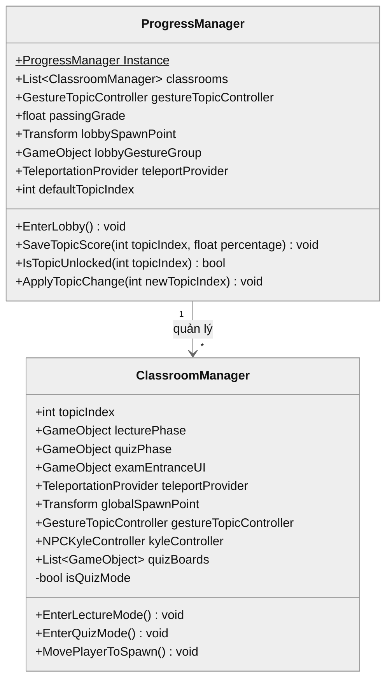
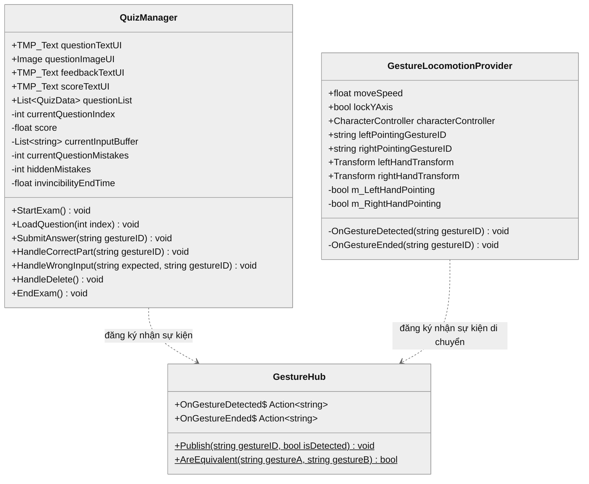
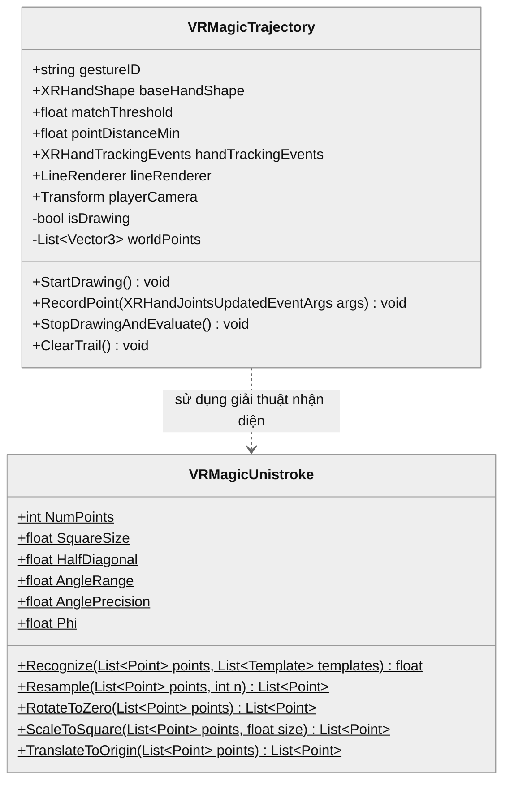
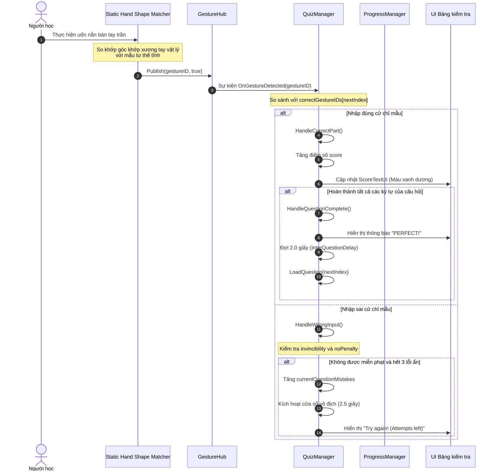
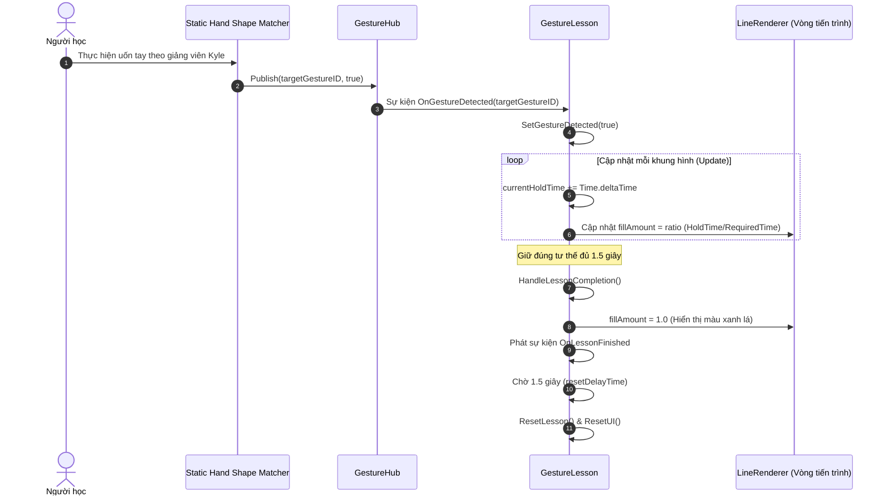
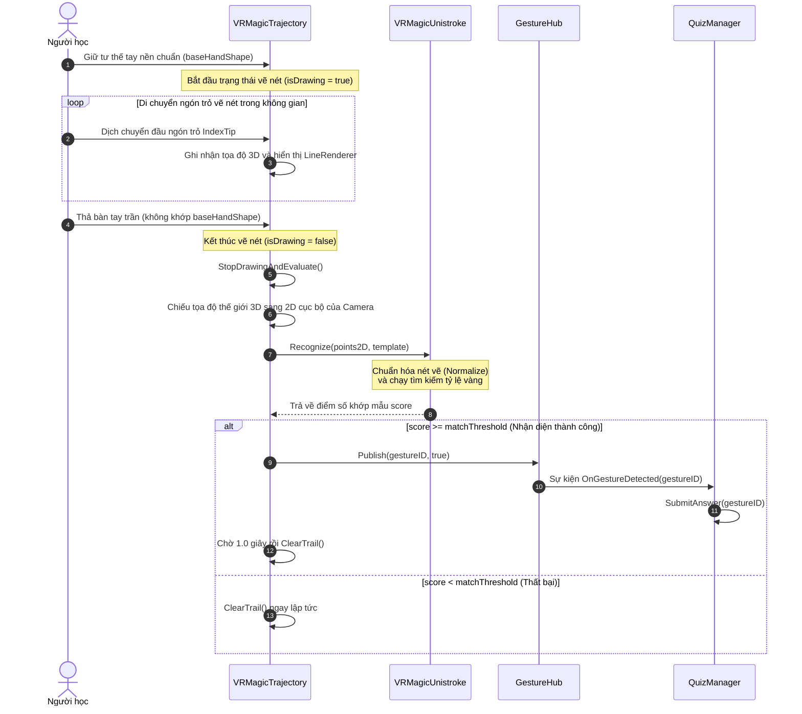

# CHƯƠNG 5. THỰC NGHIỆM VÀ ĐÁNH GIÁ

## 5.1 Thiết kế kiến trúc

### 5.1.1 Lựa chọn kiến trúc phần mềm

Hệ thống bài giảng tương tác Ngôn ngữ ký hiệu Mỹ trong Thực tế ảo (ASL VR) được xây dựng dựa trên mô hình Kiến trúc dựa trên thành phần (Component-Based Architecture), một phương pháp tiếp cận phổ biến và được hỗ trợ tự nhiên bởi môi trường phát triển Unity Engine. Nguyên tắc cốt lõi của kiến trúc này là xây dựng các đối tượng (GameObjects) bằng cách tổng hợp từ nhiều thành phần độc lập (Components), mỗi thành phần đóng gói một logic hoặc tập dữ liệu cụ thể. Để tách biệt rõ ràng giữa xử lý logic nghiệp vụ và giao diện trình diễn, đồng thời tối ưu hóa tính năng tương tác hand tracking, hệ thống được tinh chỉnh và phân chia thành bốn lớp logic chính hoạt động độc lập nhằm phân tách các mối quan tâm khác nhau.

Lớp Dữ liệu Học thuật (Academic Data Layer) chịu trách nhiệm lưu trữ và định nghĩa toàn bộ nội dung giáo trình, bao gồm danh sách từ vựng ký hiệu và hệ thống câu hỏi kiểm tra dưới dạng dữ liệu tĩnh. Ý nghĩa cốt lõi của lớp này là tách rời hoàn toàn phần nội dung bài học ra khỏi logic lập trình. Điều này giúp cho việc cập nhật, bổ sung học liệu hoặc mở rộng thêm các bài giảng mới trong tương lai có thể thực hiện một cách nhanh chóng và linh hoạt trực tiếp trên môi trường Unity mà không cần phải can thiệp hay thay đổi mã nguồn của ứng dụng.

Lớp Thu thập và Nhận dạng Cử chỉ (Gesture Capture & Recognition Layer) đóng vai trò thu nhận chuyển động của xương bàn tay từ cảm biến camera của thiết bị thực tế ảo và thực hiện nhận dạng các cử chỉ tay tĩnh hoặc động trong không gian. Ý nghĩa của lớp này là chuyển đổi các hành động vật lý tự nhiên của người học thành các tín hiệu cử chỉ có cấu trúc. Lớp này đóng gói toàn bộ các thuật toán xử lý khớp xương và quỹ đạo chuyển động phức tạp, cung cấp dữ liệu nhận diện đồng nhất và ổn định để các lớp logic cấp cao hơn có thể hiểu và xử lý.

Lớp Điều khiển và Quản lý Tiến trình (Control & Progression Layer) đóng vai trò là bộ não điều hành toàn bộ logic sư phạm, lưu trữ kết quả và điều phối trạng thái của phòng học ảo. Ý nghĩa của lớp này là quản lý vòng đời của bài học, kiểm tra điều kiện mở khóa bài mới dựa trên kết quả tự học, và vận hành cơ chế thi cử với các quy tắc sư phạm hỗ trợ. Lớp này giúp kết nối dữ liệu tĩnh của bài học với các phản hồi sư phạm thực tế, tạo ra một lộ trình học tập có cấu trúc và có tính tương tác cao cho người học.

Lớp Trình diễn và Tương tác (Presentation & Interaction Layer) chịu trách nhiệm hiển thị giao diện đồ họa trực quan, các phản hồi hình ảnh thời gian thực và xử lý di chuyển thực tế ảo. Ý nghĩa của lớp này là tối ưu hóa trải nghiệm tương tác trực quan của người học trong không gian ba chiều, giúp hiển thị tiến trình học trên cổ tay, thể hiện các hoạt ảnh hướng dẫn sinh động của giảng viên ảo, và cung cấp cơ chế di chuyển tự nhiên bằng cử chỉ tay trần để tăng cường tính chân thực và sự tập trung.

---

### 5.1.2 Thiết kế tổng quan

Biểu đồ gói dưới đây mô tả kiến trúc tổng quan của ứng dụng ASL VR, được phân chia thành các gói (package) logic và gom nhóm theo vai trò lõi hoặc ngoại vi của hệ thống bài giảng:



### 5.1.3 Thiết kế chi tiết gói

Biểu đồ thiết kế chi tiết các lớp cốt lõi và mối quan hệ tương tác của từng gói lập trình chính trong hệ thống được trình bày cụ thể dưới đây:

#### a, Gói Progression (Quản lý tiến trình)

> **Hình 5.2:** _Thiết kế chi tiết của Gói Progression (Quản lý tiến trình)_



Đây là gói quan trọng nhất giúp điều hành tiến trình học tập của người học và quản lý toàn bộ các phòng học ảo cùng hệ thống thi trắc nghiệm và các nhân vật hướng dẫn ảo. Lớp ProgressManager giữ vai trò trung tâm, quản lý trạng thái tổng thể của tiến trình học tập, lưu trữ điểm số cao nhất của người học thông qua PlayerPrefs và điều phối việc mở khóa chủ đề tiếp theo dựa trên điểm đạt được.

Lớp ClassroomManager chịu trách nhiệm quản lý vòng đời và các giai đoạn học tập của mỗi phòng học ảo chuyên đề cụ thể, bao gồm việc chuyển đổi giữa giai đoạn học lý thuyết (Lecture Phase) và giai đoạn thi trắc nghiệm (Quiz Phase). Lớp GestureTopicController điều khiển việc bật tắt các nhóm cử chỉ nhận diện tĩnh theo từng chủ đề học tập để đảm bảo tối ưu hiệu năng và độ chính xác của hệ thống nhận diện.

Lớp QuizManager điều phối toàn bộ quá trình thi cử của phòng học ảo, nạp danh sách câu hỏi kiểm tra, tiếp nhận các sự kiện cử chỉ đáp án của người học thông qua bộ trung chuyển sự kiện GestureHub để thực hiện chấm điểm tự động và áp dụng các cơ chế trò chơi hóa như cửa sổ vô địch và lượt phạt.

Các nhân vật hướng dẫn ảo đóng vai trò hỗ trợ đắc lực và là một phần không thể tách rời của ClassroomManager. Lớp NPCKyleController điều khiển giảng viên ảo Kyle thực hiện các hoạt ảnh vẫy tay chào khi người học bước vào phòng học, suy nghĩ khi người học thực hành và vỗ tay khích lệ khi hoàn thành bài học. Lớp NPCLobbyInstructorController điều khiển nhân vật hướng dẫn tại sảnh hành lang để chào đón và đưa ra lời giới thiệu ban đầu cho người học.

#### b, Gói Gesture Recognition (Nhận dạng cử chỉ)

> **Hình 5.3:** _Thiết kế chi tiết của Gói Gesture Recognition (Nhận dạng cử chỉ)_



Đây là gói nền tảng chịu trách nhiệm thu nhận dữ liệu khớp xương tay, thực hiện nhận dạng các cử chỉ tĩnh, động và điều khiển di chuyển bằng tay trần của người học. Lớp GestureHub giữ vai trò trung tâm hoạt động như một bộ trung chuyển sự kiện, cung cấp sự kiện tĩnh OnGestureDetected để tất cả các thành phần khác có thể đăng ký lắng nghe và phản hồi khi có cử chỉ tương ứng.

Lớp GestureLesson lắng nghe các cử chỉ học tập cụ thể để kiểm tra thời gian giữ đúng tư thế (Hold Time) và cập nhật vòng tiến trình thời gian thực. Lớp VRMagicTrajectory chịu trách nhiệm thu nhận chuyển động ngón trỏ để vẽ nét và nhận diện cử chỉ động cho chữ J và Z.

Lớp VRMagicUnistroke cung cấp thuật toán nhận diện nét vẽ 2D Unistroke, tính toán điểm số khớp mẫu so với các quỹ đạo mẫu được lưu trữ. Lớp GestureTrigger cho phép kích hoạt các sự kiện cử chỉ khi bàn tay người học tương tác vật lý với các vùng không gian xác định. Lớp GestureLocomotionProvider chịu trách nhiệm di chuyển người học trong không gian ảo bằng cách lắng nghe các tín hiệu cử chỉ chỉ tay từ GestureHub thay vì trực tiếp truy cập và kiểm tra các khớp tay từ SDK để kích hoạt di chuyển mượt mà (Smooth Locomotion).

---

## 5.2 Thiết kế chi tiết

### 5.2.1 Thiết kế lớp

Để làm rõ phương thức hoạt động, cấu trúc thuộc tính, phương thức xử lý và mối liên hệ tương tác giữa các thực thể phần mềm trong hệ thống bài giảng ASL VR, mục này trình bày chi tiết thiết kế lớp theo từng nhóm (batch) chức năng cốt lõi.

#### a, Nhóm lớp điều phối tiến trình và quản lý phòng học ảo

Nhóm lớp này đóng vai trò điều phối tổng thể tiến trình học tập của người học, mở khóa bài học mới và quản lý vòng đời hoạt động của từng phòng học chuyên đề tương ứng.

> **Hình 5.4:** _Sơ đồ lớp ProgressManager và ClassroomManager_



Lớp ProgressManager (Hình 5.4) là lớp Singleton trung tâm, đóng vai trò là bộ não điều hành toàn bộ vòng đời và tiến trình học tập của ứng dụng ASL VR. Để bảo đảm tính duy nhất và cung cấp giao diện truy cập toàn cục cho các thành phần khác, lớp này sử dụng thuộc tính tĩnh Instance. Nó chứa các tham chiếu quan trọng như danh sách classrooms của các phòng học chuyên đề, đối tượng lobbyGestureGroup để bật tắt cử chỉ tại sảnh, và teleportProvider để thực hiện dịch chuyển người học. Lớp này quản lý tiến trình của người học bằng cách so sánh điểm số cao nhất của chủ đề trước được lưu trong bộ nhớ thiết bị PlayerPrefs với ngưỡng điểm đạt passingGrade. Các phương thức chính bao gồm EnterLobby() để reset trạng thái và đưa người học về sảnh chính, IsTopicUnlocked() để xác thực quyền mở khóa phòng học mới, và ApplyTopicChange() để thực thi các thiết lập khi học viên chuyển chủ đề học.

Lớp ClassroomManager (Hình 5.4) chịu trách nhiệm quản lý vòng đời và trạng thái hoạt động của một phòng học chuyên đề cụ thể trong hệ thống. Lớp này lưu trữ chỉ số chủ đề topicIndex và các tham chiếu đến các đối tượng tương ứng với từng giai đoạn học tập như lecturePhase (giai đoạn lý thuyết), quizPhase (giai đoạn làm bài kiểm tra) và examEntranceUI (giao diện bảng kích hoạt bài thi). Nó cũng quản lý các đối tượng giao diện bảng thi trong danh sách quizBoards và thực thể giảng viên ảo kyleController. Lớp này cung cấp các phương thức công khai như EnterLectureMode() để bắt đầu giai đoạn học lý thuyết và vẫy tay chào người học, và EnterQuizMode() để kích hoạt giai đoạn làm bài thi trắc nghiệm. Sự phối hợp giữa ProgressManager và ClassroomManager giúp hệ thống phân tách rõ ràng trách nhiệm quản lý tổng thể của sảnh chung và logic nội bộ của từng phòng học chuyên đề.

#### b, Nhóm lớp quản lý thi cử và truyền thông tin cử chỉ tĩnh

Nhóm lớp này vận hành quy tắc thi trắc nghiệm, chấm điểm tự động, truyền tín hiệu nhận diện cử chỉ và xử lý di chuyển của người học bằng tay trần.

> **Hình 5.5:** _Sơ đồ lớp QuizManager, GestureHub và GestureLocomotionProvider_



Lớp QuizManager (Hình 5.5) chịu trách nhiệm vận hành toàn bộ logic của một bài thi trắc nghiệm ký hiệu ASL. Lớp này nắm giữ các thành phần hiển thị giao diện UI bảng thi như questionTextUI, questionImageUI, feedbackTextUI và scoreTextUI. Nó lưu trữ danh sách câu hỏi questionList và quản lý trạng thái thi của người học qua các thuộc tính private như currentQuestionIndex, điểm số score, bộ đệm ký tự đã nhập đúng currentInputBuffer, và các thuộc tính hỗ trợ luật sư phạm bao gồm currentQuestionMistakes (chỉ số lỗi phạt chính thức), hiddenMistakes (số lỗi sai ẩn) và invincibilityEndTime (thời điểm kết thúc cửa sổ vô địch). Các phương thức chính bao gồm StartExam() để khởi tạo bài thi, LoadQuestion() để tải câu hỏi lên bảng, SubmitAnswer() để đối chiếu cử chỉ nhận diện với đáp án, HandleCorrectPart() để xử lý khi người học làm đúng và HandleWrongInput() để xử lý khi người học làm sai theo quy tắc giảm lỗi và miễn phạt.

Lớp GestureHub (Hình 5.5) hoạt động như một trung tâm điều phối sự kiện tĩnh (Static Event Hub), đóng vai trò trung gian truyền tín hiệu cử chỉ giữa hệ thống nhận diện và các hệ thống ứng dụng khác mà không gây ràng buộc trực tiếp (coupling). Lớp này khai báo hai sự kiện tĩnh công khai là OnGestureDetected và OnGestureEnded. Khi một cử chỉ được nhận diện hoặc kết thúc nhận diện, phương thức Publish() sẽ được gọi để kích hoạt sự kiện tương ứng và phát đi mã cử chỉ gestureID. Ngoài ra, lớp này còn cung cấp phương thức tĩnh AreEquivalent() để chuẩn hóa và gom nhóm các cử chỉ có hình dáng tương đương (như các biến thể nắm đấm M, N, T, S, E), giúp nâng cao độ chính xác của hệ thống nhận diện.

Lớp GestureLocomotionProvider (Hình 5.5) chịu trách nhiệm di chuyển người học trong không gian ảo bằng cử chỉ tay trần theo nguyên lý đơn nhiệm (SRP) và đảo ngược phụ thuộc (DIP). Nó định nghĩa hai thuộc tính định danh cử chỉ di chuyển là leftPointingGestureID (mặc định Pointing_Left) và rightPointingGestureID (mặc định Pointing_Right) cùng các tham chiếu hướng leftHandTransform, rightHandTransform và CharacterController để di chuyển người học. Thay vì truy cập trực tiếp SDK XR Hands, lớp này đăng ký nhận sự kiện tĩnh từ GestureHub.OnGestureDetected và GestureHub.OnGestureEnded trong phương thức OnEnable() và hủy đăng ký trong OnDisable(). Khi nhận diện được cả hai tay cùng thực hiện cử chỉ chỉ tay trỏ về phía trước, biến trạng thái m_LeftHandPointing và m_RightHandPointing sẽ là true, và trong Update() lớp sẽ thực thi di chuyển người học theo hướng trung bình của hai tay.

#### c, Nhóm lớp thu thập và nhận diện cử chỉ động vẽ nét

Nhóm lớp này thu thập tọa độ di chuyển của đầu ngón trỏ, hiển thị nét vẽ động 3D và chuẩn hóa quỹ đạo để thực thi thuật toán nhận dạng 2D Unistroke.

> **Hình 5.6:** _Sơ đồ lớp VRMagicTrajectory và lớp VRMagicUnistroke_



Lớp VRMagicTrajectory (Hình 5.6) là thành phần chịu trách nhiệm thu thập tọa độ và điều khiển vẽ quỹ đạo nét vẽ trong không gian 3D của ngón trỏ để nhận diện các ký hiệu động. Lớp này kế thừa từ MonoBehaviour và lưu trữ các cấu hình như gestureID, tư thế tay kích hoạt vẽ baseHandShape, ngưỡng nhận dạng matchThreshold và khoảng cách tối thiểu giữa hai điểm vẽ pointDistanceMin. Nó chứa các tham chiếu trực quan bao gồm lineRenderer để hiển thị nét vẽ 3D và playerCamera để chiếu tọa độ. Khi nhận sự kiện từ handTrackingEvents khớp với baseHandShape, phương thức StartDrawing() sẽ được kích hoạt để bắt đầu quá trình ghi nhận tọa độ đầu ngón trỏ vào danh sách worldPoints thông qua RecordPoint(). Khi người học hạ tay kết thúc vẽ, StopDrawingAndEvaluate() được gọi để chuyển đổi quỹ đạo 3D thành 2D trên không gian local của camera và chuyển dữ liệu sang lớp VRMagicUnistroke để tính điểm.

Lớp VRMagicUnistroke (Hình 5.6) là một lớp tiện ích phi hành vi (non-MonoBehaviour) thực thi thuật toán nhận dạng nét vẽ 2D Unistroke độc lập. Lớp này chứa các hằng số cấu hình thuật toán như số điểm chuẩn hóa NumPoints, kích thước hộp SquareSize và tỉ lệ vàng Phi để tìm kiếm góc tối ưu. Phương thức tĩnh Recognize() của lớp tiếp nhận danh sách các điểm vẽ 2D từ VRMagicTrajectory, sau đó thực hiện chuỗi tiền xử lý chuẩn hóa bao gồm Resample() (nội suy đều số điểm vẽ thành 64 điểm), RotateToZero() (xoay nét vẽ về góc không độ chuẩn để loại bỏ sai lệch hướng), ScaleToSquare() (co giãn tỉ lệ nét vẽ về kích thước hộp vuông tiêu chuẩn) và TranslateToOrigin() (dịch tâm nét vẽ về tọa độ gốc). Sau khi chuẩn hóa, nét vẽ được so khớp khoảng cách Euclid với danh sách các mẫu chữ cái lưu sẵn để tính ra điểm số khớp cao nhất và phản hồi lại cho bộ lọc.

---

#### d, Sơ đồ hoạt động truyền thông điệp (Sequence Diagrams)

Để minh họa luồng xử lý thông điệp thời gian thực giữa các lớp đối tượng, dưới đây là biểu đồ trình tự của ba Use Case cốt lõi trong hệ thống:

##### Use Case 1: Học viên thực hiện bài kiểm tra và trả lời câu hỏi tĩnh

Biểu đồ mô tả quy trình khi người học thực hiện uốn nắn bàn tay trần để trả lời một câu hỏi nhận diện tư thế tay tĩnh trên bảng thi:



##### Use Case 2: Học viên thực hành uốn tay trong chế độ học lý thuyết

Biểu đồ mô tả quy trình giữ tư thế tay theo hướng dẫn của giảng viên Kyle để hoàn thành một bài học thực hành:



##### Use Case 3: Người học thực hiện vẽ chữ cái động J hoặc Z trên không gian

Biểu đồ mô tả quy trình thu thập tọa độ ngón trỏ, chiếu lên mặt phẳng camera và chạy giải thuật so khớp quỹ đạo nét vẽ:



---

### 5.2.2 Thiết kế cơ sở dữ liệu

Vì hệ thống bài giảng tương tác ASL VR được thiết kế để vận hành độc lập trực tiếp trên thiết bị kính Meta Quest 2 mà không yêu cầu kết nối mạng liên tục, cơ sở dữ liệu của hệ thống được tối giản hóa tối đa nhằm tối ưu hiệu năng và độ trễ truy cập dữ liệu. Hệ thống sử dụng PlayerPrefs – cơ chế lưu trữ dữ liệu dạng khóa-giá trị (Key-Value) nội bộ của Unity – để lưu trữ và quản lý điểm số tiến trình của người học một cách an toàn và bền vững.

#### a, Thiết kế bảng dữ liệu lưu trữ

Cấu trúc lưu trữ dữ liệu điểm số các chủ đề học tập được đặc tả qua bảng sơ đồ thuộc tính dưới đây:

| Tên Khóa (Key Name) | Kiểu dữ liệu | Giá trị hợp lệ | Ý nghĩa / Giải thích                                                                                |
| :------------------ | :----------: | :------------: | :-------------------------------------------------------------------------------------------------- |
| **Topic_0_Score**   |    float     |  0.0 - 100.0   | Điểm số phần trăm cao nhất đạt được tại phòng thi chủ đề Bảng chữ cái (Alphabets). Mặc định bằng 0. |
| **Topic_1_Score**   |    float     |  0.0 - 100.0   | Điểm số phần trăm cao nhất đạt được tại phòng thi chủ đề Chữ số (Numbers). Mặc định bằng 0.         |
| **Topic_2_Score**   |    float     |  0.0 - 100.0   | Điểm số phần trăm cao nhất đạt được tại phòng thi chủ đề Hội thoại (Greetings). Mặc định bằng 0.    |

> **Bảng 5.1:** _Đặc tả cấu trúc khóa lưu trữ dữ liệu tiến trình học tập_

#### b, Logic đồng bộ hóa và mở khóa chủ đề

Sơ đồ ánh xạ logic dưới đây mô tả cách lớp ProgressManager truy vấn cơ sở dữ liệu nội bộ để xác định điều kiện mở khóa phòng học mới:

```mermaid
graph LR
    subgraph Storage [Thiết bị lưu trữ nội bộ]
        db[(PlayerPrefs Key-Value)]
    end

    subgraph Manager [Lớp ProgressManager]
        check{IsTopicUnlocked?}
        score[GetHighestScore(topicIndex - 1)]
        pass[passingGrade = 80%]
    end

    subgraph TargetRoom [Phòng học mục tiêu]
        action[ApplyTopicChange]
        unlocked((Bật cửa phòng học & Dịch chuyển))
        locked((Cửa đóng & Báo lỗi khóa))
    end

    db -->|Đọc khóa Topic_X_Score| score
    score --> check
    pass --> check
    check -->|Điểm số >= 80%| unlocked
    check -->|Điểm số < 80%| locked
    unlocked --> action
```

Mỗi khi người học hoàn thành bài thi tại QuizManager, điểm số phần trăm mới sẽ được so sánh với giá trị tốt nhất hiện tại. Nếu điểm số mới cao hơn, phương thức SaveTopicScore sẽ thực hiện lưu đè giá trị mới vào PlayerPrefs và gọi hàm Save để ghi nhận vĩnh viễn vào bộ nhớ flash của kính VR, đảm bảo tiến trình tự học của người học không bị mất khi tắt ứng dụng hoặc khởi động lại thiết bị.

---

## 5.3 Xây dựng ứng dụng

### 5.3.1 Thư viện và công cụ sử dụng

Dưới đây là danh sách chi tiết các công cụ phần mềm, ngôn ngữ lập trình, bộ phát triển phần mềm (Software Development Kit - SDK) và thư viện liên kết được sử dụng xuyên suốt quá trình xây dựng bài giảng tương tác ASL VR:

| Mục đích                     | Công cụ / Thư viện     | Phiên bản   | Địa chỉ URL                                                |
| :--------------------------- | :--------------------- | :---------- | :--------------------------------------------------------- |
| **Môi trường phát triển**    | Unity Editor           | 2022.3.50f1 | unity.com                                                  |
| **Trình soạn thảo mã nguồn** | Visual Studio Code     | 1.85        | code.visualstudio.com                                      |
| **Giao tiếp kính VR**        | OpenXR Plugin          | 1.10.0      | docs.unity3d.com/Packages/com.unity.xr.openxr              |
| **Theo dõi bàn tay**         | Unity XR Hands         | 1.4.3       | docs.unity3d.com/Packages/com.unity.xr.hands               |
| **Tương tác thực tế ảo**     | XR Interaction Toolkit | 2.5.2       | docs.unity3d.com/Packages/com.unity.xr.interaction.toolkit |
| **Hiển thị văn bản 3D**      | TextMesh Pro           | 3.0.6       | docs.unity3d.com/Packages/com.unity.textmeshpro            |

> **Bảng 5.2:** _Danh sách thư viện và công cụ sử dụng_

---

### 5.3.2 Kết quả đạt được

Quá trình phát triển đã xây dựng thành công ứng dụng bài giảng tương tác ASL VR hoàn chỉnh dưới dạng tệp cài đặt chạy trực tiếp trên thiết bị kính. Mã nguồn được tổ chức chặt chẽ thành 3 gói chính như đã thiết kế ở phần thiết kế kiến trúc, mỗi gói đóng gói một nhóm chức năng chuyên biệt:

1. **GestureRecognition_Package:** Chứa toàn bộ logic nhận diện các cử chỉ tay tĩnh, động, bộ trung chuyển sự kiện và cơ chế di chuyển bằng tay trần (bao gồm các lớp GestureHub, GestureLesson, TrajectoryRecognizer, UnistrokeRecognizer, GestureTrigger và GestureLocomotionProvider). Gói này có tính mô-đun hóa cao, có thể tái sử dụng trực tiếp cho các dự án thực tế ảo khác có yêu cầu tương tác và di chuyển bằng tay trần.
2. **Progression_Package:** Quản lý tiến trình học tập tổng thể, lưu trữ điểm số, trạng thái phòng học ảo, cơ chế thi cử trắc nghiệm và hoạt ảnh phản hồi của các nhân vật hướng dẫn ảo (bao gồm các lớp ProgressManager, ClassroomManager, QuizManager, NPCKyleController, NPCLobbyInstructorController cùng các lớp dữ liệu học thuật PracticeData và QuizData).
3. **PresentationInteraction_Package:** Quản lý giao diện bảng đeo cổ tay của người học, camera hướng về giao diện người dùng và các tiện ích tùy biến trong editor (bao gồm các lớp WristDashboardUI, WristFollower, UIFaceCamera và RefineWristDashboard).

Dưới đây là bảng thông số thống kê chi tiết về số lượng lớp, số lượng dòng code (Lines of Code - LOC) và dung lượng mã nguồn của từng gói logic trong dự án:

| Tên gói (Package Name)              | Số lượng lớp | Số dòng code (LOC) | Kích thước gói |
| :---------------------------------- | :----------: | :----------------: | :------------: |
| **GestureRecognition_Package**      |      6       |        781         |    24,0 KB     |
| **Progression_Package**             |      8       |       1.233        |    45,0 KB     |
| **PresentationInteraction_Package** |      4       |        355         |    13,6 KB     |
| **Tổng cộng**                       |    **18**    |     **2.369**      |  **82,6 KB**   |

> **Bảng 5.3:** _Thông số chi tiết các gói mã nguồn của ứng dụng_

Việc module hóa sâu sắc các gói mã nguồn giúp tổng thể ứng dụng đạt hiệu suất xử lý tối ưu, dễ bảo trì và mở rộng thêm nhiều phòng học chuyên đề hoặc từ vựng mới trong tương lai mà không làm ảnh hưởng đến cấu trúc nền tảng của hệ thống.
