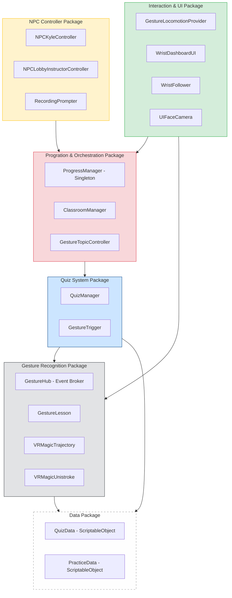
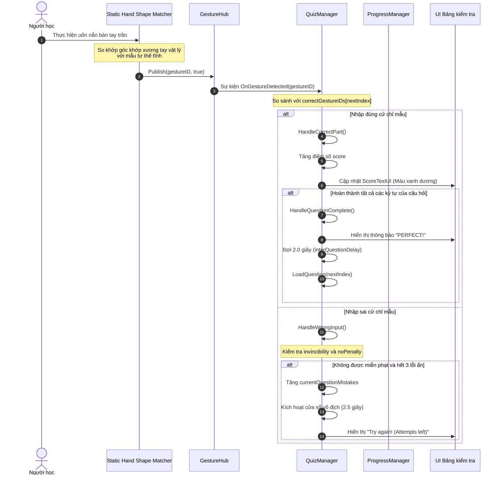
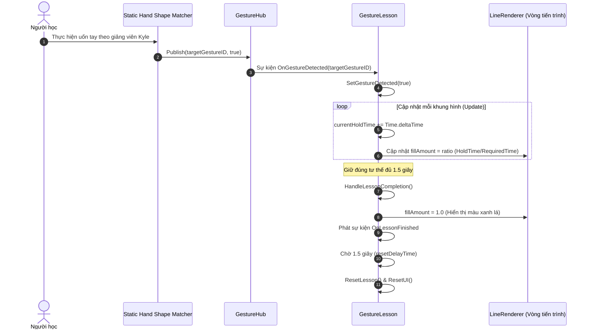
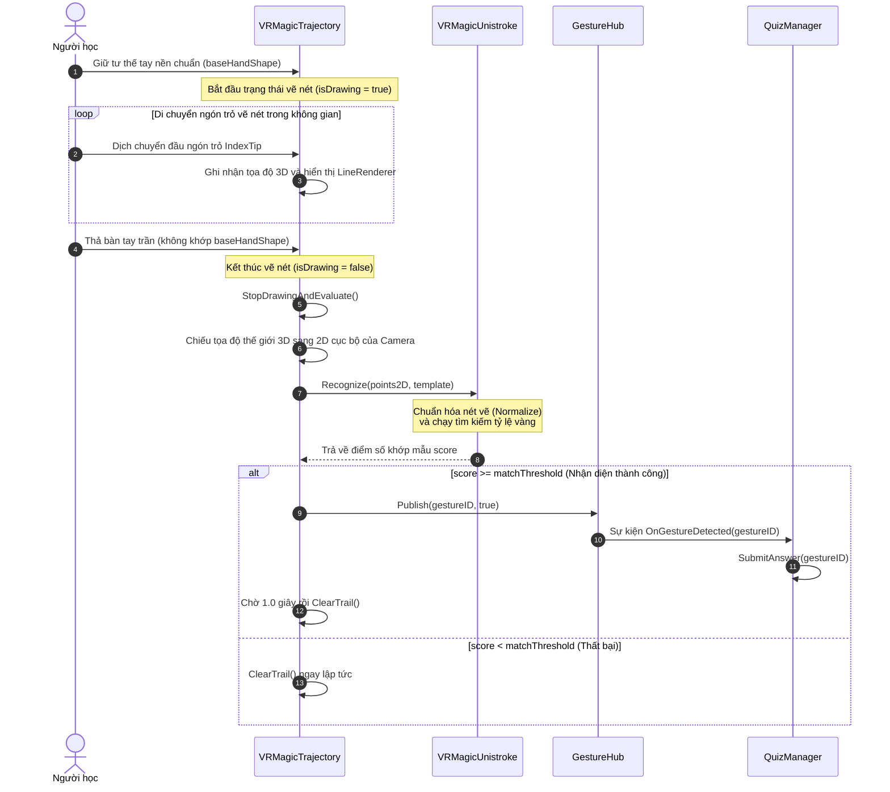

# CHƯƠNG 5. THỰC NGHIỆM VÀ ĐÁNH GIÁ

## 5.1 Thiết kế kiến trúc

### 5.1.1 Lựa chọn kiến trúc phần mềm

Hệ thống bài giảng tương tác Ngôn ngữ ký hiệu Mỹ trong Thực tế ảo (ASL VR) được xây dựng dựa trên mô hình Kiến trúc dựa trên thành phần (Component-Based Architecture), một phương pháp tiếp cận phổ biến và được hỗ trợ tự nhiên bởi môi trường phát triển Unity Engine. Nguyên tắc cốt lõi của kiến trúc này là xây dựng các đối tượng (GameObjects) bằng cách tổng hợp từ nhiều thành phần độc lập (Components), mỗi thành phần đóng gói một logic hoặc tập dữ liệu cụ thể. Để tách biệt rõ ràng giữa xử lý logic nghiệp vụ và giao diện trình diễn, đồng thời tối ưu hóa tính năng tương tác hand tracking, hệ thống được tinh chỉnh và phân chia thành bốn lớp logic chính hoạt động độc lập nhằm phân tách các mối quan tâm khác nhau.

Lớp Dữ liệu Học thuật (Academic Data Layer) chịu trách nhiệm định nghĩa các cấu trúc dữ liệu tĩnh phục vụ cho chương trình giảng dạy. Trái tim của lớp này bao gồm PracticeData dùng để lưu trữ từ vựng đích và chuỗi các cử chỉ tay cần thực hiện tuần tự và QuizData dùng để định nghĩa câu hỏi thi, hình ảnh ký hiệu mẫu, âm thanh phát âm và đáp án cử chỉ. Thiết kế này tách rời hoàn toàn nội dung bài học ra khỏi logic lập trình, cho phép bổ sung, chỉnh sửa học liệu trực tiếp từ Editor của Unity mà không cần biên dịch lại mã nguồn.

Lớp Thu thập và Nhận dạng Cử chỉ (Gesture Capture & Recognition Layer) có nhiệm vụ thu nhận dữ liệu 26 khớp xương tay của bàn tay vật lý từ cảm biến camera của thiết bị đeo đầu thông qua bộ công cụ Unity XR Hands. Lớp này xử lý nhận dạng qua hai kênh song song bao gồm nhận dạng tĩnh để so khớp các góc gập khớp ngón tay vật lý với các mẫu tư thế tay đã cấu hình sẵn (baseHandShape), và nhận dạng động sử dụng lớp VRMagicTrajectory để bắt tọa độ di chuyển của đầu ngón trỏ (IndexTip) khi người học uốn tay ở một tư thế nền nhất định. Toàn bộ cử chỉ nhận dạng thành công được đồng bộ và xuất bản thông qua lớp trung gian GestureHub hoạt động như một Bộ trung chuyển sự kiện bằng sự kiện tĩnh toàn cục (OnGestureDetected).

Lớp Điều khiển và Quản lý Tiến trình (Control & Progression Layer) là trung tâm điều hướng chính của hệ thống bài giảng, chịu trách nhiệm điều khiển toàn bộ logic sư phạm, lưu trữ tiến trình học tập của học viên và điều phối trạng thái phòng học ảo. Trong lớp này, lớp ProgressManager chịu trách nhiệm quản lý tiến trình tổng thể của người học, thực hiện lưu trữ điểm số cao nhất của mỗi chủ đề và kiểm tra điều kiện mở khóa và kích hoạt chuyển đổi chủ đề học. Lớp ClassroomManager quản lý vòng đời của từng phòng học ảo bao gồm Lecture Phase và Quiz Phase và kích hoạt bục dịch chuyển người học. Lớp GestureTopicController quản lý bật tắt các nhóm cử chỉ nhận diện của các chữ cái, chữ số hoặc câu chào tương ứng với chủ đề phòng học được kích hoạt. Lớp QuizManager quản lý quá trình thi cử, tự động nạp câu hỏi từ QuizData, kiểm tra đáp án gõ vào, xử lý gõ sai, đệm thời gian gõ sai và áp dụng các cơ chế trò chơi hóa (Gamification) để giảm áp lực phòng thi như lỗi sai ẩn (hiddenMistakes), thời gian vô địch (invincibilityDuration), miễn phạt (noPenaltyGestures). Lớp GestureLesson quản lý bài thực hành uốn tay của học viên trong chế độ học lý thuyết, tính toán thời gian người học giữ đúng cử chỉ tay theo mẫu và phát đi tín hiệu hoàn thành.

Lớp Trình diễn và Tương tác (Presentation & Interaction Layer) chịu trách nhiệm tương tác vật lý trực quan và hiển thị phản hồi đồ họa cho người học. Lớp GestureLocomotionProvider thực hiện di chuyển mượt mà cho người học trong môi trường 3D khi cả hai bàn tay cùng thực hiện cử chỉ chỉ tay trỏ về phía trước. Lớp WristDashboardUI xử lý giao diện bảng tiến trình học gắn trên cổ tay người học. Lớp NPCKyleController quản lý hoạt ảnh và máy trạng thái hành vi phản hồi của giảng viên ảo Kyle dựa trên Máy trạng thái hữu hạnbao gồm vẫy tay chào và vỗ tay khích lệ.

---

### 5.2.2 Thiết kế tổng quan

Mã nguồn của hệ thống tương tác ASL VR được tổ chức thành năm gói chính: GestureRecognition_Package, Orchestration_Package, QuizSystem_Package, InteractionLocomotion_Package, và NPC_Package. Cấu trúc này tuân thủ nguyên tắc thiết kế phân lớp, đảm bảo tính phụ thuộc một chiều từ các lớp tương tác, trình diễn cấp cao xuống các lớp xử lý logic cốt lõi và dữ liệu cấp thấp, giảm thiểu tối đa hiện tượng liên kết vòng.

Biểu đồ gói UML dưới đây mô tả cấu trúc phân rã các gói và mối quan hệ phụ thuộc giữa chúng:



- **GestureRecognition_Package:** Đóng vai trò là nền tảng nhận dạng và phân phối cử chỉ tay. Gói này cung cấp sự kiện tĩnh thông qua GestureHub để tất cả các gói khác đăng ký sử dụng.
- **QuizSystem_Package:** Quản lý logic chấm điểm, nạp dữ liệu thi. Gói này phụ thuộc vào GestureRecognition_Package để lấy đáp án cử chỉ nhập vào và phụ thuộc vào Data_Package để lấy nội dung câu hỏi.
- **Orchestration_Package:** Đóng vai trò điều phối tiến trình và trạng thái phòng học ảo. Gói này quản lý việc kích hoạt phòng học và giao tiếp với QuizSystem_Package để bắt đầu bài thi.
- **InteractionLocomotion_Package:** Quản lý tương tác UI của người chơi và cơ chế di chuyển trong thế giới 3D. Gói này phụ thuộc vào Orchestration_Package để lấy spawn point và cập nhật điểm số lên Wrist UI.
- **NPC_Package:** Điều khiển giảng viên Kyle, nhận các tín hiệu trạng thái từ Orchestration_Package để thay đổi trạng thái hoạt ảnh.

---

### 5.2.3 Thiết kế chi tiết gói

Biểu đồ lớp UML chi tiết dưới đây mô tả cấu trúc và mối quan hệ giữa các lớp cốt lõi thuộc ba gói quan trọng nhất trong hệ thống: Orchestration_Package, QuizSystem_Package và GestureRecognition_Package.

Thiết kế này thể hiện rõ ràng nguyên tắc hướng sự kiện để giảm liên kết chặt và thiết kế đơn thể để quản lý trạng thái tập trung:

```mermaid
classDiagram
    %% Gói Orchestration
    class ProgressManager {
        +static ProgressManager Instance
        +List~ClassroomManager~ classrooms
        +GestureTopicController gestureTopicController
        +float passingGrade
        +Transform lobbySpawnPoint
        +GameObject lobbyGestureGroup
        +TeleportationProvider teleportProvider
        +int defaultTopicIndex
        +EnterLobby() void
        +SaveTopicScore(int topicIndex, float percentage) void
        +GetHighestScore(int topicIndex) float
        +IsTopicUnlocked(int topicIndex) bool
        +ApplyTopicChange(int newTopicIndex) bool
    }

    class ClassroomManager {
        +int topicIndex
        +GameObject lecturePhase
        +GameObject quizPhase
        +GameObject examEntranceUI
        +TeleportationProvider teleportProvider
        +GestureTopicController gestureTopicController
        +NPCKyleController kyleController
        +List~GameObject~ quizBoards
        +EnterLectureMode() void
        +EnterQuizMode() void
        -MovePlayerToSpawn() void
    }

    class GestureTopicController {
        +List~TopicGroup~ topics
        +EnableTopicByIndex(int index) void
        +GetSpawnPointByIndex(int index) Transform
        +EnableTopic(string topicName) void
    }

    %% Gói Quiz System
    class QuizManager {
        +TMP_Text questionTextUI
        +Image questionImageUI
        +TMP_Text feedbackTextUI
        +TMP_Text scoreTextUI
        +GameObject examCanvas
        +int topicIndex
        +List~QuizData~ questionList
        +float interQuestionDelay
        +float interCharCooldown
        +string[] noPenaltyGestures
        +float invincibilityDuration
        +AudioSource audioSource
        +UnityEvent onExamFinished
        -int currentQuestionIndex
        -float score
        -bool isExamActive
        -List~string~ currentInputBuffer
        -int currentQuestionMistakes
        -int hiddenMistakes
        +StartExam() void
        +SubmitAnswer(string gestureID) void
        +HandleDelete() void
        -LoadQuestion(int index) void
        -HandleCorrectPart(string gestureID) void
        -HandleWrongInput(string expected, string gestureID) void
        -EndExam() void
    }

    %% Gói Gesture Recognition
    class GestureHub {
        +static event Action~string~ OnGestureDetected
        +static event Action~string~ OnGestureEnded
        +static Publish(string gestureID, bool isDetected) void
        +static AreEquivalent(string gestureA, string gestureB) bool
    }

    class GestureLesson {
        +Image progressRing
        +TMP_Text statusText
        +float requiredHoldTime
        +string targetGestureID
        +string defaultMessage
        +UnityEvent OnLessonFinished
        -float currentHoldTime
        -bool isGestureDetected
        +SetGestureDetected(bool detected) void
        -HandleGestureDetected(string id) void
    }

    class VRMagicTrajectory {
        +string gestureID
        +XRHandShape baseHandShape
        +float matchThreshold
        +LineRenderer lineRenderer
        +Transform playerCamera
        -bool isDrawing
        -List~Vector3~ worldPoints
        -StartDrawing() void
        -RecordPoint(XRHandJointsUpdatedEventArgs args) void
        -StopDrawingAndEvaluate() void
    }

    class VRMagicUnistroke {
        +const int NumPoints
        +const float SquareSize
        +static Recognize(List~Point~ points, Template template) float
        +static Normalize(List~Point~ points) List~Point~
    }

    %% Mối quan hệ giữa các lớp
    ProgressManager "1" o-- "many" ClassroomManager : quản lý
    ProgressManager "1" --> "1" GestureTopicController : điều phối
    ClassroomManager "1" --> "1" GestureTopicController : lấy spawn point
    ClassroomManager "1" o-- "many" QuizManager : chứa bảng thi

    QuizManager ..> GestureHub : lắng nghe sự kiện cử chỉ
    GestureLesson ..> GestureHub : lắng nghe sự kiện cử chỉ
    VRMagicTrajectory ..> GestureHub : xuất bản sự kiện cử chỉ
    VRMagicTrajectory --> VRMagicUnistroke : sử dụng giải thuật

    %% Annotation/Mối quan hệ kết hợp/phụ thuộc
    class TopicGroup {
        +string topicName
        +GameObject gestureGroupObject
        +Transform topicSpawnPoint
    }
    GestureTopicController +-- TopicGroup
```

---

## 5.3 Thiết kế chi tiết

### 5.3.1 Thiết kế lớp

Để làm rõ phương thức hoạt động và tương tác giữa các thực thể phần mềm trong bài giảng ASL VR, mục này trình bày chi tiết các thuộc tính và phương thức xử lý chính của ba lớp chủ đạo trong hệ thống, bao gồm QuizManager, VRMagicTrajectory và ProgressManager.

#### a, Lớp QuizManager

Lớp này chịu trách nhiệm điều phối toàn bộ quá trình thi cử của mỗi phòng học ảo, xử lý logic kiểm tra cử chỉ, cập nhật điểm số và áp dụng các cơ chế trò chơi hóa để giảm áp lực phòng thi cho học viên.

- **Các thuộc tính quan trọng:**
  - `questionTextUI`: Thành phần TMP_Text hiển thị nội dung câu hỏi hiện tại lên bảng thi 3D.
  - `questionImageUI`: Thành phần Image hiển thị hình ảnh ký hiệu hoặc sơ đồ gợi ý tương ứng.
  - `feedbackTextUI`: Thành phần TMP_Text hiển thị các phản hồi trực quan thời gian thực (như đúng, sai hoặc số lượt làm sai còn lại).
  - `scoreTextUI`: Thành phần TMP_Text hiển thị điểm số tích lũy của học viên.
  - `questionList`: Danh sách chứa các đối tượng câu hỏi QuizData nạp vào từ ScriptableObject.
  - `currentQuestionIndex`: Chỉ số nguyên đại diện cho câu hỏi hiện tại đang xử lý.
  - `score`: Giá trị thực lưu trữ điểm số tích lũy của người học trong bài thi hiện tại.
  - `currentInputBuffer`: Bộ đệm danh sách chuỗi ký tự chứa các cử chỉ đã nhập đúng của câu hỏi hiện tại (phục vụ cho chế độ đánh vần).
  - `currentQuestionMistakes`: Số lỗi phạt chính thức học viên đã mắc phải ở câu hỏi hiện tại (tối đa là 3 lỗi).
  - `hiddenMistakes`: Số lỗi gõ sai ẩn tích lũy (3 lỗi ẩn quy đổi thành 1 lỗi phạt chính thức).
  - `invincibilityEndTime`: Thời điểm kết thúc cửa sổ vô địch (sau khi mắc lỗi phạt đầu tiên, người học có 2.5 giây miễn phạt).
- **Các phương thức chính:**
  - `StartExam()`: Khởi động bài thi, reset điểm số và nạp câu hỏi đầu tiên.
  - `LoadQuestion(index: int)`: Tải dữ liệu câu hỏi từ danh sách theo chỉ số chỉ định, xóa bộ đệm nhập liệu và cập nhật giao diện hiển thị câu hỏi.
  - `SubmitAnswer(gestureID: string)`: Phương thức lắng nghe sự kiện từ GestureHub. Tiếp nhận cử chỉ tay của người học, kiểm tra điều kiện thời gian trễ giữa các ký tự, so sánh với đáp án mong muốn để quyết định xử lý đúng hoặc sai.
  - `HandleCorrectPart(gestureID: string)`: Xử lý khi học viên thực hiện đúng một ký tự hoặc từ mục tiêu. Cập nhật bộ đệm, tính toán điểm số cộng thêm và kiểm tra xem đã hoàn thành toàn bộ câu hỏi chưa.
  - `HandleWrongInput(expected: string, gestureID: string)`: Xử lý khi học viên thực hiện sai cử chỉ. Phương thức kiểm tra danh sách miễn phạt noPenaltyGestures và trạng thái cửa sổ vô địch. Nếu không thỏa mãn, tăng chỉ số lỗi ẩn. Khi lỗi ẩn đạt ngưỡng 3, tăng số lỗi phạt chính thức và kích hoạt cửa sổ vô địch.
  - `HandleDelete()`: Cho phép học viên xóa cử chỉ vừa nhập sai trong chuỗi đánh vần để nhập lại.
  - `EndExam()`: Kết thúc bài thi, tính toán phần trăm điểm đạt được, gửi kết quả về ProgressManager để lưu trữ và kích hoạt thông báo hoàn thành chủ đề.

#### b, Lớp VRMagicTrajectory

Lớp này chịu trách nhiệm thu nhận tọa độ chuyển động của ngón trỏ để vẽ nét trên không gian, chiếu tọa độ và kích hoạt thuật toán nhận diện cử chỉ động cho chữ J và Z.

- **Các thuộc tính quan trọng:**
  - `gestureID`: Chuỗi định danh chữ cái động cần nhận diện (J hoặc Z).
  - `baseHandShape`: Đối tượng XRHandShape cấu hình tư thế bàn tay trần chuẩn để kích hoạt trạng thái vẽ (ngón trỏ duỗi thẳng, các ngón khác nắm lại).
  - `matchThreshold`: Ngưỡng điểm số tối thiểu để công nhận nét vẽ khớp với mẫu (mặc định 0.3).
  - `lineRenderer`: Thành phần vẽ nét LineRenderer hiển thị quỹ đạo vẽ trực quan trong không gian 3D.
  - `playerCamera`: Transform tham chiếu camera của người học để làm mốc chiếu tọa độ.
  - `worldPoints`: Danh sách lưu trữ chuỗi các tọa độ 3D thu được từ đầu ngón trỏ trong không gian thế giới.
  - `isDrawing`: Trạng thái Boolean xác định người học có đang thực hiện thao tác vẽ nét hay không.
- **Các phương thức chính:**
  - `OnJointsUpdated(args: XRHandJointsUpdatedEventArgs)`: Lắng nghe sự kiện cập nhật vị trí khớp xương tay từ camera HMD. Kiểm tra xem tư thế bàn tay người học có khớp với baseHandShape hay không để bắt đầu hoặc kết thúc vẽ nét.
  - `StartDrawing()`: Khởi động trạng thái vẽ nét, dọn dẹp danh sách tọa độ cũ và bật hiển thị LineRenderer.
  - `RecordPoint(args: XRHandJointsUpdatedEventArgs)`: Truy xuất tọa độ đầu ngón trỏ IndexTip. Nếu khoảng cách dịch chuyển so với điểm liền trước vượt quá ngưỡng tối thiểu pointDistanceMin (1cm), ghi nhận tọa độ này vào worldPoints và cập nhật hiển thị nét vẽ.
  - `StopDrawingAndEvaluate()`: Dừng trạng thái vẽ nét. Chuyển đổi toàn bộ tọa độ thế giới 3D trong worldPoints thành tọa độ 2D trên mặt phẳng song song trước mắt camera camera-local space thông qua InverseTransformPoint, sau đó gửi danh sách điểm 2D này sang lớp VRMagicUnistroke để tính toán điểm số khớp mẫu. Nếu điểm số vượt quá matchThreshold, gọi GestureHub.Publish để phát đi sự kiện phát hiện thành công chữ cái động.
  - `ClearTrail()`: Tắt hiển thị nét vẽ và reset số điểm vẽ về không.

#### c, Lớp ProgressManager

Lớp quản lý đơn thể điều phối tiến trình mở khóa bài học và dịch chuyển người chơi giữa các không gian.

- **Các thuộc tính quan trọng:**
  - `Instance`: Thực thể đơn thể duy nhất để truy cập toàn cục.
  - `classrooms`: Danh sách các ClassroomManager quản lý trạng thái của từng phòng học chuyên đề tương ứng.
  - `gestureTopicController`: Lớp điều khiển bật tắt các nhóm cử chỉ nhận diện tĩnh theo từng chủ đề.
  - `passingGrade`: Điểm số tối thiểu để được công nhận Master và mở khóa chủ đề tiếp theo (mặc định 80%).
  - `lobbySpawnPoint`: Vị trí dịch chuyển xuất phát tại Sảnh hành lang chính.
- **Các phương thức chính:**
  - `EnterLobby()`: Tắt tất cả các phòng học ảo và nhóm cử chỉ nhận diện chuyên đề, chỉ bật nhóm cử chỉ mặc định của sảnh và dịch chuyển người học về sảnh chính.
  - `SaveTopicScore(topicIndex: int, percentage: float)`: Lưu trữ điểm số thi cao nhất của học viên ở chủ đề tương ứng vào bộ nhớ PlayerPrefs của thiết bị.
  - `IsTopicUnlocked(topicIndex: int)`: Kiểm tra xem chủ đề hiện tại có được mở khóa hay không bằng cách truy vấn điểm số cao nhất của chủ đề liền trước từ PlayerPrefs và so sánh với passingGrade.
  - `ApplyTopicChange(newTopicIndex: int)`: Thực hiện chuyển đổi phòng học ảo. Phương thức kiểm tra điều kiện mở khóa thông qua IsTopicUnlocked, tắt nhóm cử chỉ cũ, kích hoạt nhóm cử chỉ chuyên đề mới, kích hoạt GameObject của phòng học tương ứng và đưa phòng học vào Lecture Mode.

---

#### d, Sơ đồ hoạt động truyền thông điệp (Sequence Diagrams)

Để minh họa luồng xử lý thông điệp thời gian thực giữa các lớp đối tượng, dưới đây là biểu đồ trình tự của ba Use Case cốt lõi trong hệ thống:

##### Use Case 1: Học viên thực hiện bài kiểm tra và trả lời câu hỏi tĩnh

Biểu đồ mô tả quy trình khi người học thực hiện uốn nắn bàn tay trần để trả lời một câu hỏi nhận diện tư thế tay tĩnh trên bảng thi:



##### Use Case 2: Học viên thực hành uốn tay trong chế độ học lý thuyết

Biểu đồ mô tả quy trình giữ tư thế tay theo hướng dẫn của giảng viên Kyle để hoàn thành một bài học thực hành:



##### Use Case 3: Người học thực hiện vẽ chữ cái động J hoặc Z trên không gian

Biểu đồ mô tả quy trình thu thập tọa độ ngón trỏ, chiếu lên mặt phẳng camera và chạy giải thuật so khớp quỹ đạo nét vẽ:



---

### 5.3.2 Thiết kế cơ sở dữ liệu

Vì hệ thống bài giảng tương tác ASL VR được thiết kế để vận hành độc lập trực tiếp trên thiết bị kính Meta Quest 2 mà không yêu cầu kết nối mạng liên tục, cơ sở dữ liệu của hệ thống được tối giản hóa tối đa nhằm tối ưu hiệu năng và độ trễ truy cập dữ liệu. Hệ thống sử dụng PlayerPrefs – cơ chế lưu trữ dữ liệu dạng khóa-giá trị (Key-Value) nội bộ của Unity – để lưu trữ và quản lý điểm số tiến trình của người học một cách an toàn và bền vững.

#### a, Thiết kế bảng dữ liệu lưu trữ

Cấu trúc lưu trữ dữ liệu điểm số các chủ đề học tập được đặc tả qua bảng sơ đồ thuộc tính dưới đây:

| Tên Khóa (Key Name) | Kiểu dữ liệu | Giá trị hợp lệ | Ý nghĩa / Giải thích                                                                                |
| :------------------ | :----------: | :------------: | :-------------------------------------------------------------------------------------------------- |
| **Topic_0_Score**   |    float     |  0.0 - 100.0   | Điểm số phần trăm cao nhất đạt được tại phòng thi chủ đề Bảng chữ cái (Alphabets). Mặc định bằng 0. |
| **Topic_1_Score**   |    float     |  0.0 - 100.0   | Điểm số phần trăm cao nhất đạt được tại phòng thi chủ đề Chữ số (Numbers). Mặc định bằng 0.         |
| **Topic_2_Score**   |    float     |  0.0 - 100.0   | Điểm số phần trăm cao nhất đạt được tại phòng thi chủ đề Hội thoại (Greetings). Mặc định bằng 0.    |

> **Bảng 5.1:** _Đặc tả cấu trúc khóa lưu trữ dữ liệu tiến trình học tập_

#### b, Logic đồng bộ hóa và mở khóa chủ đề

Sơ đồ ánh xạ logic dưới đây mô tả cách lớp ProgressManager truy vấn cơ sở dữ liệu nội bộ để xác định điều kiện mở khóa phòng học mới:

```mermaid
graph LR
    subgraph Storage [Thiết bị lưu trữ nội bộ]
        db[(PlayerPrefs Key-Value)]
    end

    subgraph Manager [Lớp ProgressManager]
        check{IsTopicUnlocked?}
        score[GetHighestScore(topicIndex - 1)]
        pass[passingGrade = 80%]
    end

    subgraph TargetRoom [Phòng học mục tiêu]
        action[ApplyTopicChange]
        unlocked((Bật cửa phòng học & Dịch chuyển))
        locked((Cửa đóng & Báo lỗi khóa))
    end

    db -->|Đọc khóa Topic_X_Score| score
    score --> check
    pass --> check
    check -->|Điểm số >= 80%| unlocked
    check -->|Điểm số < 80%| locked
    unlocked --> action
```

Mỗi khi người học hoàn thành bài thi tại QuizManager, điểm số phần trăm mới sẽ được so sánh với giá trị tốt nhất hiện tại. Nếu điểm số mới cao hơn, phương thức SaveTopicScore sẽ thực hiện lưu đè giá trị mới vào PlayerPrefs và gọi hàm Save để ghi nhận vĩnh viễn vào bộ nhớ flash của kính VR, đảm bảo tiến trình tự học của người học không bị mất khi tắt ứng dụng hoặc khởi động lại thiết bị.

---

## 5.4 Xây dựng ứng dụng

### 5.4.1 Thư viện và công cụ sử dụng

Dưới đây là danh sách chi tiết các công cụ phần mềm, ngôn ngữ lập trình, bộ phát triển phần mềm (Software Development Kit - SDK) và thư viện liên kết được sử dụng xuyên suốt quá trình xây dựng bài giảng tương tác ASL VR:

| Mục đích                     | Công cụ / Thư viện     | Phiên bản   | Địa chỉ URL                                                |
| :--------------------------- | :--------------------- | :---------- | :--------------------------------------------------------- |
| **Môi trường phát triển**    | Unity Editor           | 2022.3.50f1 | unity.com                                                  |
| **Trình soạn thảo mã nguồn** | Visual Studio Code     | 1.85        | code.visualstudio.com                                      |
| **Giao tiếp kính VR**        | OpenXR Plugin          | 1.10.0      | docs.unity3d.com/Packages/com.unity.xr.openxr              |
| **Theo dõi bàn tay**         | Unity XR Hands         | 1.4.3       | docs.unity3d.com/Packages/com.unity.xr.hands               |
| **Tương tác thực tế ảo**     | XR Interaction Toolkit | 2.5.2       | docs.unity3d.com/Packages/com.unity.xr.interaction.toolkit |
| **Hiển thị văn bản 3D**      | TextMesh Pro           | 3.0.6       | docs.unity3d.com/Packages/com.unity.textmeshpro            |

> **Bảng 5.2:** _Danh sách thư viện và công cụ sử dụng_

---

### 5.4.2 Kết quả đạt được

Quá trình phát triển đã xây dựng thành công ứng dụng bài giảng tương tác ASL VR hoàn chỉnh dưới dạng tệp cài đặt chạy trực tiếp trên thiết bị kính. Mã nguồn được tổ chức chặt chẽ thành 5 gói chính như đã thiết kế ở phần thiết kế kiến trúc, mỗi gói đóng gói một nhóm chức năng chuyên biệt:

1. **GestureRecognition_Package:** Chứa toàn bộ logic nhận diện các cử chỉ tay tĩnh và động cùng bộ trung chuyển sự kiện. Gói này có tính mô-đun hóa cao, có thể tái sử dụng trực tiếp cho các dự án game thực tế ảo khác có yêu cầu tương tác tay trần.
2. **QuizSystem_Package:** Quản lý logic nạp câu hỏi, chấm điểm, áp dụng các cơ chế trò chơi hóa thi cử và điều khiển bảng thi 3D.
3. **Orchestration_Package:** Quản lý các trạng thái phòng học ảo, bục dịch chuyển và tiến trình mở khóa bài học dựa trên kết quả thi lưu trữ.
4. **InteractionLocomotion_Package:** Điều khiển cơ chế di chuyển rẽ hướng theo cử chỉ chỉ tay trỏ của người học và quản lý giao diện bảng đeo cổ tay.
5. **NPC_Package:** Quản lý hoạt ảnh và máy trạng thái hành vi phản hồi của giảng viên ảo Kyle.

Dưới đây là bảng thông số thống kê chi tiết về số lượng lớp, số lượng dòng code (Lines of Code - LOC) và dung lượng mã nguồn của từng gói logic trong dự án:

| Tên gói (Package Name)            | Số lượng lớp | Số dòng code (LOC) | Kích thước gói |
| :-------------------------------- | :----------: | :----------------: | :------------: |
| **GestureRecognition_Package**    |      5       |        526         |    18,0 KB     |
| **QuizSystem_Package**            |      3       |        488         |    24,0 KB     |
| **Orchestration_Package**         |      3       |        265         |    11,0 KB     |
| **InteractionLocomotion_Package** |      5       |        466         |    20,6 KB     |
| **NPC_Package**                   |      3       |        339         |    12,2 KB     |
| **Tổng cộng**                     |    **19**    |     **2.084**      |  **85,8 KB**   |

> **Bảng 5.3:** _Thông số chi tiết các gói mã nguồn của ứng dụng_

Việc module hóa sâu sắc các gói mã nguồn giúp tổng thể ứng dụng đạt hiệu suất xử lý tối ưu, dễ bảo trì và mở rộng thêm nhiều phòng học chuyên đề hoặc từ vựng mới trong tương lai mà không làm ảnh hưởng đến cấu trúc nền tảng của hệ thống.
