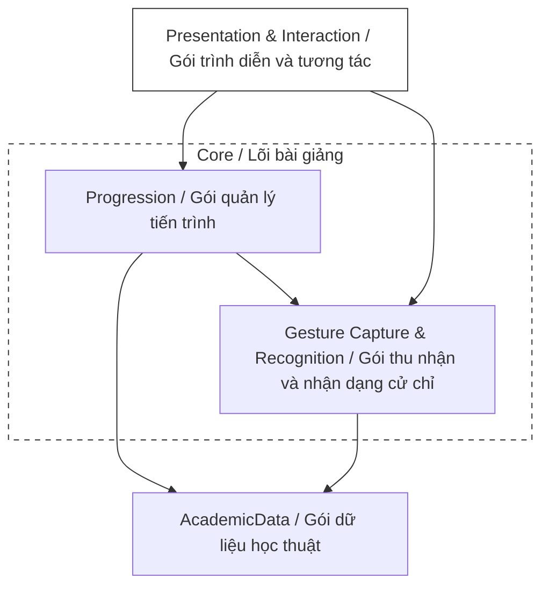
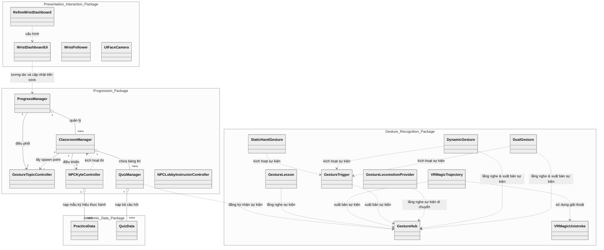
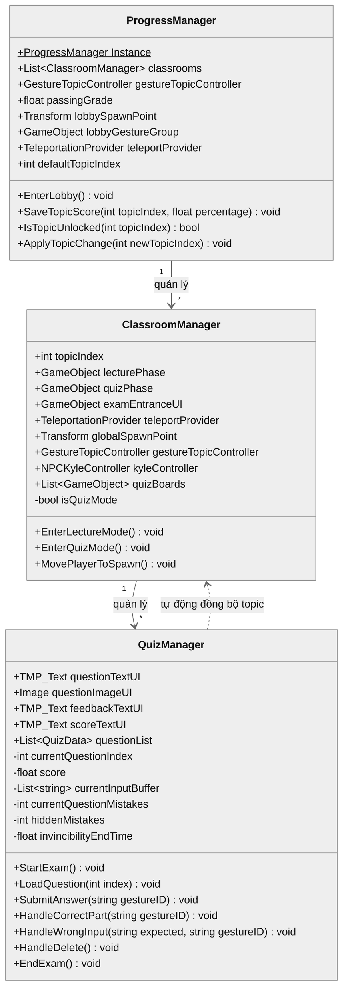
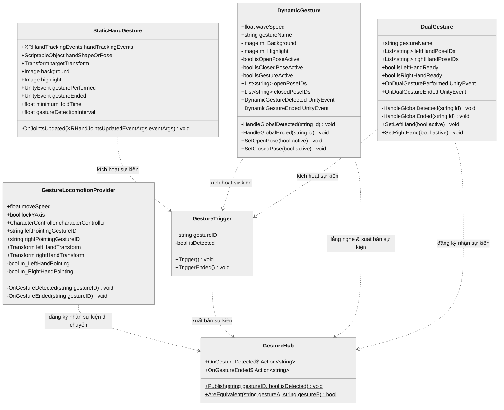
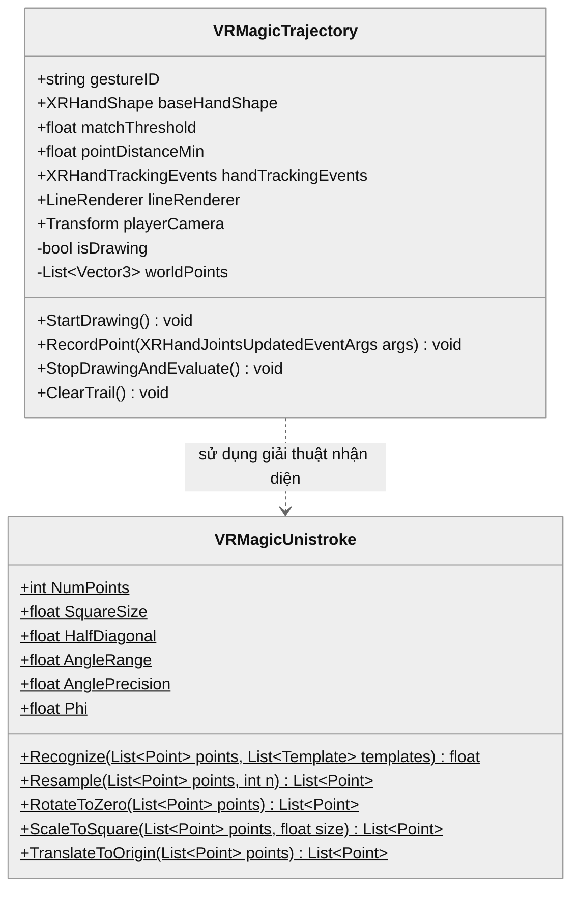
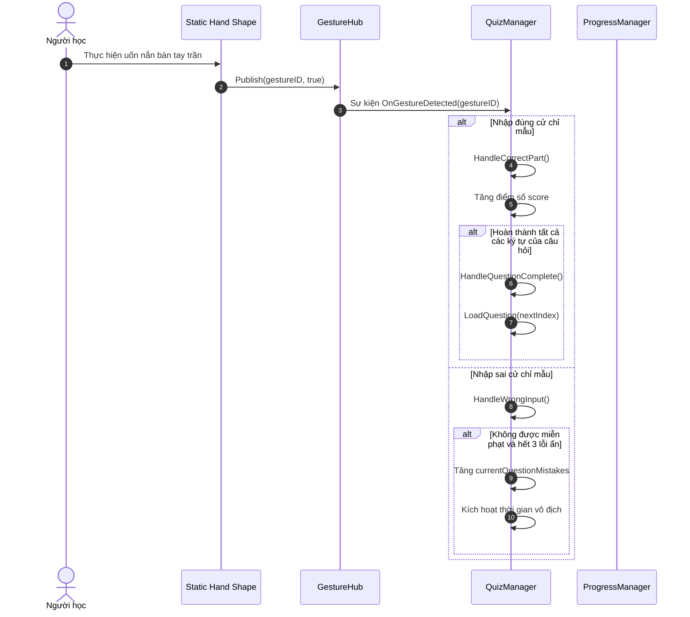
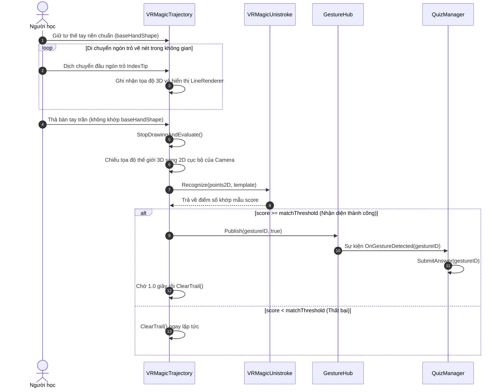

# CHƯƠNG 5. THỰC NGHIỆM VÀ ĐÁNH GIÁ

## 5.1 Thiết kế kiến trúc

### 5.1.1 Lựa chọn kiến trúc phần mềm

Hệ thống bài giảng tương tác Ngôn ngữ ký hiệu Mỹ trong Thực tế ảo (ASL VR) được xây dựng dựa trên mô hình Kiến trúc dựa trên thành phần (Component-Based Architecture), một phương pháp tiếp cận phổ biến và được hỗ trợ tự nhiên bởi môi trường phát triển Unity Engine. Nguyên tắc cốt lõi của kiến trúc này là xây dựng các đối tượng (GameObjects) bằng cách tổng hợp từ nhiều thành phần độc lập (Components), mỗi thành phần đóng gói một logic hoặc tập dữ liệu cụ thể. Để tách biệt rõ ràng giữa xử lý logic nghiệp vụ và giao diện trình diễn, đồng thời tối ưu hóa tính năng tương tác hand tracking, hệ thống được tinh chỉnh và phân chia thành bốn lớp logic chính hoạt động độc lập nhằm phân tách các mối quan tâm khác nhau.

Lớp Dữ liệu Học thuật (Academic Data Layer) chịu trách nhiệm lưu trữ và định nghĩa toàn bộ nội dung giáo trình, bao gồm danh sách từ vựng ký hiệu và hệ thống câu hỏi kiểm tra dưới dạng dữ liệu tĩnh. Ý nghĩa cốt lõi của lớp này là tách rời hoàn toàn phần nội dung bài học ra khỏi logic lập trình. Điều này giúp cho việc cập nhật, bổ sung học liệu hoặc mở rộng thêm các bài giảng mới trong tương lai có thể thực hiện một cách nhanh chóng và linh hoạt trực tiếp trên môi trường Unity mà không cần phải can thiệp hay thay đổi mã nguồn của ứng dụng.

Lớp Thu thập và Nhận dạng Cử chỉ (Gesture Capture & Recognition Layer) đóng vai trò thu nhận chuyển động của xương bàn tay từ cảm biến camera của thiết bị thực tế ảo và thực hiện nhận dạng các cử chỉ tay tĩnh hoặc động trong không gian. Ý nghĩa của lớp này là chuyển đổi các hành động vật lý tự nhiên của người học thành các tín hiệu cử chỉ có cấu trúc. Lớp này đóng gói toàn bộ các thuật toán xử lý khớp xương và quỹ đạo chuyển động phức tạp, cung cấp dữ liệu nhận diện đồng nhất và ổn định để các lớp logic cấp cao hơn có thể hiểu và xử lý.

Lớp Điều khiển và Quản lý Tiến trình (Control & Progression Layer) đóng vai trò là bộ não điều hành toàn bộ logic sư phạm, lưu trữ kết quả và điều phối trạng thái của phòng học ảo. Ý nghĩa của lớp này là quản lý vòng đời của bài học, kiểm tra điều kiện mở khóa bài mới dựa trên kết quả tự học, và vận hành cơ chế thi cử với các quy tắc sư phạm hỗ trợ. Lớp này giúp kết nối dữ liệu tĩnh của bài học với các phản hồi sư phạm thực tế, tạo ra một lộ trình học tập có cấu trúc và có tính tương tác cao cho người học.

Lớp Trình diễn và Tương tác (Presentation & Interaction Layer) chịu trách nhiệm hiển thị giao diện đồ họa trực quan, các phản hồi hình ảnh thời gian thực và xử lý di chuyển thực tế ảo. Ý nghĩa của lớp này là tối ưu hóa trải nghiệm tương tác trực quan của người học trong không gian ba chiều, giúp hiển thị tiến trình học trên cổ tay, thể hiện các hoạt ảnh hướng dẫn sinh động của giảng viên ảo, và cung cấp cơ chế di chuyển tự nhiên bằng cử chỉ tay trần để tăng cường tính chân thực và sự tập trung.

---

### 5.1.2 Thiết kế tổng quan

Biểu đồ gói dưới đây mô tả kiến trúc tổng quan của ứng dụng ASL VR, được phân chia thành các gói (package) logic và gom nhóm theo vai trò lõi hoặc ngoại vi của hệ thống bài giảng:

### 5.1.3 Thiết kế gói

Biểu đồ thiết kế chi tiết cấu trúc các lớp và mối quan hệ tương tác giữa bốn gói lập trình trong toàn bộ hệ thống (Presentation & Interaction, Progression, Gesture Recognition, và Academic Data) được trình bày cụ thể dưới đây:

> **Hình 5.2:** _Sơ đồ cấu trúc các lớp và mối quan hệ tương quan giữa các gói trong hệ thống_

Hệ thống vận hành thông qua sự tương tác chặt chẽ giữa bốn gói chức năng chính. Gói Academic Data cung cấp dữ liệu cấu trúc bài giảng và câu hỏi kiểm tra làm cơ sở nội dung cho toàn bộ ứng dụng. Gói Gesture Recognition liên tục thu nhận chuyển động tay từ cảm biến vật lý để nhận diện cử chỉ và gửi tín hiệu sự kiện tương ứng đến gói Progression. Gói Progression tiếp nhận các sự kiện cử chỉ này để đối chiếu với đáp án từ gói Academic Data nhằm quản lý tiến trình tự học, vận hành bài thi trắc nghiệm và điều khiển nhân vật hướng dẫn ảo. Cuối cùng, gói Presentation & Interaction truy vấn thông tin tiến trình từ gói Progression để hiển thị trực quan lên bảng điều khiển đeo cổ tay của người học và thực thi các thao tác điều hướng phòng học tương ứng.

---

## 5.2 Thiết kế chi tiết

### 5.2.1 Thiết kế lớp

Để làm rõ phương thức hoạt động, cấu trúc thuộc tính, phương thức xử lý và mối liên hệ tương tác giữa các thực thể phần mềm trong hệ thống bài giảng ASL VR, mục này trình bày chi tiết thiết kế lớp theo từng nhóm (batch) chức năng cốt lõi.

#### a, Nhóm lớp điều phối tiến trình và quản lý phòng học ảo

Nhóm lớp này đóng vai trò điều phối tổng thể tiến trình học tập của người học, mở khóa bài học mới và quản lý vòng đời hoạt động của từng phòng học chuyên đề tương ứng.

> **Hình 5.3:** _Sơ đồ lớp ProgressManager, ClassroomManager và QuizManager_

Lớp ProgressManager (Hình 5.3) là lớp Singleton trung tâm, đóng vai trò là bộ não điều hành toàn bộ vòng đời và tiến trình học tập của ứng dụng ASL VR. Nó chứa các tham chiếu quan trọng như danh sách classrooms của các phòng học chuyên đề, đối tượng lobbyGestureGroup để bật tắt cử chỉ tại sảnh, và teleportProvider để thực hiện dịch chuyển người học. Lớp này quản lý tiến trình của người học bằng cách so sánh điểm số cao nhất của chủ đề trước được lưu trong bộ nhớ thiết bị với ngưỡng điểm đạt passingGrade. Các phương thức chính bao gồm EnterLobby() để reset trạng thái và đưa người học về sảnh chính, IsTopicUnlocked() để xác thực quyền mở khóa phòng học mới, và ApplyTopicChange() để thực thi các thiết lập khi học viên chuyển chủ đề học.

Lớp ClassroomManager (Hình 5.3) chịu trách nhiệm quản lý vòng đời và trạng thái hoạt động của một phòng học chuyên đề cụ thể trong hệ thống. Lớp này lưu trữ chỉ số chủ đề topicIndex và các tham chiếu đến các đối tượng tương ứng với từng giai đoạn học tập như lecturePhase và quizPhase. Nó cũng quản lý các đối tượng giao diện bảng thi trong danh sách quizBoards và thực thể giảng viên ảo kyleController. Lớp này cung cấp các phương thức công khai như EnterLectureMode() để bắt đầu giai đoạn học lý thuyết và EnterQuizMode() để kích hoạt giai đoạn làm bài thi trắc nghiệm. Sự phối hợp giữa ProgressManager và ClassroomManager giúp hệ thống phân tách rõ ràng trách nhiệm quản lý tổng thể của sảnh chung và logic nội bộ của từng phòng học chuyên đề.

Lớp QuizManager (Hình 5.3) chịu trách nhiệm vận hành toàn bộ logic của một bài thi trắc nghiệm ký hiệu ASL. Lớp này nắm giữ các thành phần hiển thị giao diện UI bảng thi. Song song, nó lưu trữ danh sách câu hỏi questionList và quản lý trạng thái thi của người học qua các thuộc tính như điểm số score, bộ đệm ký tự đã nhập đúng currentInputBuffer, và các thuộc tính hỗ trợ luật sư phạm bao gồm currentQuestionMistakes (chỉ số lỗi phạt chính thức), hiddenMistakes (số lỗi sai ẩn) và invincibilityEndTime (thời điểm kết thúc khoảng thời gian miễn phạt). Các phương thức chính bao gồm StartExam() để khởi tạo bài thi, LoadQuestion() để tải câu hỏi lên bảng, SubmitAnswer() để đối chiếu cử chỉ nhận diện với đáp án, HandleCorrectPart() để xử lý khi người học làm đúng và HandleWrongInput() để xử lý khi người học làm sai theo quy tắc giảm lỗi và miễn phạt.

#### b, Nhóm lớp quản lý thi cử và nhận dạng cử chỉ tĩnh/chuỗi cử chỉ động

Nhóm lớp này vận hành toàn bộ logic thi trắc nghiệm, trung chuyển sự kiện, thực thi di chuyển và nhận diện các tư thế tay tĩnh cũng như chuỗi cử chỉ động chuyển đổi qua lại giữa các trạng thái tay.

> **Hình 5.4:** _Sơ đồ lớp GestureHub, GestureLocomotionProvider, StaticHandGesture, GestureTrigger, DynamicGesture và DualGesture_

Lớp GestureHub (Hình 5.4) hoạt động như một trung tâm điều phối sự kiện, đóng vai trò trung gian truyền tín hiệu cử chỉ giữa hệ thống nhận diện và các hệ thống ứng dụng khác mà không gây ràng buộc trực tiếp. Lớp này khai báo hai sự kiện tĩnh công khai là OnGestureDetected và OnGestureEnded. Khi một cử chỉ được nhận diện hoặc kết thúc nhận diện, phương thức Publish() sẽ được gọi để kích hoạt sự kiện tương ứng và phát đi mã cử chỉ gestureID.

Lớp GestureLocomotionProvider (Hình 5.4) chịu trách nhiệm di chuyển người học trong không gian ảo bằng cử chỉ tay trần. Nó định nghĩa hai thuộc tính định danh cử chỉ di chuyển là leftPointingGestureID và rightPointingGestureID cùng các tham chiếu hướng leftHandTransform, rightHandTransform và CharacterController để di chuyển người học. Thay vì truy cập trực tiếp SDK XR Hands, lớp này đăng ký nhận sự kiện tĩnh từ GestureHub.OnGestureDetected và GestureHub.OnGestureEnded trong phương thức OnEnable() và hủy đăng ký trong OnDisable(). Khi nhận diện được cả hai tay cùng thực hiện cử chỉ chỉ tay trỏ về phía trước, biến trạng thái m_LeftHandPointing và m_RightHandPointing sẽ là true, và trong Update() lớp sẽ thực thi di chuyển người học theo hướng trung bình của hai tay.

Lớp StaticHandGesture (Hình 5.4) là thành phần thuộc thư viện mẫu của XR Hands, chịu trách nhiệm nhận diện tư thế bàn tay tĩnh của người học dựa trên dữ liệu khớp xương tay thu nhận từ hệ thống. Lớp này chứa các trường cấu hình quan trọng như m_HandTrackingEvents để đăng ký nhận cập nhật khớp xương tay, m_HandShapeOrPose trỏ tới tài nguyên hình dáng cử chỉ tĩnh, và các thiết lập thời gian bao gồm m_MinimumHoldTime (thời gian giữ tối thiểu) và m_GestureDetectionInterval (chu kỳ kiểm tra cử chỉ).

Lớp GestureTrigger (Hình 5.4) hoạt động như một cầu nối trung gian chuyển tiếp, giúp tách biệt logic nhận diện tư thế tay vật lý khỏi logic nghiệp vụ của bài giảng. Lớp này lưu giữ định danh cử chỉ tương ứng thông qua thuộc tính gestureID. Thay vì tự động tìm kiếm thành phần bằng mã nguồn, lớp này được các thành phần StaticHandGesture gắn trên cùng đối tượng (hoặc các lớp nhận diện cử chỉ phức tạp khác) gọi trực tiếp thông qua cơ chế sự kiện UnityEvent kéo thả trên giao diện Unity Inspector. Khi sự kiện tương ứng được StaticHandGesture kích hoạt, nó sẽ gọi phương thức Trigger() hoặc TriggerEnded() trên GestureTrigger để chuyển tiếp và xuất bản ra toàn hệ thống qua GestureHub.Publish().

Lớp DynamicGesture (Hình 5.4) chịu trách nhiệm nhận diện các cử chỉ động dạng chuỗi thời gian chuyển trạng thái (như chữ số 11). Nó định nghĩa tốc độ thực hiện cử chỉ waveSpeed và các tham chiếu bộ nhớ đệm openPoseIDs và closedPoseIDs. Lớp này đăng ký nhận sự kiện từ GestureHub trong phương thức OnEnable(). Khi nhận diện được chuỗi tư thế tay mở rồi đến tư thế tay đóng trong khoảng thời gian waveSpeed, lớp sẽ kích hoạt sự kiện DynamicGestureDetected để gọi thành phần GestureTrigger gắn kèm nhằm thực hiện xuất bản cử chỉ động hoàn thành ra toàn hệ thống qua GestureHub.

Lớp DualGesture (Hình 5.4) chịu trách nhiệm nhận diện các cử chỉ yêu cầu sự tham gia và đồng bộ của cả hai bàn tay cùng một lúc (như cử chỉ What's up). Lớp này chứa các danh sách cấu hình leftHandPoseIDs và rightHandPoseIDs chứa các ID cử chỉ tĩnh tương ứng với từng tay. Bằng cách đăng ký nhận các sự kiện từ GestureHub trong phương thức OnEnable(), lớp sẽ tự động cập nhật trạng thái sẵn sàng của tay trái isLeftHandReady và tay phải isRightHandReady dựa trên các sự kiện do các GestureTrigger của hai tay gửi đến. Khi cả hai tay đều ở trạng thái sẵn sàng, lớp sẽ kích hoạt sự kiện OnDualGesturePerformed để gọi thành phần GestureTrigger gắn kèm nhằm thực hiện xuất bản cử chỉ hai tay hoàn chỉnh ra toàn hệ thống qua GestureHub.

#### c, Nhóm lớp thu thập và nhận diện cử chỉ động vẽ nét

Nhóm lớp này thu thập tọa độ di chuyển của đầu ngón trỏ, hiển thị nét vẽ động 3D và chuẩn hóa quỹ đạo để thực thi thuật toán nhận dạng 2D Unistroke.

> **Hình 5.5:** _Sơ đồ lớp VRMagicTrajectory và lớp VRMagicUnistroke_

Lớp VRMagicTrajectory (Hình 5.5) là thành phần chịu trách nhiệm thu nhận dữ liệu khớp tay, ghi lại quỹ đạo nét vẽ của ngón trỏ và điều khiển vẽ quỹ đạo nét vẽ trong không gian 3D của ngón trỏ để nhận diện các ký hiệu động. Lớp này lưu trữ các cấu hình như gestureID, tư thế tay kích hoạt vẽ baseHandShape, ngưỡng nhận dạng matchThreshold và khoảng cách tối thiểu giữa hai điểm vẽ pointDistanceMin. Nó chứa các tham chiếu trực quan bao gồm lineRenderer để hiển thị nét vẽ 3D và playerCamera để chiếu tọa độ. Khi nhận sự kiện từ handTrackingEvents khớp với baseHandShape, phương thức StartDrawing() sẽ được kích hoạt để bắt đầu quá trình ghi nhận tọa độ đầu ngón trỏ vào danh sách worldPoints thông qua RecordPoint(). Khi người học hạ tay kết thúc vẽ, StopDrawingAndEvaluate() được gọi để chuyển đổi quỹ đạo 3D thành 2D trên không gian local của camera và chuyển dữ liệu sang lớp VRMagicUnistroke để tính điểm. Khi điểm số vượt ngưỡng, nó trực tiếp gọi GestureHub.Publish() để truyền thông điệp.

Lớp VRMagicUnistroke (Hình 5.5) là một lớp thực thi thuật toán nhận dạng nét vẽ 2D Unistroke độc lập. Lớp này chứa các hằng số cấu hình thuật toán như số điểm chuẩn hóa NumPoints, kích thước hộp SquareSize và tỉ lệ vàng Phi để tìm kiếm góc tối ưu. Phương thức Recognize() của lớp tiếp nhận danh sách các điểm vẽ 2D từ VRMagicTrajectory, sau đó thực hiện chuỗi tiền xử lý chuẩn hóa bao gồm Resample() (nội suy đều số điểm vẽ thành 64 điểm), RotateToZero() (xoay nét vẽ về góc không độ chuẩn để loại bỏ sai lệch hướng), ScaleToSquare() (co giãn tỉ lệ nét vẽ về kích thước hộp vuông tiêu chuẩn) và TranslateToOrigin() (dịch tâm nét vẽ về tọa độ gốc). Sau khi chuẩn hóa, nét vẽ được so khớp khoảng cách Euclid với danh sách các mẫu chữ cái lưu sẵn để tính ra điểm số khớp cao nhất và phản hồi lại cho bộ lọc.

---

### 5.2.2 Thiết kế các luồng xử lý quan trọng

Để làm rõ sự phối hợp hoạt động và truyền thông điệp giữa các gói lớp đối tượng tại runtime, mục này trình bày chi tiết thiết kế luồng xử lý của hai trường hợp sử dụng quan trọng nhất trong hệ thống bài giảng ASL VR.

#### a, Luồng học viên thực hiện bài kiểm tra và trả lời câu hỏi tĩnh

Biểu đồ tuần tự tại Hình 5.6 mô tả các bước tương tác chi tiết khi người học thực hiện bài thi trắc nghiệm và uốn nắn bàn tay trần để trả lời câu hỏi nhận diện tư thế tay tĩnh:

> **Hình 5.6:** _Biểu đồ tuần tự luồng học viên thực hiện bài kiểm tra và trả lời câu hỏi_

Biểu đồ tuần tự tại Hình 5.6 mô tả luồng tương tác trả lời câu hỏi tĩnh để đánh giá năng lực người học. Luồng tương tác bắt đầu khi người học thực hiện uốn nắn bàn tay trần. Thành phần StaticHandGesture đóng vai trò đối sánh tư thế tĩnh, tuân thủ nguyên tắc tách biệt các mối quan tâm, liên tục đối chiếu khớp xương từ camera cảm biến với tệp mẫu; khi khớp và đủ thời gian giữ tư thế, nó kích hoạt sự kiện báo cho GestureTrigger. Để đảm bảo phân tách trách nhiệm, GestureTrigger không tự xử lý logic mà chuyển tiếp sự kiện bằng cách gọi Publish của bộ trung chuyển sự kiện tĩnh GestureHub. Lớp QuizManager đang lắng nghe sự kiện tĩnh từ GestureHub sẽ tiếp nhận mã cử chỉ và đối chiếu với đáp án của câu hỏi hiện tại. Tại đây, QuizManager thực hiện phân nhánh xử lý: nếu đúng, nó gọi HandleCorrectPart để tăng điểm, đổi màu chữ ScoreTextUI và tự động chuyển câu hỏi tiếp theo sau khoảng trễ; nếu sai, nó gọi HandleWrongInput để kiểm tra số lỗi ẩn và lượt miễn phạt; nếu vượt quá giới hạn, hệ thống mới tăng số lỗi phạt chính thức và tạm khóa phản hồi sai qua cửa sổ vô địch để giúp người học bình tĩnh thử lại, hoàn tất một chu trình tương tác-xử lý-phản hồi hoàn chỉnh.

#### b, Luồng nhận diện cử chỉ động vẽ nét chữ cái bằng giải thuật Unistroke

Biểu đồ tuần tự tại Hình 5.7 mô tả quy trình thu thập dữ liệu ngón trỏ và chạy thuật toán nhận diện nét vẽ cho trường hợp sử dụng nhận diện cử chỉ động vẽ nét chữ cái J và Z:

> **Hình 5.7:** _Biểu đồ tuần tự luồng nhận diện cử chỉ động vẽ nét chữ cái J và Z_

Biểu đồ tuần tự tại Hình 5.7 mô tả quy trình thu thập và nhận diện nét vẽ chữ cái J và Z. Luồng tương tác bắt đầu khi người học giữ tư thế tay nền chuẩn để kích hoạt trạng thái vẽ. Khi di chuyển ngón trỏ, component VRMagicTrajectory thu nhận tọa độ 3D và hiển thị nét vẽ qua LineRenderer để cung cấp phản hồi hình ảnh thời gian thực. Khi người học thả tư thế tay nền ra, VRMagicTrajectory gọi StopDrawingAndEvaluate, chiếu toàn bộ tọa độ 3D thành 2D phẳng cục bộ của Camera rồi gửi đến module phi hành vi VRMagicUnistroke để so khớp. VRMagicUnistroke thực hiện tiền xử lý chuẩn hóa nét vẽ qua bốn bước gồm nội suy đều số điểm vẽ (Resample), xoay góc định vị về 0 (RotateToZero), co giãn về khung hình vuông chuẩn (ScaleToSquare) và dịch tâm về gốc tọa độ (TranslateToOrigin). Cuối cùng, thuật toán tính khoảng cách Euclid giữa nét vẽ và nét mẫu; nếu điểm số vượt ngưỡng matchThreshold, VRMagicTrajectory gọi GestureHub.Publish để phát sự kiện thành công ra toàn hệ thống, từ đó QuizManager tiếp nhận sự kiện để ghi nhận đáp án và điểm số, hoàn tất chu trình tương tác-xử lý-phản hồi hoàn chỉnh.

---

## 5.3 Xây dựng ứng dụng

### 5.3.1 Thư viện và công cụ sử dụng

Dưới đây là danh sách chi tiết các công cụ phần mềm, ngôn ngữ lập trình, bộ phát triển phần mềm (Software Development Kit - SDK) và thư viện liên kết được sử dụng xuyên suốt quá trình xây dựng bài giảng tương tác ASL VR:

| Mục đích | Công cụ | Địa chỉ URL |
| :--- | :--- | :--- |
| **Môi trường phát triển** | Unity Editor 2022.3.50f1 | https://unity.com/ |
| **Theo dõi bàn tay** | Unity XR Hands 1.5.1 | https://docs.unity3d.com/Packages/com.unity.xr.hands |
| **Tương tác thực tế ảo** | XR Interaction Toolkit 3.0.3 | https://docs.unity3d.com/Packages/com.unity.xr.interaction.toolkit |

> **Bảng 5.2:** _Danh sách thư viện và công cụ sử dụng_

---

### 5.3.2 Kết quả đạt được

Quá trình phát triển đã xây dựng thành công ứng dụng bài giảng tương tác ASL VR hoàn chỉnh dưới dạng tệp cài đặt chạy trực tiếp trên thiết bị kính. Mã nguồn được tổ chức chặt chẽ thành 3 gói chính như đã thiết kế ở phần thiết kế kiến trúc, mỗi gói đóng gói một nhóm chức năng chuyên biệt:

1. **GestureRecognition_Package:** Chứa toàn bộ logic nhận diện các cử chỉ tay tĩnh, động, bộ trung chuyển sự kiện và cơ chế di chuyển bằng tay trần (bao gồm các lớp GestureHub, GestureLesson, TrajectoryRecognizer, UnistrokeRecognizer, GestureTrigger và GestureLocomotionProvider). Gói này có tính mô-đun hóa cao, có thể tái sử dụng trực tiếp cho các dự án thực tế ảo khác có yêu cầu tương tác và di chuyển bằng tay trần.
2. **Progression_Package:** Quản lý tiến trình học tập tổng thể, lưu trữ điểm số, trạng thái phòng học ảo, cơ chế thi cử trắc nghiệm và hoạt ảnh phản hồi của các nhân vật hướng dẫn ảo (bao gồm các lớp ProgressManager, ClassroomManager, QuizManager, NPCKyleController, NPCLobbyInstructorController cùng các lớp dữ liệu học thuật PracticeData và QuizData).
3. **PresentationInteraction_Package:** Quản lý giao diện bảng đeo cổ tay của người học, camera hướng về giao diện người dùng và các tiện ích tùy biến trong editor (bao gồm các lớp WristDashboardUI, WristFollower, UIFaceCamera và RefineWristDashboard).

Dưới đây là bảng thông số thống kê chi tiết về số lượng lớp, số lượng dòng code (Lines of Code - LOC) và dung lượng mã nguồn của từng gói logic trong dự án:

| Tên gói (Package Name)              | Số lượng lớp | Số dòng code (LOC) | Kích thước gói |
| :---------------------------------- | :----------: | :----------------: | :------------: |
| **GestureRecognition_Package**      |      6       |        781         |    24,0 KB     |
| **Progression_Package**             |      8       |       1.233        |    45,0 KB     |
| **PresentationInteraction_Package** |      4       |        355         |    13,6 KB     |
| **Tổng cộng**                       |    **18**    |     **2.369**      |  **82,6 KB**   |

> **Bảng 5.3:** _Thông số chi tiết các gói mã nguồn của ứng dụng_

Việc module hóa sâu sắc các gói mã nguồn giúp tổng thể ứng dụng đạt hiệu suất xử lý tối ưu, dễ bảo trì và mở rộng thêm nhiều phòng học chuyên đề hoặc từ vựng mới trong tương lai mà không làm ảnh hưởng đến cấu trúc nền tảng của hệ thống.
