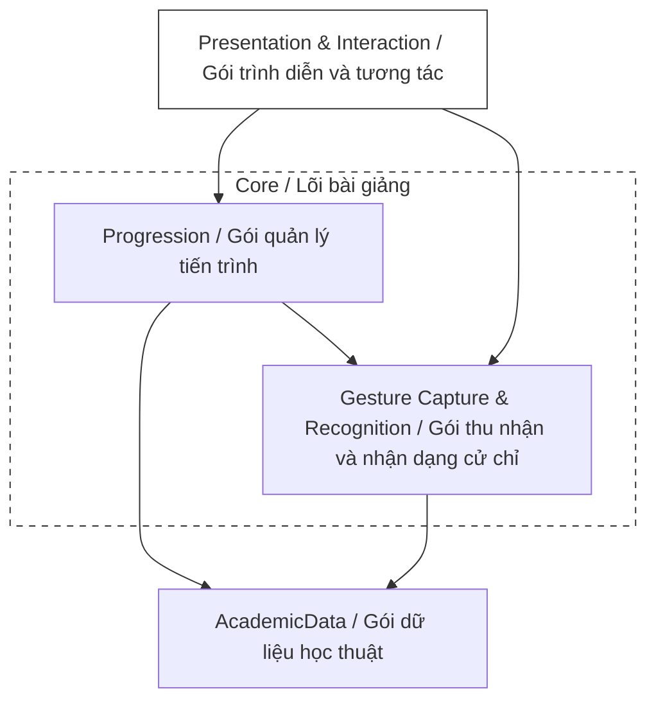
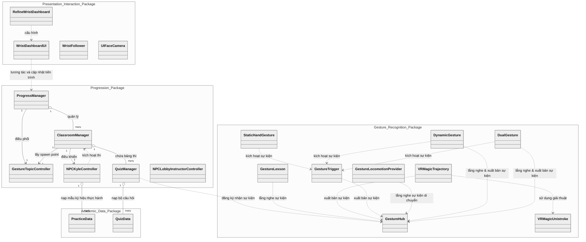
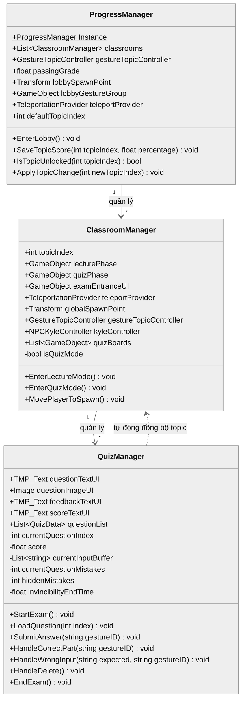
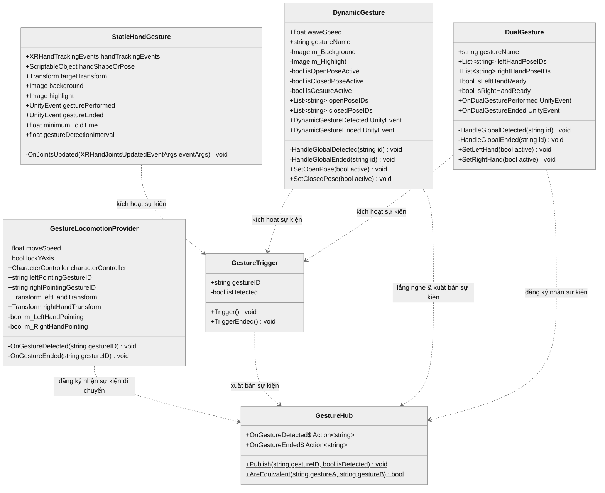
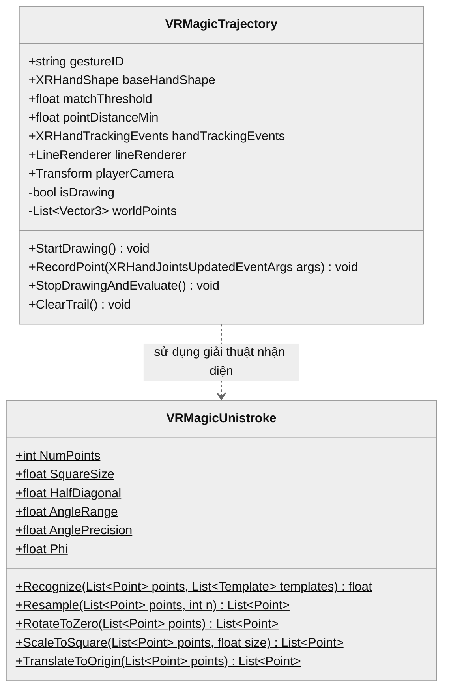
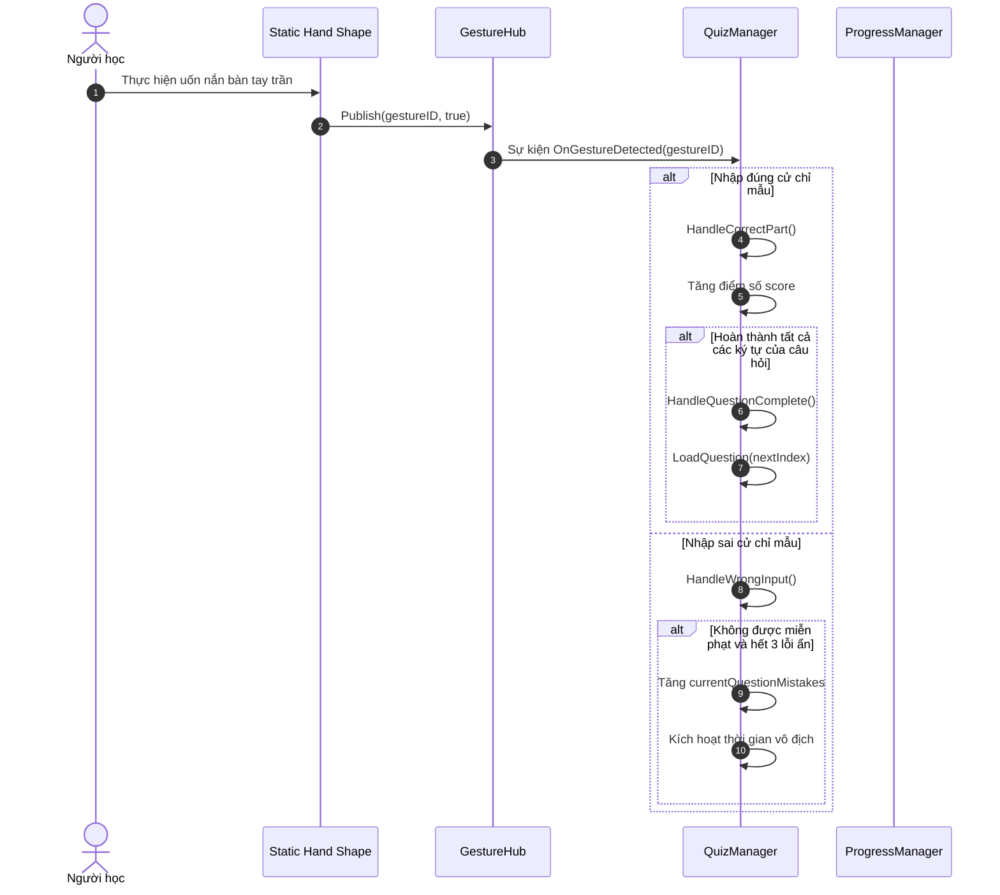
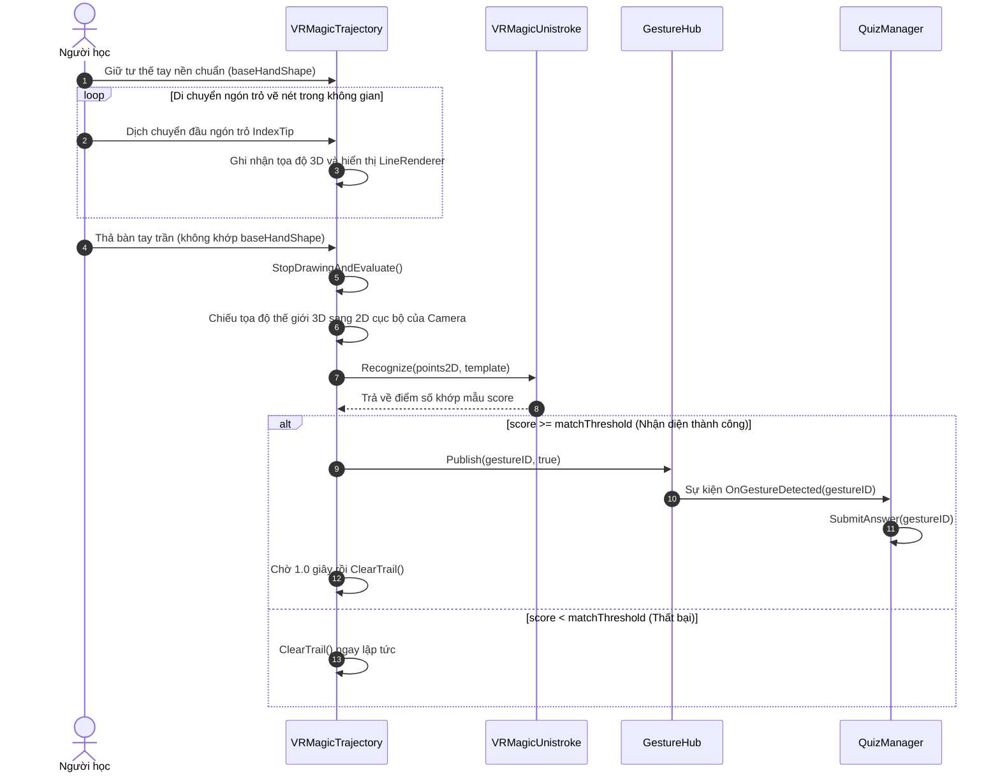

# CHƯƠNG 5. THỰC NGHIỆM VÀ ĐÁNH GIÁ

## 5.1 Thiết kế kiến trúc

### 5.1.1 Lựa chọn kiến trúc phần mềm

Hệ thống bài giảng tương tác Ngôn ngữ ký hiệu Mỹ trong Thực tế ảo (ASL VR) được xây dựng dựa trên mô hình Kiến trúc dựa trên thành phần (Component-Based Architecture), một phương pháp tiếp cận phổ biến và được hỗ trợ tự nhiên bởi môi trường phát triển Unity Engine. Nguyên tắc cốt lõi của kiến trúc này là xây dựng các đối tượng (GameObjects) bằng cách tổng hợp từ nhiều thành phần độc lập (Components), mỗi thành phần đóng gói một logic hoặc tập dữ liệu cụ thể. Để tách biệt rõ ràng giữa xử lý logic nghiệp vụ và giao diện trình diễn, đồng thời tối ưu hóa tính năng tương tác hand tracking, hệ thống được tinh chỉnh và phân chia thành bốn lớp logic chính hoạt động độc lập nhằm phân tách các mối quan tâm khác nhau.

Lớp Dữ liệu Học thuật (Academic Data Layer) chịu trách nhiệm lưu trữ và định nghĩa toàn bộ nội dung giáo trình, bao gồm danh sách từ vựng ký hiệu và hệ thống câu hỏi kiểm tra dưới dạng dữ liệu tĩnh. Ý nghĩa cốt lõi của lớp này là tách rời hoàn toàn phần nội dung bài học ra khỏi logic lập trình. Điều này giúp cho việc cập nhật, bổ sung học liệu hoặc mở rộng thêm các bài giảng mới trong tương lai có thể thực hiện một cách nhanh chóng và linh hoạt trực tiếp trên môi trường Unity mà không cần phải can thiệp hay thay đổi mã nguồn của ứng dụng.

Lớp Thu thập và Nhận dạng Cử chỉ (Gesture Capture & Recognition Layer) đóng vai trò thu nhận chuyển động của xương bàn tay từ cảm biến camera của thiết bị thực tế ảo và thực hiện nhận dạng các cử chỉ tay tĩnh hoặc động trong không gian. Ý nghĩa của lớp này là chuyển đổi các hành động vật lý tự nhiên của người học thành các tín hiệu cử chỉ có cấu trúc. Lớp này đóng gói toàn bộ các thuật toán xử lý khớp xương và quỹ đạo chuyển động phức tạp, cung cấp dữ liệu nhận diện đồng nhất và ổn định để các lớp logic cấp cao hơn có thể hiểu và xử lý.

Lớp Điều khiển và Quản lý Tiến trình (Control & Progression Layer) đóng vai trò là bộ não điều hành toàn bộ logic sư phạm, lưu trữ kết quả và điều phối trạng thái của phòng học ảo. Ý nghĩa của lớp này là quản lý vòng đời của bài học, kiểm tra điều kiện mở khóa bài mới dựa trên kết quả tự học, và vận hành cơ chế thi cử với các quy tắc sư phạm hỗ trợ. Lớp này giúp kết nối dữ liệu tĩnh của bài học với các phản hồi sư phạm thực tế, tạo ra một lộ trình học tập có cấu trúc và có tính tương tác cao cho người học.

Lớp Trình diễn và Tương tác (Presentation & Interaction Layer) chịu trách nhiệm hiển thị giao diện đồ họa trực quan, các phản hồi hình ảnh thời gian thực và xử lý di chuyển thực tế ảo. Ý nghĩa của lớp này là tối ưu hóa trải nghiệm tương tác trực quan của người học trong không gian ba chiều, giúp hiển thị tiến trình học trên cổ tay, thể hiện các hoạt ảnh hướng dẫn sinh động của giảng viên ảo, và cung cấp cơ chế di chuyển tự nhiên bằng cử chỉ tay trần để tăng cường tính chân thực và sự tập trung.

---

### 5.1.2 Thiết kế tổng quan

Biểu đồ gói dưới đây mô tả kiến trúc tổng quan của ứng dụng ASL VR, được phân chia thành các gói (package) logic và gom nhóm theo vai trò lõi hoặc ngoại vi của hệ thống bài giảng:

### 5.1.3 Thiết kế gói

Biểu đồ thiết kế chi tiết cấu trúc các lớp và mối quan hệ tương tác giữa bốn gói lập trình trong toàn bộ hệ thống (Presentation & Interaction, Progression, Gesture Recognition, và Academic Data) được trình bày cụ thể dưới đây:

> **Hình 5.2:** _Sơ đồ cấu trúc các lớp và mối quan hệ tương quan giữa các gói trong hệ thống_

Hệ thống vận hành thông qua sự tương tác chặt chẽ giữa bốn gói chức năng chính. Gói Academic Data cung cấp dữ liệu cấu trúc bài giảng và câu hỏi kiểm tra làm cơ sở nội dung cho toàn bộ ứng dụng. Gói Gesture Recognition liên tục thu nhận chuyển động tay từ cảm biến vật lý để nhận diện cử chỉ và gửi tín hiệu sự kiện tương ứng đến gói Progression. Gói Progression tiếp nhận các sự kiện cử chỉ này để đối chiếu với đáp án từ gói Academic Data nhằm quản lý tiến trình tự học, vận hành bài thi trắc nghiệm và điều khiển nhân vật hướng dẫn ảo. Cuối cùng, gói Presentation & Interaction truy vấn thông tin tiến trình từ gói Progression để hiển thị trực quan lên bảng điều khiển đeo cổ tay của người học và thực thi các thao tác điều hướng phòng học tương ứng.

---

## 5.2 Thiết kế chi tiết

### 5.2.1 Thiết kế lớp

Để làm rõ phương thức hoạt động, cấu trúc thuộc tính, phương thức xử lý và mối liên hệ tương tác giữa các thực thể phần mềm trong hệ thống bài giảng ASL VR, mục này trình bày chi tiết thiết kế lớp theo từng nhóm (batch) chức năng cốt lõi.

#### a, Nhóm lớp điều phối tiến trình và quản lý phòng học ảo

Nhóm lớp này đóng vai trò điều phối tổng thể tiến trình học tập của người học, mở khóa bài học mới và quản lý vòng đời hoạt động của từng phòng học chuyên đề tương ứng.

> **Hình 5.3:** _Sơ đồ lớp ProgressManager, ClassroomManager và QuizManager_

Lớp ProgressManager (Hình 5.3) là lớp Singleton trung tâm, đóng vai trò là bộ não điều hành toàn bộ vòng đời và tiến trình học tập của ứng dụng ASL VR. Nó chứa các tham chiếu quan trọng như danh sách classrooms của các phòng học chuyên đề, đối tượng lobbyGestureGroup để bật tắt cử chỉ tại sảnh, và teleportProvider để thực hiện dịch chuyển người học. Lớp này quản lý tiến trình của người học bằng cách so sánh điểm số cao nhất của chủ đề trước được lưu trong bộ nhớ thiết bị với ngưỡng điểm đạt passingGrade. Các phương thức chính bao gồm EnterLobby() để reset trạng thái và đưa người học về sảnh chính, IsTopicUnlocked() để xác thực quyền mở khóa phòng học mới, và ApplyTopicChange() để thực thi các thiết lập khi học viên chuyển chủ đề học.

Lớp ClassroomManager (Hình 5.3) chịu trách nhiệm quản lý vòng đời và trạng thái hoạt động của một phòng học chuyên đề cụ thể trong hệ thống. Lớp này lưu trữ chỉ số chủ đề topicIndex và các tham chiếu đến các đối tượng tương ứng với từng giai đoạn học tập như lecturePhase và quizPhase. Nó cũng quản lý các đối tượng giao diện bảng thi trong danh sách quizBoards và thực thể giảng viên ảo kyleController. Lớp này cung cấp các phương thức công khai như EnterLectureMode() để bắt đầu giai đoạn học lý thuyết và EnterQuizMode() để kích hoạt giai đoạn làm bài thi trắc nghiệm. Sự phối hợp giữa ProgressManager và ClassroomManager giúp hệ thống phân tách rõ ràng trách nhiệm quản lý tổng thể của sảnh chung và logic nội bộ của từng phòng học chuyên đề.

Lớp QuizManager (Hình 5.3) chịu trách nhiệm vận hành toàn bộ logic của một bài thi trắc nghiệm ký hiệu ASL. Lớp này nắm giữ các thành phần hiển thị giao diện UI bảng thi. Song song, nó lưu trữ danh sách câu hỏi questionList và quản lý trạng thái thi của người học qua các thuộc tính như điểm số score, bộ đệm ký tự đã nhập đúng currentInputBuffer, và các thuộc tính hỗ trợ luật sư phạm bao gồm currentQuestionMistakes (chỉ số lỗi phạt chính thức), hiddenMistakes (số lỗi sai ẩn) và invincibilityEndTime (thời điểm kết thúc khoảng thời gian miễn phạt). Các phương thức chính bao gồm StartExam() để khởi tạo bài thi, LoadQuestion() để tải câu hỏi lên bảng, SubmitAnswer() để đối chiếu cử chỉ nhận diện với đáp án, HandleCorrectPart() để xử lý khi người học làm đúng và HandleWrongInput() để xử lý khi người học làm sai theo quy tắc giảm lỗi và miễn phạt.

#### b, Nhóm lớp quản lý thi cử và nhận dạng cử chỉ tĩnh/chuỗi cử chỉ động

Nhóm lớp này vận hành toàn bộ logic thi trắc nghiệm, trung chuyển sự kiện, thực thi di chuyển và nhận diện các tư thế tay tĩnh cũng như chuỗi cử chỉ động chuyển đổi qua lại giữa các trạng thái tay.

> **Hình 5.4:** _Sơ đồ lớp GestureHub, GestureLocomotionProvider, StaticHandGesture, GestureTrigger, DynamicGesture và DualGesture_

Lớp GestureHub (Hình 5.4) hoạt động như một trung tâm điều phối sự kiện, đóng vai trò trung gian truyền tín hiệu cử chỉ giữa hệ thống nhận diện và các hệ thống ứng dụng khác mà không gây ràng buộc trực tiếp. Lớp này khai báo hai sự kiện tĩnh công khai là OnGestureDetected và OnGestureEnded. Khi một cử chỉ được nhận diện hoặc kết thúc nhận diện, phương thức Publish() sẽ được gọi để kích hoạt sự kiện tương ứng và phát đi mã cử chỉ gestureID.

Lớp GestureLocomotionProvider (Hình 5.4) chịu trách nhiệm di chuyển người học trong không gian ảo bằng cử chỉ tay trần. Nó định nghĩa hai thuộc tính định danh cử chỉ di chuyển là leftPointingGestureID và rightPointingGestureID cùng các tham chiếu hướng leftHandTransform, rightHandTransform và CharacterController để di chuyển người học. Thay vì truy cập trực tiếp SDK XR Hands, lớp này đăng ký nhận sự kiện tĩnh từ GestureHub.OnGestureDetected và GestureHub.OnGestureEnded. Khi nhận diện được cả hai tay cùng thực hiện cử chỉ chỉ tay trỏ về phía trước, các biến trạng thái m_LeftHandPointing và m_RightHandPointing sẽ chuyển sang true, và trong hàm Update() lớp sẽ thực thi di chuyển người học theo hướng trung bình của hai tay.

Lớp StaticHandGesture (Hình 5.4) là thành phần thuộc thư viện mẫu của XR Hands, chịu trách nhiệm nhận diện tư thế bàn tay tĩnh của người học dựa trên dữ liệu khớp xương tay thu nhận từ hệ thống. Lớp này chứa các trường cấu hình quan trọng như handTrackingEvents để đăng ký nhận cập nhật khớp xương tay, handShapeOrPose trỏ tới tài nguyên hình dáng cử chỉ tĩnh, và các thiết lập thời gian bao gồm minimumHoldTime (thời gian giữ tối thiểu) và gestureDetectionInterval (chu kỳ kiểm tra cử chỉ).

Lớp GestureTrigger (Hình 5.4) hoạt động như một cầu nối trung gian chuyển tiếp, giúp tách biệt logic nhận diện tư thế tay vật lý khỏi logic nghiệp vụ của bài giảng. Lớp này lưu giữ định danh cử chỉ tương ứng thông qua thuộc tính gestureID. Trong phương thức Start(), nó tìm kiếm các thành phần StaticHandGesture gắn trên cùng một đối tượng để đăng ký lắng nghe hai sự kiện gesturePerformed và gestureEnded. Khi sự kiện bắt đầu được kích hoạt, nó gọi phương thức Trigger() để gọi sang GestureHub.Publish() nhằm xuất bản sự kiện nhận diện cử chỉ đến toàn hệ thống.

Lớp DynamicGesture (Hình 5.4) chịu trách nhiệm nhận diện các cử chỉ động dạng chuỗi thời gian chuyển trạng thái (như chữ số 11). Nó định nghĩa tốc độ thực hiện cử chỉ waveSpeed và các tham chiếu bộ nhớ đệm openPoseIDs và closedPoseIDs. Lớp này đăng ký nhận sự kiện từ GestureHub. Khi nhận diện được chuỗi tư thế tay mở rồi đến tư thế tay đóng trong khoảng thời gian waveSpeed, lớp sẽ kích hoạt sự kiện DynamicGestureDetected để gọi thành phần GestureTrigger gắn kèm nhằm thực hiện xuất bản cử chỉ động hoàn thành ra toàn hệ thống qua GestureHub.

Lớp DualGesture (Hình 5.4) chịu trách nhiệm nhận diện các cử chỉ yêu cầu sự tham gia và đồng bộ của cả hai bàn tay cùng một lúc. Lớp này chứa các danh sách cấu hình leftHandPoseIDs và rightHandPoseIDs chứa các ID cử chỉ tĩnh tương ứng với từng tay. Bằng cách đăng ký nhận các sự kiện từ GestureHub, lớp sẽ tự động cập nhật trạng thái sẵn sàng của tay trái isLeftHandReady và tay phải isRightHandReady dựa trên các sự kiện do các GestureTrigger của hai tay gửi đến. Khi cả hai tay đều ở trạng thái sẵn sàng, lớp sẽ kích hoạt sự kiện OnDualGesturePerformed để gọi thành phần GestureTrigger gắn kèm nhằm thực hiện xuất bản cử chỉ hai tay hoàn chỉnh ra toàn hệ thống qua GestureHub.

#### c, Nhóm lớp thu thập và nhận diện cử chỉ động vẽ nét

Nhóm lớp này thu thập tọa độ di chuyển của đầu ngón trỏ, hiển thị nét vẽ động 3D và chuẩn hóa quỹ đạo để thực thi thuật toán nhận dạng 2D Unistroke.

> **Hình 5.5:** _Sơ đồ lớp VRMagicTrajectory và lớp VRMagicUnistroke_

Lớp VRMagicTrajectory (Hình 5.5) là thành phần chịu trách nhiệm thu nhận dữ liệu khớp tay, ghi lại quỹ đạo nét vẽ của ngón trỏ và điều khiển vẽ quỹ đạo nét vẽ trong không gian 3D của ngón trỏ để nhận diện các ký hiệu động. Lớp này lưu trữ các cấu hình như gestureID, tư thế tay kích hoạt vẽ baseHandShape, ngưỡng nhận dạng matchThreshold và khoảng cách tối thiểu giữa hai điểm vẽ pointDistanceMin. Nó chứa các tham chiếu trực quan bao gồm lineRenderer để hiển thị nét vẽ 3D và playerCamera để chiếu tọa độ. Khi nhận sự kiện từ handTrackingEvents khớp với baseHandShape, phương thức StartDrawing() sẽ được kích hoạt để bắt đầu quá trình ghi nhận tọa độ đầu ngón trỏ vào danh sách worldPoints thông qua RecordPoint(). Khi người học hạ tay kết thúc vẽ, StopDrawingAndEvaluate() được gọi để chuyển đổi quỹ đạo 3D thành 2D trên không gian local của camera và chuyển dữ liệu sang lớp VRMagicUnistroke để tính điểm. Khi điểm số vượt ngưỡng, nó trực tiếp gọi GestureHub.Publish() để truyền thông điệp.

Lớp VRMagicUnistroke (Hình 5.5) là một lớp thực thi thuật toán nhận dạng nét vẽ 2D Unistroke độc lập. Lớp này chứa các hằng số cấu hình thuật toán như số điểm chuẩn hóa NumPoints, kích thước hộp SquareSize và tỉ lệ vàng Phi để tìm kiếm góc tối ưu. Phương thức Recognize() của lớp tiếp nhận danh sách các điểm vẽ 2D từ VRMagicTrajectory, sau đó thực hiện chuỗi tiền xử lý chuẩn hóa bao gồm Resample(), RotateToZero(), ScaleToSquare() và TranslateToOrigin(). Sau khi chuẩn hóa, nét vẽ được so khớp khoảng cách Euclid với danh sách các mẫu chữ cái lưu sẵn để tính ra điểm số khớp cao nhất và phản hồi lại cho bộ lọc.

---

### 5.2.2 Thiết kế các luồng xử lý quan trọng

Để làm rõ sự phối hợp hoạt động và truyền thông điệp giữa các gói lớp đối tượng tại runtime, mục này trình bày chi tiết thiết kế luồng xử lý của hai trường hợp sử dụng quan trọng nhất trong hệ thống bài giảng ASL VR.

#### a, Luồng học viên thực hiện bài kiểm tra và trả lời câu hỏi tĩnh

Biểu đồ tuần tự tại Hình 5.6 mô tả các bước tương tác chi tiết khi người học thực hiện bài thi trắc nghiệm và uốn nắn bàn tay trần để trả lời câu hỏi nhận diện tư thế tay tĩnh:

> **Hình 5.6:** _Biểu đồ tuần tự luồng học viên thực hiện bài kiểm tra và trả lời câu hỏi_

Biểu đồ tuần tự tại Hình 5.6 mô tả luồng tương tác trả lời câu hỏi tĩnh để đánh giá năng lực người học. Luồng tương tác bắt đầu khi người học thực hiện uốn nắn bàn tay trần. Thành phần StaticHandGesture đóng vai trò đối sánh tư thế tĩnh, tuân thủ nguyên tắc tách biệt các mối quan tâm, liên tục đối chiếu khớp xương từ camera cảm biến với tệp mẫu; khi khớp và đủ thời gian giữ tư thế, nó kích hoạt sự kiện báo cho GestureTrigger. Để đảm bảo phân tách trách nhiệm, GestureTrigger không tự xử lý logic mà chuyển tiếp sự kiện bằng cách gọi Publish của bộ trung chuyển sự kiện tĩnh GestureHub. Lớp QuizManager đang lắng nghe sự kiện tĩnh từ GestureHub sẽ tiếp nhận mã cử chỉ và đối chiếu với đáp án của câu hỏi hiện tại. Tại đây, QuizManager thực hiện phân nhánh xử lý: nếu đúng, nó gọi HandleCorrectPart để tăng điểm, đổi màu chữ ScoreTextUI và tự động chuyển câu hỏi tiếp theo sau khoảng trễ; nếu sai, nó gọi HandleWrongInput để kiểm tra số lỗi ẩn và lượt miễn phạt; nếu vượt quá giới hạn, hệ thống mới tăng số lỗi phạt chính thức và tạm khóa phản hồi sai qua cửa sổ vô địch để giúp người học bình tĩnh thử lại, hoàn tất một chu trình tương tác-xử lý-phản hồi hoàn chỉnh.

#### b, Luồng nhận diện cử chỉ động vẽ nét chữ cái bằng giải thuật Unistroke

Biểu đồ tuần tự tại Hình 5.7 mô tả quy trình thu thập dữ liệu ngón trỏ và chạy thuật toán nhận diện nét vẽ cho trường hợp sử dụng nhận diện cử chỉ động vẽ nét chữ cái J và Z:

> **Hình 5.7:** _Biểu đồ tuần tự luồng nhận diện cử chỉ động vẽ nét chữ cái J và Z_

Biểu đồ tuần tự tại Hình 5.7 mô tả quy trình thu thập và nhận diện nét vẽ chữ cái J và Z. Luồng tương tác bắt đầu khi người học giữ tư thế tay nền chuẩn để kích hoạt trạng thái vẽ. Khi di chuyển ngón trỏ, component VRMagicTrajectory thu nhận tọa độ 3D và hiển thị nét vẽ qua LineRenderer để cung cấp phản hồi hình ảnh thời gian thực. Khi người học thả tư thế tay nền ra, VRMagicTrajectory gọi StopDrawingAndEvaluate, chiếu toàn bộ tọa độ 3D thành 2D phẳng cục bộ của Camera rồi gửi đến module phi hành vi VRMagicUnistroke để so khớp. VRMagicUnistroke thực hiện tiền xử lý chuẩn hóa nét vẽ qua bốn bước gồm nội suy đều số điểm vẽ (Resample), xoay góc định vị về 0 (RotateToZero), co giãn về khung hình vuông chuẩn (ScaleToSquare) và dịch tâm về gốc tọa độ (TranslateToOrigin). Cuối cùng, thuật toán tính khoảng cách Euclid giữa nét vẽ và nét mẫu; nếu điểm số vượt ngưỡng matchThreshold, VRMagicTrajectory gọi GestureHub.Publish để phát sự kiện thành công ra toàn hệ thống, từ đó QuizManager tiếp nhận sự kiện để ghi nhận đáp án và điểm số, hoàn tất chu trình tương tác-xử lý-phản hồi hoàn chỉnh.

---

## 5.3 Xây dựng ứng dụng

### 5.3.1 Thư viện và công cụ sử dụng

Dưới đây là danh sách chi tiết các công cụ phần mềm, ngôn ngữ lập trình, bộ phát triển phần mềm và thư viện liên kết được sử dụng xuyên suốt quá trình xây dựng bài giảng tương tác ASL VR:

| Mục đích                  | Công cụ                      | Địa chỉ URL                                                        |
| :------------------------ | :--------------------------- | :----------------------------------------------------------------- |
| **Môi trường phát triển** | Unity Editor 2022.3.50f1     | https://unity.com/                                                 |
| **Theo dõi bàn tay**      | Unity XR Hands 1.5.1         | https://docs.unity3d.com/Packages/com.unity.xr.hands               |
| **Tương tác thực tế ảo**  | XR Interaction Toolkit 3.0.3 | https://docs.unity3d.com/Packages/com.unity.xr.interaction.toolkit |

> **Bảng 5.2:** _Danh sách thư viện và công cụ sử dụng_

---

### 5.3.2 Kết quả đạt được

Kết quả đạt được của đồ án là một nguyên mẫu ứng dụng học tập thực tế ảo chức năng có tên "ASL VR", được đóng gói thành tệp ".apk" để triển khai trên nền tảng Meta Quest 2. Sản phẩm đã hiện thực hóa thành công các thành phần cốt lõi, bao gồm một hệ thống phòng học ảo ASL với bài giảng có chiều sâu và các cơ chế kiểm tra đánh giá tương tác tự nhiên. Vai trò chính của nguyên mẫu này là một minh chứng cho tính khả thi của giải pháp đề xuất, đặc biệt là việc tích hợp thành công hệ thống nhận diện cử chỉ tay trần tĩnh và nét vẽ động trong không gian ảo 3D – đóng góp kỹ thuật nổi bật nhất của đồ án. Hệ thống này cho phép người học tự do uốn nắn khớp tay và di chuyển trực quan, qua đó trực tiếp giải quyết các hạn chế về tương tác vật lý và trải nghiệm của các phương pháp học ngôn ngữ ký hiệu 2D truyền thống.

| Hạng mục               | Thông tin                                                                                               |
| :--------------------- | :------------------------------------------------------------------------------------------------------ |
| **Sản phẩm đóng gói**  | Tệp ứng dụng ".apk" cho Meta Quest 2                                                                    |
| **Nền tảng**           | Meta Quest 2                                                                                            |
| **Số dòng code (LOC)** | > 10,000                                                                                                |
| **Các gói chính**      | GestureRecognition_Package, Progression_Package, PresentationInteraction_Package                        |
| **Các lớp chính**      | GestureHub, ProgressManager, ClassroomManager, QuizManager, GestureLocomotionProvider |

> **Bảng 5.3:** _Bảng thống kê thông tin ứng dụng_

---

## 5.4 Giao diện sản phẩm và kịch bản tương tác

Để người học có thể hình dung toàn bộ trải nghiệm học tập và tương tác trong ứng dụng thực tế ảo mà không cần cài đặt trực tiếp sản phẩm lên thiết bị Meta Quest 2, phần này trình bày chi tiết các giao diện chức năng chính cùng kịch bản vận hành thực tế của ASL VR.

> **Hình 5.8:** _Giao diện Sảnh chính và Bảng điều khiển đeo cổ tay_

Ngay khi bắt đầu ứng dụng, người học được đưa vào không gian sảnh chính rộng lớn, được thiết kế theo phong cách hiện đại và tối giản, đóng vai trò là căn cứ khởi đầu của toàn bộ hành trình học tập. Tại không gian trung tâm này, người học đối diện với nhân vật giảng viên hướng dẫn ảo đứng chào mừng và sẵn sàng hỗ trợ. Điểm nổi bật nhất ở giao diện sảnh chính là Bảng điều khiển tự động bám theo và hiển thị ngay trên cổ tay trái của người học. Giao diện bảng đeo tay hiển thị các nút bấm không gian tượng trưng cho ba phòng học chuyên đề cốt lõi: Chữ cái, Chữ số và Hội thoại, đi kèm thanh tiến trình phần trăm hoàn thành trực quan. Người học sử dụng ngón trỏ của tay phải để chạm vật lý trực tiếp lên các nút chức năng để kích hoạt chuyển đổi và dịch chuyển tới phòng họp tương ứng.

> **Hình 5.9:** _Giao diện học lý thuyết và thực hành trong Phòng học Chữ cái_

Khi chuyển sang phòng học chuyên đề, cụ thể là Phòng học Chữ cái, người học sẽ tham gia vào giai đoạn học lý thuyết và thực hành cử chỉ tay. Giao diện phòng học được thiết kế trực quan bao gồm ba bảng hiển thị thẻ bài học lớn đặt cạnh nhau và giảng viên ảo Kyle đứng bên cạnh. Các thẻ bài học hiển thị thẻ từ vựng với hình ảnh minh họa trực quan, mô tả chi tiết hình dáng tư thế tay của các chữ cái (như chữ J, A, S) để người học quan sát và đối chiếu. Giảng viên ảo đóng vai trò hướng dẫn và điều phối sư phạm, đưa ra bong bóng hội thoại chứa lời thoại hướng dẫn trực quan cùng các nút chọn chức năng không gian để bắt đầu làm bài thi trắc nghiệm hoặc luyện tập. Người học sẽ nhìn vào hình ảnh minh họa trên các bảng học, sau đó tự uốn nắn các khớp bàn tay trần của mình trước kính VR. Hệ thống camera cảm biến trên Meta Quest 2 sẽ tự động theo dõi, thu thập dữ liệu khớp xương tay thời gian thực để đối chiếu với cử chỉ chuẩn, giúp người học nhận biết và điều chỉnh tư thế chính xác.

> **Hình 5.10:** _Giao diện vẽ nét cử chỉ động J và Z trong không gian_

Đối với các chữ cái động có quỹ đạo chuyển động phức tạp như J và Z, ứng dụng cung cấp giao diện vẽ nét động 3D lơ lửng trong không gian. Khi người học uốn bàn tay trần thành tư thế tay nền chuẩn (dáng tay chữ I cho chữ J, dáng tay chữ X cho chữ Z) và di chuyển ngón trỏ, hệ thống sẽ ghi nhận tọa độ bàn tay trong không gian thế giới thực và hiển thị nét vẽ thời gian thực. Nét vẽ có màu sắc neon phát sáng rực rỡ để mang lại phản hồi trực quan sinh động. Khi người học hoàn thành nét vẽ và thả tư thế tay nền ra, hệ thống sẽ tiến hành kiểm tra. Nếu nét vẽ chính xác và điểm số đạt ngưỡng yêu cầu, vệt vẽ sẽ tự động chuyển sang màu xanh lá cây trước khi biến mất, giúp người học nhận biết kết quả tức thì.

> **Hình 5.11:** _Giao diện phòng thi trắc nghiệm và phản hồi sư phạm_

Sau khi hoàn thành các bài học, người học sẽ thi trắc nghiệm để đánh giá năng lực. Giao diện phòng thi nổi bật với bảng thi trắc nghiệm 3D lớn hiển thị câu hỏi dưới dạng văn bản hoặc hình ảnh ký hiệu, yêu cầu người học phải trả lời bằng cách thực hiện các cử chỉ tay tương thích. Để giảm thiểu áp lực học tập và khuyến khích người học, hệ thống áp dụng cơ chế bộ đệm lỗi sai ẩn cho phép sai tối đa 3 lần cho mỗi ký tự trước khi tính lỗi chính thức, kết hợp với thời gian miễn phạt để người học bình tĩnh điều chỉnh lại các ngón tay mà không bị phạt liên tiếp.

> **Hình 5.12:** _Giao diện di chuyển bằng cử chỉ tay trần_

Để tăng tính nhập vai và giải phóng người học khỏi tay cầm vật lý, ứng dụng hỗ trợ cơ chế di chuyển hoàn toàn bằng cử chỉ tay trần. Giao diện hiển thị mũi tên hướng dẫn di chuyển 3D xuất hiện lơ lửng từ cổ tay hướng theo ngón trỏ khi người học thực hiện uốn cả hai bàn tay thành tư thế chỉ tay hướng về phía trước. Khi nhận diện được cử chỉ này, hệ thống sẽ tính toán vector hướng trung bình của hai tay, chiếu phẳng lên mặt sàn và di chuyển cơ thể người học trượt đi mượt mà trong không gian lớp học ảo. Cơ chế này mang lại khả năng khám phá phòng học tự nhiên và nhập vai hoàn toàn bằng tay trần.

## 5.5 Triển khai

### 5.5.1 Quy trình thực nghiệm đối chứng

Nhằm đánh giá khoa học và khách quan hiệu quả của giải pháp học tập ngôn ngữ ký hiệu Mỹ trong môi trường thực tế ảo so với phương pháp truyền thống qua video, đồ án đã thiết kế một nghiên cứu thực nghiệm đối chứng giữa hai nhóm người học. Cả hai nhóm đều được tiếp cận và học tập cùng một nội dung kiến thức bao quát cả ba chủ đề giảng dạy chính của chương trình gồm Chữ cái, Chữ số và Giao tiếp nhằm đánh giá tổng thể hệ thống, tuy nhiên có sự khác biệt rõ rệt về phương thức truyền đạt và tương tác thông tin.

 Nghiên cứu đã xây dựng một bộ đề trắc nghiệm gồm ba mươi câu hỏi chia làm hai phần chính để thu thập dữ liệu về hiệu quả tiếp thu và lưu giữ kiến thức của học viên. Phần thứ nhất tập trung vào nhận diện thị giác gồm mười lăm câu hỏi đầu tiên, yêu cầu người học quan sát hình ảnh hoặc video mô tả cử chỉ và chọn nghĩa từ khóa tương ứng nhằm kiểm tra khả năng giải nghĩa cử chỉ. Phần thứ hai tập trung vào trí nhớ vận động gồm mười lăm câu hỏi tiếp theo, đưa ra từ khóa bằng văn bản và yêu cầu người học lựa chọn mô tả chính xác nhất về thao tác thực hiện để đánh giá khả năng tự tái tạo cử chỉ. Toàn bộ bộ câu hỏi được số hóa trên biểu mẫu trực tuyến độc lập, tự động đảo trộn ngẫu nhiên thứ tự câu hỏi và phương án trả lời để đảm bảo tính trung thực, đồng thời giới hạn thời gian trả lời tối đa mỗi câu là ba mươi giây nhằm đo lường phản xạ tự nhiên của học viên. Thông tin chi tiết của nội dung đề thi xem tại Phụ lục.

Quy trình thực nghiệm được triển khai trên hai mươi tình nguyện viên chưa từng có kinh nghiệm học ngôn ngữ ký hiệu Mỹ, được chia ngẫu nhiên thành hai nhóm có quy mô bằng nhau gồm nhóm thực tế ảo với mười học viên tự học trên kính Meta Quest 2 và nhóm video với mười học viên tự học qua video hướng dẫn phẳng. Quy trình thực nghiệm tuân thủ nghiêm ngặt bốn giai đoạn liên tục gồm tiền thực nghiệm (khảo sát trình độ nền), học tập và can thiệp (tự học trong mười lăm đến hai mươi phút), đánh giá tức thì (làm bài thi lần một ngay sau khi học) và đánh giá trì hoãn (làm bài thi lần hai sau một tuần biệt lập hoàn toàn và không ôn tập). Dữ liệu thu thập được từ hai bài thi của hai mươi học viên sau đó được phân tích để đánh giá toàn diện hiệu quả học tập tổng thể và độ bền trí nhớ cơ bắp dài hạn giữa hai phương pháp.

Phân tích dữ liệu định lượng từ kết quả bài thi dựa trên các chỉ số điểm trung bình ($M$) đại diện cho mức độ tiếp thu trung bình của học viên và độ lệch chuẩn ($SD$) phản ánh mức độ phân tán của điểm số xung quanh điểm trung bình. Để kiểm định ý nghĩa thống kê của sự khác biệt giữa hai phương pháp học tập, nghiên cứu áp dụng phép kiểm định t-test độc lập với bậc tự do $df = 18$. Công thức tính giá trị kiểm định $t$ được mô tả cụ thể dưới đây:

$$t = \frac{M_1 - M_2}{\sqrt{\frac{SD_1^2}{N_1} + \frac{SD_2^2}{N_2}}}$$

Hệ số kiểm định $t$ được tính toán dựa trên điểm trung bình của nhóm thực tế ảo ($M_1$) và nhóm video ($M_2$), độ lệch chuẩn tương ứng ($SD_1, SD_2$), cùng quy mô mẫu của mỗi nhóm ($N_1 = 10, N_2 = 10$). Việc đối chiếu giá trị kiểm định $t$ thực tế so với giá trị tới hạn trong bảng phân phối Student giúp xác định mức độ tin cậy của giả thuyết thực nghiệm, chứng minh tính vượt trội có ý nghĩa thống kê của môi trường thực tế ảo.

### 5.5.2 Phân tích kết quả thực nghiệm

Sau khi thu thập đủ dữ liệu từ hai giai đoạn kiểm tra của hai mươi học viên, tiến hành xử lý và tính toán thống kê. Các chỉ số cốt lõi bao gồm điểm bài thi cuối khóa đại diện cho điểm số đạt được trong bài thi đánh giá tức thì với thang điểm tối đa là ba mươi điểm, và khả năng lưu giữ kiến thức sau một tuần đại diện cho tỷ lệ phần trăm sụt giảm giữa bài thi lần hai so với lần một.

Kết quả tổng hợp điểm số trung bình của bài thi đánh giá tức thì ngay sau phiên học tập của hai nhóm được trình bày chi tiết tại Bảng 5.4.

| Nhóm đối chứng      | Điểm trung bình | Độ lệch chuẩn |
| :------------------ | :-------------: | :-----------: |
| **Nhóm thực tế ảo** |      25.60      |     2.10      |
| **Nhóm video**      |      22.20      |     2.45      |

> **Bảng 5.4**: _Kết quả so sánh điểm thi đánh giá tức thì tổng thể giữa hai nhóm._

Dữ liệu thực nghiệm tổng thể cho thấy nhóm học tập trong thực tế ảo đạt điểm số trung bình là 25.60 trên 30 điểm, vượt trội so với nhóm tự học qua video là 22.20 trên 30 điểm. Kết quả kiểm định t-test độc lập cho thấy sự khác biệt này có ý nghĩa thống kê cực kỳ rõ rệt khi giá trị kiểm định t tính toán bằng 3.33, mức ý nghĩa thống kê p nhỏ hơn 0.01 ($t = 3.33, p < 0.01$), vượt xa giá trị tới hạn 2.878 ở mức tự do 18.

Tiếp tục đánh giá sau 7 ngày biệt lập không ôn tập để đo lường khả năng ghi nhớ cơ bắp và độ bền kiến thức, kết quả bài thi trì hoãn được thống kê tại Bảng 5.5.

| Nhóm đối chứng      | Điểm trung bình sau 1 tuần | Khả năng lưu giữ |
| :------------------ | :------------------------: | :--------------: |
| **Nhóm thực tế ảo** |           21.63            |      84.50%      |
| **Nhóm video**      |           16.16            |      72.80%      |

> **Bảng 5.5**: _Kết quả so sánh khả năng lưu giữ kiến thức sau một tuần giữa hai nhóm._

Chỉ số khả năng lưu giữ kiến thức sau một tuần phản ánh rõ nét hiệu quả của việc ghi nhớ vận động. Nhóm học viên trải nghiệm thực tế ảo đạt điểm trung bình là 21.63 trên 30 điểm (duy trì được hiệu quả ghi nhớ cơ bắp ở mức 84.50%), trong khi nhóm học qua video bị sụt giảm điểm số mạnh, chỉ còn đạt 16.16 trên 30 điểm (chỉ giữ được 72.80%). Phép kiểm định t-test độc lập tiếp tục khẳng định lợi thế vượt trội có ý nghĩa thống kê của môi trường thực tế ảo khi giá trị kiểm định t tính toán bằng 3.54, mức ý nghĩa thống kê p nhỏ hơn 0.01 ($t = 3.54, p < 0.01$).
